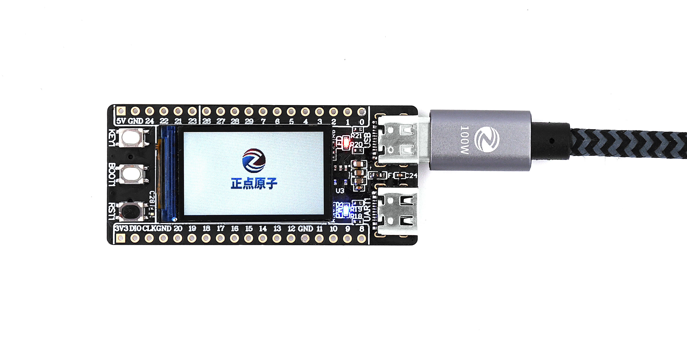

# 目录

- **入门指南**
  - [产品验收](./start-guide/product-acceptance.md)
  - [配套资料下载](./start-guide/download.md)
  - [DNRP2350AM 介绍](./start-guide/dnrp2350am-introduction.md)
  - [RP2350A 与 PICO-SDK 介绍](./start-guide/rp2350a-and-picosdk-introduction.md)
  - [固件烧录](./start-guide/firmware-flash.md)
  - [常见问题汇总（FAQ）](./start-guide/FAQ.md)

- **开发环境搭建**
  - [VSCode环境部署与新建工程](./set-up-development-environment/dnrp2350am-sdk-dev.md)
  - [CH343 驱动安装](./set-up-development-environment/ch32-driver.md)
  - [Thonny环境部署与新建工程](./set-up-development-mpy-environment/method-of-application.md)

- **PICO-SDK基础实验**
  - [LED灯实验](./set-up-development-environment/example-sdk/led.md)
  - [按键输入实验](./set-up-development-environment/example-sdk/key.md)
  - [外部中断实验](./set-up-development-environment/example-sdk/exit.md)
  - [串口实验](./set-up-development-environment/example-sdk/uart.md)
  - [PIO实验](./set-up-development-environment/example-sdk/pio.md)
  - [定时器实验](./set-up-development-environment/example-sdk/timg.md)
  - [看门狗实验](./set-up-development-environment/example-sdk/wdt.md)
  - [PWM实验](./set-up-development-environment/example-sdk/pwm.md)
  - [DMA实验](./set-up-development-environment/example-sdk/dma.md)
  - [ADC实验](./set-up-development-environment/example-sdk/adc.md)
  - [内部温度传感器实验](./set-up-development-environment/example-sdk/internal_temperature.md)
  - [LCD实验](./set-up-development-environment/example-sdk/lcd.md)
  - [RTC实验](./set-up-development-environment/example-sdk/rtc.md)
  - [随机数实验](./set-up-development-environment/example-sdk/trng.md)
  - [SD卡实验](./set-up-development-environment/example-sdk/sd_card.md)
  - [USB虚拟串口实验](./set-up-development-environment/example-sdk/usb.md)

- **PICO-MicroPython基础实验**
  - [LED灯实验](./set-up-development-mpy-environment/example-mpy/led.md)
  - [按键输入实验](./set-up-development-mpy-environment/example-mpy/key.md)
  - [外部中断实验](./set-up-development-mpy-environment/example-mpy/exit.md)
  - [串口实验](./set-up-development-mpy-environment/example-mpy/uart.md)
  - [定时器实验](./set-up-development-mpy-environment/example-mpy/timg.md)
  - [看门狗实验](./set-up-development-mpy-environment/example-mpy/wdt.md)
  - [PWM实验](./set-up-development-mpy-environment/example-mpy/pwm.md)
  - [RTC实验](./set-up-development-mpy-environment/example-mpy/rtc.md)
  - [thread实验](./set-up-development-mpy-environment/example-mpy/thread.md)
  - [LCD实验](./set-up-development-mpy-environment/example-mpy/lcd.md)
  - [ADC实验](./set-up-development-mpy-environment/example-mpy/adc.md)
  - [内部温度传感器实验](./set-up-development-mpy-environment/example-mpy/adc_temperature.md)
  - [DMA实验](./set-up-development-mpy-environment/example-mpy/dma.md)
  - [SD卡实验](./set-up-development-mpy-environment/example-mpy/sd_card.md)
  - [汉字显示实验](./set-up-development-mpy-environment/example-mpy/chinese_Show.md)
  - [USB虚拟串口实验](./set-up-development-mpy-environment/example-mpy/usb_cdc.md)
