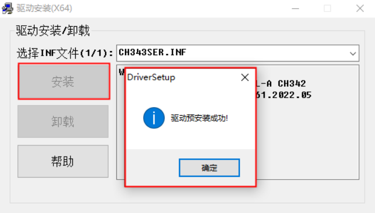
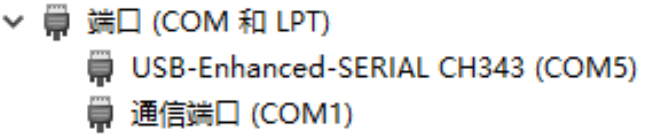

# CH343驱动安装

## 概述

[**CH343**](https://www.wch.cn/products/CH343.html) 是一个USB总线的转接芯片，实现USB转高速异步串口，提供了常用的MODEM联络信号，用于为计算机扩展异步串口，或者将普通的串口设备或者MCU直接升级到USB总线。

CH343 的驱动程序可在其官网的[**资料下载**](https://www.wch.cn/search?q=CH343&t=downloads)页面进行下载，也可以通过[**这里**](https://www.wch.cn/downloads/CH343SER_EXE.html)下载最新的适用于 Windows 的一键式安装驱动程序。

## 安装

> 本章以 Windows 环境为例，介绍使用 CH343 的一键式安装驱动程序在 Windows 下安装 CH343 的驱动程序

打开 CH343 驱动安装程序后，点击安装程序中的“安装”按钮，若提示“驱动安装成功”，
则说明 CH343P 驱动已经安装成功了， 如下图所示。

接下来， 使用 USB 线将开发板 UART 接口与 PC 的 USB 端口相连接即可。此时， PC 端的设备管理器中查看到 CH343P 虚拟出的串口，如下图所示。

从上图可以看出， CH343P 虚拟出的串口被 PC 分配了 COM5 的端口号。这个端口号用于串口调试助手等上位机确定与之通信的串口端。需要注意的是，当 CH343P 与不同的 PC 连接，甚至是与同一台 PC 的不同 USB 端口连接后，虚拟出的串口被 PC分配到的端口号可能是不同的，例如 COM6 或 COM7。读者可以根据设备管理器中端口设备的名称来判断具体是哪个端口号。如果同时连接了多个 CH343 系列的芯片，则需要逐个测试端口号。