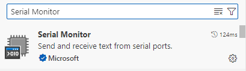
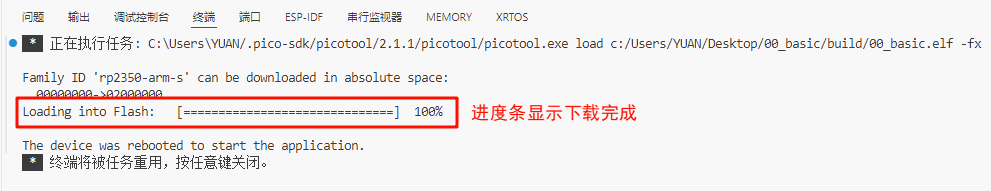

# 前言

Visual Studio Code（VS Code）是一款轻量级且功能强大的跨平台源代码编辑器，支持 Windows、macOS 和 Linux 系统。其核心功能包括语法高亮、智能代码补全（IntelliSense）、代码重构及定义跳转，并集成终端和 Git 版本控制。原生支持 JavaScript、TypeScript 和 Node.js，同时通过扩展生态系统提供对 C++、C#、Java、Python、PHP、Go 及 .NET 等多种语言和运行时的支持。

## 下载

首先，我们先进入[**VSCode官方网站**](https://code.visualstudio.com/Download) 的下载页面。开发者可以根据所用的电脑操作系统选择对应的VSCode版本下载：


这里，我们选择Windows版本进行下载。因为，我们是在Windows环境下进行的开发，故在此介绍Windows版本的下载步骤。不出意外，其它版本的下载方式应该也是一样的。这里我们不多废话，直接点击下载。

下载完后，我们按照如下所示步骤进行即可：


在该步骤中，路径如需更改的，请您点击“浏览”进行更改，但请注意：修改的路径最好不要出现中文，以避免在往后的开发过程中遇到问题而导致重装软件，这对您来说就得不偿失了。


如需修改，同样点击“浏览”进行设置，无需修改的话直接点击“下一步”即可。


这一步骤同样是有需求的都勾上，我们建议是都勾上。


点击“安装”后，您只需静候佳音即可。


到这一步便可以开始运行VSCode了。打开VS Code，在扩展商店的搜索区域输入```Chinese```安装中文插件，如下图所示：


另外，我们还需要安装一个串口调试插件。同样的操作，我们在扩展商店的搜索区域输入```Serial Monitor```安装串口调试插件，如下所示：



至此，VSCode的安装与配置便算是大功告成了。感谢您能耐心看到此处。

## 安装与配置Raspberry Pi Pico插件

打开VS Code软件，然后按下快捷键“Ctrl+Shift+X”进入应用商城，在搜索栏下搜索Raspberry Pi Pico插件，点击安装即可。首次下载SDK时，扩展将自动下载并安装Python、Ninja、CMake、Git等构建依赖项。该扩展还深度集成了Picotool开发工具链，无需额外配置即可直接在VSCode中完成固件烧录、调试等全流程开发操作。


至此Raspberry Pi Pico插件就算安装好了，不需要过多复杂的配置步骤即可使用。

## 新建基础工程

在前面的章节中，我们已经阐述了VS Code IDE环境的搭建以及Raspberry Pi Pico插件的安装流程。现在，基于这些前期准备，我们将在本章搭建一个PICO-SDK基础工程，以后的例程都是基于此基础例程为模版来编写的。

### 搭建基础工程

在VS Code中新建PICO-SDK基础工程步骤如下：

#### 1，打开位于侧边栏的Raspberry Pi Pico插件

我们在VS Code的侧边栏找到安装好的Raspberry Pi Pico插件。拿作者已经安装好的情况来举例，点击```New C/C++ Project```进入新建工程配置界面，如下图所示：


#### 2，配置工程参数


当然我们也可以选择插件提供的示例工程，我们点击上图中的```Example```,进入示例工程配置界面，如下所示：


我们选择了示例工程后，其它选项保持默认即可。点击Create按钮后，扩展会拉取对应版本的SDK库，并新建项目。如果是第一次创建的用户，这个过程耗时会稍微长一点，请耐心等待。


当进度条加载完毕我们可以在工程存放的路径下看见一个系统生成的文件夹，我们将其打开，文件夹界面如下：


使用VSCode打开后，整个工程界面如下：


### 基础工程的文件架构解析


```.vscode``` 文件夹通常位于项目的根目录下，用于存放 VS Code 的项目级设置和扩展配置。这个文件夹中的文件不会影响其他用户或全局的 VS Code 设置，它们只针对当前项目有效在 .vscode 文件夹中，常见的文件包括：
```
1.settings.json。用于定义项目特定的 VS Code 设置（个性配置和工作环境配置）。

2.tasks.json。用于定义任务，这些任务可以在 VS Code 的终端中运行，或者与编辑器中的其他功能（如代码片段）结合使用。

3.launch.json。用于配置调试器，包括启动配置和断点等。

4.c_cpp_properties.json。这个文件用于定义 C 和 C++ 项目的编译器路径、包含路径、编译器定义以及其他与 IntelliSense 相关的设置。

5.cmake-tools-kits.json 。该文件是 Visual Studio Code (VSCode) 中 CMake Tools 插件使用的一个配置文件，用于定义项目无关和配置无关的编译信息。这个文件可以包含编译器、Visual Studio 安装、工具链文件等信息。

6.extensions.json 。该文件是一个用于 Visual Studio Code (VSCode) 的配置文件，通常位于项目根目录下的 .vscode 文件夹中。它的主要作用是为项目推荐安装的插件列表，以确保所有开发者在同一个项目中使用相同的插件，从而保持开发环境的一致性。
```

上述文件都是VSCode自动生成的，不需要人为去编写。但是在某种特殊情况下需要人为介入，如代码调试（需要修改launch.json）、编译错误（需要修改c_cpp_properties.json）和个性配置（需要修改settings.json）等。

```bulid```文件夹是由编译器产生的文件，如log、固件、map等下载和调试文件。

```.gitignore``` 文件是一个纯文本文件，包含了项目中所有指定的文件和文件夹的列表，这些文件和文件夹是 Git 应该忽略和不追踪的。

```CMakeLists.txt``` 文件是项目的主CMake文件，定义了项目的基本设置和组件。其具体作用与配置方法我们在后续章节中再进行详细讲解。

```main.c```文件是主应用程序的C源文件，通常包含int main()入口函数。

```pico_sdk_import.cmake```文件是一个CMake源文件，通常可以将其放入外部项目中以帮助定位此SDK。一般不需要人为干预。

### 调试相关工具介绍


```General```为工程创建部分。该部分可以用于创建包含 C/C++/MicroPython 等语言的工程。

```Project```为工程调试部分。该部分包含了编译、烧录、调试、清除等步骤。

```
1.Debug Project:工程项目调试。

2.Compile Project:工程项目编译。

3.Run Project(USB):工程项目运行/下载,通过USB方式下载。

4.Flash Project(SWD):这一步是第二和第三步的整合，先编译后下载，但此处需要搭配特定下载器。

5.Configure CMake:配置工程的CMake。

6.Clean CMake:清除工程项目编译后在build文件夹下产生的编译文件，从而达到节省项目空间的目的。

7.Switch Build Type Debug:切换CMake构建类型。插件提供了四种CMake构建类型，我们选择默认的Debug即可。

8.Switch SDK 2.1.1:切换PICO-SDK的版本。当前，在此插件中，2.1.1为最新版本。

9.Switch Board pico2:切换树莓派板卡类型。目前本教程是基于RP2350A芯片进行讲解，正是目前pico 2搭载的主控。
```

```Documentation```为工程文件部分。可用于查看API函数的信息。

以上是Raspberry Pi Pico插件提供的调试工具，一般我们只用到1、2、3、6即可完成程序开发。当然，我们也可以在主函数界面的右下角找到这些调试工具，如下所示：


### 编译、下载与验证

#### 1，编译

我们仍以```00_basic```项目为例。点击```Compile```,我们在进行项目编译且成功后，系统会有以下提示：


如果编译不成功可以查找代码的问题所在，并给予修正。

#### 2，下载

编译成功后我们点击```Run```进行下载，成功后系统会有以下提示：



#### 3，验证

我们打开终端下的```串行监视器```,选择正确的端口号，便可看见开发板在以一秒钟的频率通过串口不断的输出```Hello, world!```,如下所示：


至此，环境部署与新建工程的流程便是讲解完毕，感谢各位读者能够耐心的看到此处。