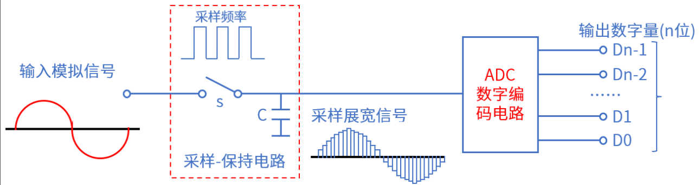
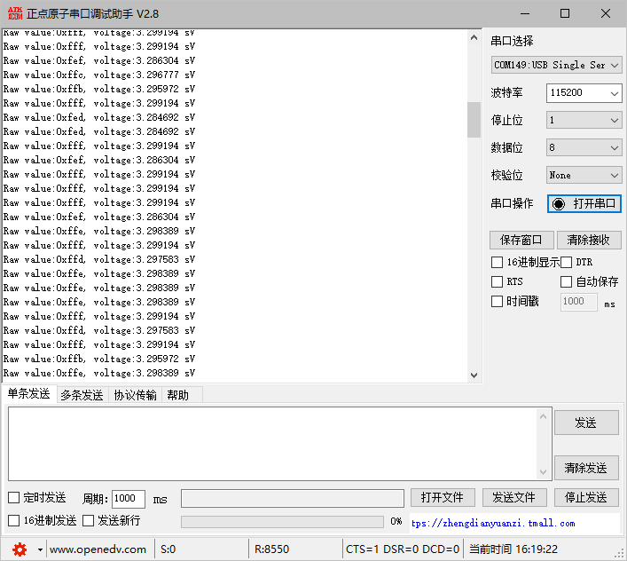

# ADC实验

## 前言

本章介绍使用 RP2350A模数转换器（ADC）进行带通道的电压采集。通过本章的学习，读者将学习到单通道 ADC 的使用。

## ADC 介绍

### 1，ADC 简介

生活中接触到的大多数信息是随着时间连续变化的物理量，如声音、温度、压力等。表达这些信息的电信号，称为模拟信号（Analog Signal）。为了方便存储、处理，在计算机系统中，都是数字 0 和 1 信号，将模拟信号（连续信号）转换为数字信号（离散信号）的器件就叫模数转换器（Analog-to-Digital Convert， ADC）。ADC 转换器可分为： 并行比较型 A/D 转换器(FLASH ADC)、逐次比较型 A/D 转换器(SARADC)和双积分式 A/D 转换器(Double Integral ADC)。A/D 转换过程通常为 4 步：采样、保持、量化和编码，如下图所示:



采样：把时间连续变化的信号变换为时间离散的信号。

保持：保持采样信号，使有充分时间转换为数字信号。

量化：把采样保持电路的输出信号用单位量化电压的整数倍表示。

编码：把量化的结果用二进制代码表示。

采样和保持通常是在采样-保持电路中完成，量化和编码通常在 ADC 数字编码电路中完成。

### 2，RP2350A ADC介绍
RP2350A 的 ADC（模数转换器）模块支持多通道模拟输入，主要特性包括：
1. 12 位 SAR ADC：逐次逼近型架构，支持单端输入。
2. 4 个模拟输入通道：QFN-60 封装的 GPIO26-29（ADC0-3）。
3. 采样率：最高 1 MSPS（兆样本每秒）。
4. 参考电压：内部固定 1.2V 或外部参考电压（需通过 ADC_CTRL 配置）。
5. 温度传感器：集成温度测量功能，精度 ±2℃（典型值）。

## 硬件设计

### 例程功能

1. 本章实验功能简介：使用 ADC 采集通道3（IO29）上面的电压，通过串口打印ADC 转换值以及换算成电压后的电压值。 LED闪烁，提示程序运行。
2. LED闪烁，指示程序正在运行。

### 硬件资源

1. LED:
	GPIO3
2. UARTR:
	uart0
3. ADC
	通道3 - IO29

### 原理图

本章实验使用的 ADC 为 RP2350A 的片上资源，因此并没有相应的连接原理图。

## 程序设计

### ADC函数解析

PICO-SDK提供了丰富的ADC接口函数，可在```pico-sdk\src\rp2_common\hardware_adc```路径下找到相关的adc.c和adc.h文件。在adc.h头文件中，你可以找到RP2350A的所有ADC函数定义。接下来，作者将介绍一些常用的ADC函数，这些函数的描述及其作用如下：

#### ADC初始化函数

该函数的主要作用是对 RP2350A 的 ADC（模数转换器）进行初始化操作。在使用 ADC 之前，需要确保其处于已知的初始状态，并且已正确配置好相关的时钟和控制寄存器。该函数会对 ADC 进行复位、使能操作，并等待 ADC 准备好进行后续的转换工作。,其函数原型如下所示：

```
void adc_init(void)
```

【参数】

1. 无

【返回值】

1. 无

#### 启用或禁用内部温度传感器

该 函数用于启用或禁用 RP2350A 芯片中 ADC（模数转换器）模块的内部温度传感器,其函数原型如下所示：

```
static inline void adc_set_temp_sensor_enabled(bool enable)
```

【参数】

1. enable 是一个布尔类型的参数，用于指示是否要启用温度传感器。当enable的值为true时，表示要启用温度传感器；当 enable的值为false时，表示要禁用温度传感器。

【返回值】

1. 无

#### 选择ADC输入通道

该函数的主要作用是选择 RP2350A 芯片中ADC（模数转换器）的输入通道,其函数原型如下所示：

```
static inline void adc_select_input(uint input)
```

【参数】

1. input:通过这个参数来指定要使用的ADC输入通道，然后通过操作ADC的控制和状态寄存器来完成通道的选择。

【返回值】

1. 无

#### 读取ADC转换结果

该函数的主要功能是启动一次ADC（模数转换器）转换，并等待转换完成后读取转换结果。该函数会触发单次ADC转换操作，然后进入循环等待转换完成，最后从ADC的结果寄存器中读取16位的转换结果并返回,其函数原型如下所示：

```
static inline uint16_t adc_read(void)
```

【参数】

1. 无

【返回值】

1. (uint16_t) adc_hw->result:该返回值是ADC的结果寄存器，其中存储了ADC转换得到的数字值。

### ADC驱动解析

在SDK版本的10_1_adc例程中，作者在```10_1_adc\BSP```路径下新增了一个ADC文件夹，用于存放 adc.c、 adc.h这两个文件。其中，adc.h 文件负责声明ADC相关的函数和变量，而adc.c文件则实现了ADC的驱动代码。下面，我们将详细解析这两个文件的实现内容。

#### 1，adc.h文件

```
#define ADC_ADCX_CH   	3
#define ADC_GPIO_PIN	29

/* 函数声明 */
void adc3_init(void);					/* 初始化ADC */
```

#### 2，adc.c文件

```
/**
 * @brief       初始化ADC
 * @param       无
 * @retval      无
 */
void adc3_init(void)
{
    adc_init();
    adc_gpio_init(ADC_GPIO_PIN);
    adc_select_input(ADC_ADCX_CH);
}
```
从上面的代码中可以看出，调用adc3_init()后，ADC将读取GPIO26引脚的模拟信号，并通过通道0转换为数字值。后续可通过adc_read()获取该通道的数据。

### CMakeLists.txt文件

打开本章节的实验（10_1_adc），在整个工程文件下包含了一个CMakeLists.txt文件。关于该实验的CMakeLists.txt文件的具体内容与上一章节并没有什么太大的不同，因此不再赘述。


###  实验应用代码

打开main.c文件，该文件定义了工程入口函数，名为main。该函数代码如下。
```
/**
 * @brief       程序入口
 * @param       无
 * @retval      无
 */
int main()
{
    uint16_t result;
    float conversion_factor;

    stdio_init_all();       /* 初始化标准库 */
    led_init();             /* 初始化LED */
    adc3_init();            /* 初始化ADC */

    while(1)
    {
        conversion_factor = 3.3f / (1 << 12);
        result = adc_read();
        printf("Raw value:0x%03x, voltage:%f sV\n", result, result * conversion_factor);
        LED_TOGGLE();       /* LED翻转函数 */
        sleep_ms(500);
    }
}
```
从上面的代码中可以看出，在进行完包括 ADC 的所有初始化工作后，便不断地获取 ADC通道 3 进行 10 次转换后经过均值滤波后的结果，并将该原始值显示在 LCD 上，同时还通过该电压的原始值计算出了电压的模拟量，并在 LCD 上进行显示。

## 下载验证

可以通过串口助手查看ADC读取的原始值以及转换后得到的电压值。LED闪烁 ,提示程序运行。




