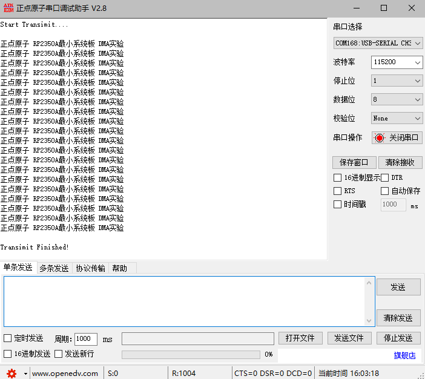

# DMA实验

## 前言

本章将介绍如何使用RP2350A开发板的DMA功能。通过本章的学习，读者将学习到如何使用SDK驱动RP2350A的DMA功能。

## DMA 介绍

### 1，DMA简介

DMA，全称为：Direct Memory Access，即直接存储器访问。DMA传输方式无需CPU直接控制传输，也没有中断处理方式那样保留现场和恢复现场的过程，通过硬件为RAM与I/O设备开辟一条直接传送数据的通路，能使CPU的效率大为提高 。

## 硬件设计

### 例程功能

1. 本章实验功能简介：创建DMA，将数据通过DMA发送到串口中，每按下KEY1，就会将定义的缓存区数据以DMA的方式发送到串口。打开串口调试助手XCOM，可以收到DMA发送的内容。
2. LED闪烁，指示程序正在运行。

### 硬件资源

1. LED:
LED-GPIO3
2. 独立按键:
KEY-GPIO2
3. uart0:（UART0_TX、UART0_RX连接至板载USB转串口芯片上

    UART0_TX - GPIO0

    UART0_RX - GPIO1
4. DMA

### 原理图

本章实验使用的 DMA 为 RP2350A 的片上资源，因此并没有相应的连接原理图。

## 程序设计

### DMA函数解析

PICO-SDK提供了丰富的DMA接口函数，开发者可以在```pico-sdk\src\rp2_common\hardware_dma```路径下找到相关的dma.c和dma.h文件。在dma.h头文件中，你可以找到RP2350A的所有DMA函数定义。接下来，作者将介绍一些常用的DMA函数，这些函数的描述及其作用如下：

#### 获取DMA通道的默认配置

该函数的主要作用是获取DMA通道的默认配置。此函数提供了一个标准化的DMA通道配置模板，适用于常见的单次内存到外设传输场景。其函数原型如下所示：

```
static inline dma_channel_config dma_channel_get_default_config(uint channel)
```

【参数】

1. uint channel:指定目标DMA通道号。

【返回值】

1. dma_channel_config: 结构体，包含DMA通道的配置参数。

#### 设置DMA通道传输的数据宽度

该函数通过位掩码操作安全配置DMA通道的数据传输宽度。其函数原型如下所示：

```
static inline void channel_config_set_transfer_data_size(dma_channel_config *c, enum dma_channel_transfer_size size)
```

【参数】

1. dma_channel_config *c：DMA通道配置结构体指针，用于修改寄存器值。
2. enum dma_channel_transfer_size size：传输数据大小枚举值（如8/16/32位）。

【返回值】

1. 无

#### 设置DMA通道的DREQ（数据请求）源

该函数通过位掩码操作安全配置DMA通道的触发请求源(DREQ)。其函数原型如下所示：

```
static inline void channel_config_set_dreq(dma_channel_config *c, uint dreq)
```

【参数】

1. dma_channel_config *c：指向DMA通道配置结构体的指针，用于修改寄存器值。
2. uint dreq：数据请求（DREQ）源编号，用于指定触发DMA传输的条件。

【返回值】

1. 无

#### 设置DMA通道读增量

该函数的主要用途是对 DMA 通道配置中的读取地址自增标志进行设置，能够依据需求灵活开启或关闭读取地址自增功能，以此来满足不同的数据传输需求。其函数原型如下所示：

```
static inline void channel_config_set_read_increment(dma_channel_config *c, bool incr)
```

【参数】

1. c：指向 dma_channel_config 结构体的指针，此结构体涵盖了 DMA 通道的各类配置信息。
2. incr：布尔类型参数，若为 true，则表示在 DMA 读取数据时要自动增加读取地址；若为 false，则表示读取地址保持不变。

【返回值】

1. 无

#### 设置DMA通道写增量

该函数的作用是灵活控制 DMA 通道在写入数据时是否自动增加写入地址。通过开启或关闭该功能，可以满足不同的数据传输场景需求，提高 DMA 数据传输的效率和灵活性。其函数原型如下所示：

```
static inline void channel_config_set_write_increment(dma_channel_config *c, bool incr)
```

【参数】

1. c：指向 dma_channel_config 结构体的指针，此结构体涵盖了 DMA 通道的各类配置信息。
2. incr：这是一个布尔类型的参数。当它的值为 true 时，表示在 DMA 写入数据时，需要自动增加写入地址；当它的值为 false 时，表示写入地址保持不变。

【返回值】

1. 无

#### 启用或禁用指定DMA通道的中断0

该函数的作用是启用或禁用指定 DMA（直接内存访问）通道的中断 0（IRQ0）。DMA 允许设备在不经过 CPU 干预的情况下直接与内存进行数据传输，而中断机制则能让 CPU 在 DMA 操作完成等特定事件发生时得到通知。其函数原型如下所示：

```
static inline void dma_channel_set_irq0_enabled(uint channel, bool enabled)
```

【参数】

1. channel：这是一个无符号整数类型的参数，代表要操作的 DMA 通道编号。
2. enabled：这是一个布尔类型的参数，若值为 true，则表示启用指定 DMA 通道的中断 0；若值为 false，则表示禁用该通道的中断 0。

【返回值】

1. 无

#### 设置中断处理程序

该函数的主要作用是为指定编号的中断（IRQ）设置一个专属的中断处理程序。该函数会确保在设置新的处理程序之前，进行必要的参数检查和并发控制，并且在某些条件下会对已有处理程序进行检查，保证操作的正确性和安全性。其函数原型如下所示：

```
void irq_set_exclusive_handler(uint num, irq_handler_t handler)
```

【参数】

1. num：这是一个无符号整数类型的参数，代表要设置处理程序的中断编号。不同的中断编号对应着不同的硬件或软件中断源。在例程中设置了```DMA_IRQ_0```作为中断源。
2. handler：这是一个 irq_handler_t 类型的函数指针，指向要为该中断设置的处理程序。当对应的中断发生时，系统会调用这个处理程序来处理中断事件。

【返回值】

1. 无

#### 启用或禁用指定编号的中断（IRQ）

该函数的主要功能是启用或禁用指定编号的中断（IRQ）。它会先对传入的中断编号进行合法性检查，然后调用 irq_set_mask_n_enabled 函数来实际执行启用或禁用中断的操作。其函数原型如下所示：

```
void irq_set_enabled(uint num, bool enabled) 
```

【参数】

1. num：无符号整数类型，代表要操作的中断编号。不同的硬件系统会有不同数量和编号的中断，该参数用于指定具体要启用或禁用的中断。在例程中设置了```DMA_IRQ_0```作为中断源。
2. enabled：布尔类型参数，true 表示启用指定中断，false 表示禁用指定中断。

【返回值】

1. 无

#### 确认指定DMA通道的中断0

该函数的主要作用是确认指定 DMA（直接内存访问）通道的中断 0（IRQ0）。在 DMA 操作中，当某个通道完成特定任务或者出现特定事件时，会触发中断通知 CPU。CPU 在处理完该中断后，需要向 DMA 控制器确认已经处理，以清除相应的中断标志，避免重复触发中断。其函数原型如下所示：

```
static inline void dma_channel_acknowledge_irq0(uint channel)
```

【参数】

1. channel：这是一个无符号整数类型的参数，代表要操作的 DMA 通道编号。

【返回值】

1. 无

#### DMA通道配置

该函数的主要作用是确认指定 DMA（直接内存访问）通道的中断 0（IRQ0）。在 DMA 操作中，当某个通道完成特定任务或者出现特定事件时，会触发中断通知 CPU。CPU 在处理完该中断后，需要向 DMA 控制器确认已经处理，以清除相应的中断标志，避免重复触发中断。其函数原型如下所示：

```
static inline void dma_channel_configure(uint channel, const dma_channel_config *config,                
                                         volatile void *write_addr,
                                         const volatile void *read_addr,
                                         uint transfer_count, bool trigger)
```

【参数】

1. channel：无符号整数类型，代表要配置的 DMA 通道编号。不同的通道可独立进行 DMA 操作。
2. config：指向 dma_channel_config 结构体的常量指针，该结构体包含了 DMA 通道的各种配置信息，如数据传输方向、传输数据大小等。
3. write_addr：指向 volatile void 类型的指针，代表 DMA 数据传输的目标地址，即数据要写入的位置。
4. read_addr：指向 const volatile void 类型的指针，代表 DMA 数据传输的源地址，即数据的读取位置。
5. transfer_count：无符号整数类型，代表要传输的数据项数量。
6. trigger：布尔类型，若为 true，则在配置完成后立即触发 DMA 传输；若为 false，则不立即触发，需要后续手动启动。

【返回值】

1. 无

#### 启动指定的DMA通道

该函数的主要作用是启动指定的 DMA（直接内存访问）通道。DMA 技术能让设备在不依赖 CPU 频繁干预的情况下，直接与内存进行数据传输，有效提升数据传输效率。该函数通过调用 dma_start_channel_mask 函数来实现启动指定 DMA 通道的操作。其函数原型如下所示：

```
static inline void dma_channel_start(uint channel)
```

【参数】

1. channel：无符号整数类型的参数，代表要启动的 DMA 通道编号。不同的 DMA 通道可以独立执行数据传输任务。

【返回值】

1. 无

#### 检查DMA通道忙碌状态

该函数的主要作用是检查指定的 DMA通道是否处于忙碌状态，即是否正在进行数据传输操作。在 DMA 系统里，这一功能很关键，因为只有在通道空闲时，才可以安全地对其进行重新配置或发起新的传输。其函数原型如下所示：

```
inline static bool dma_channel_is_busy(uint channel)
```

【参数】

1. channel：无符号整数类型的参数，代表要启动的 DMA 通道编号。不同的 DMA 通道可以独立执行数据传输任务。

【返回值】

1. 无

### DMA驱动解析

在SDK版本的09_dma例程中，作者在```09_dma\BSP```路径下新增了一个DMA文件夹，用于存放 dma.c、 dma.h这两个文件。其中，dma.h 文件负责声明ADC相关的函数和变量，而 dma.c文件则实现了DMA的驱动代码。下面，我们将详细解析这两个文件的实现内容。

#### 1，dma.h文件

```
#define UART_NUM 	uart0
#define UART_BAUD_RATE 	115200
#define UART_TX_PIN 	0
#define UART_RX_PIN 	1
#define DMA_CHAN        0

/* DMA传输完成标志 */
extern volatile bool dma_done;
extern int dma_chan;
extern dma_channel_config dma_ctrl;
```

#### 2，dma.c文件

```
/**
 * @brief       DMA完成中断处理函数
 * @param       无
 * @retval      无
 */
void __isr dma_handler(void) 
{
    if (dma_channel_get_irq0_status(DMA_CHAN))
    {
        dma_channel_acknowledge_irq0(DMA_CHAN);
        dma_done = true;
    }
}

/**
 * @brief       初始化DMA与UART
 * @param       无
 * @retval      无
 */
void dma_uart_init(void)
{
    /* 初始化 */
    uart_init(UART_NUM, UART_BAUD_RATE);
    gpio_set_function(UART_TX_PIN, GPIO_FUNC_UART);
    gpio_set_function(UART_RX_PIN, GPIO_FUNC_UART);

    /* 配置DMA通道 */
    dma_ctrl = dma_channel_get_default_config(DMA_CHAN);
    channel_config_set_transfer_data_size(&dma_ctrl, DMA_SIZE_8);    /* 8位传输 */
    channel_config_set_dreq(&dma_ctrl, DREQ_UART0_TX);               /* UART_TX作为数据请求 */
    channel_config_set_read_increment(&dma_ctrl, true);              /* 源地址递增 */
    channel_config_set_write_increment(&dma_ctrl, false);            /* 目标地址固定 */

    /* 设置DMA完成中断 */
    dma_channel_set_irq0_enabled(DMA_CHAN, true);
    irq_set_exclusive_handler(DMA_IRQ_0, dma_handler);
    irq_set_enabled(DMA_IRQ_0, true);
}
```
这两个函数相互配合，dma_uart_init 函数完成了 DMA 和 UART 的初始化与配置工作，使得 DMA 能够在 UART 发送数据时进行直接内存访问。而 dma_handler 函数则负责处理 DMA 完成中断，确保在 DMA 操作完成后进行相应的处理。

### CMakeLists.txt文件

打开本章节的实验（09_dma），在整个工程文件下包含了一个CMakeLists.txt文件。关于该实验的CMakeLists.txt文件的具体内容与上一章节并没有什么太大的不同，因此不再赘述。


###  实验应用代码

打开main.c文件，该文件定义了工程入口函数，名为main。该函数代码如下。
```
const char text_to_send[] = "正点原子 RP2350A最小系统板 DMA实验\r\n";
#define SEND_BUF_SIZE (sizeof(text_to_send) * 20)   /* 发送数据长度 */
uint8_t g_sendbuf[SEND_BUF_SIZE];

int main()
{
    uint16_t len;
    uint16_t i;
    uint8_t key;

    stdio_init_all();           /* 初始化标准库 */
    led_init();                 /* 初始化LED */
    key_init();                 /* 初始化KEY */
    dma_uart_init();            /* 初始化初始化DMA与UART */

    len = sizeof(text_to_send); /* 填充发送数据缓冲区 */

    /* 填充缓冲区：将数据重复发送20次 */
    for (i = 0; i < SEND_BUF_SIZE; i++) 
    {
        g_sendbuf[i] = text_to_send[i % len];
    }

    i = 0;

    while (1)
    {
        key = key_scan(0);

        if (key == KEY1_PRES)
        {
            printf("Start Transimit....\r\n");      /* 开始传输 */
            printf( "\r\n");

            dma_channel_configure(
                DMA_CHAN,                           /* Channel号 */
                &dma_ctrl,                          /* 配置DMA结构体 */
                &uart_get_hw(UART_NUM)->dr,         /* 目标地址（UART数据寄存器） */ 
                g_sendbuf,                          /* 源地址改为g_sendbuf */
                SEND_BUF_SIZE,                      /* 传输数量（20次完整字符串） */
                false                               /* 不立即启动 */
            );

            dma_channel_start(DMA_CHAN);            /* 显式启动 */

            while (dma_channel_is_busy(DMA_CHAN))   /* 阻塞当前代码的执行，直到 DMA 传输完成 */
            {
                tight_loop_contents();              /* 在循环中保持 CPU 活动，防止编译器优化掉这个循环，确保循环确实在等待 DMA 完成 */
            }

            printf( "\r\n");
            printf("Transimit Finished!");          /* 传输完成 */
        }

        i ++;
        sleep_ms(10);

        if (i == 20)
        {
            LED_TOGGLE();                           /* LED闪烁,提示系统正在运行 */
            i = 0;
        }
    }
}
```
该程序通过按键KEY1触发，利用 DMA 方式重复 20 次,将文本内容发送到 UART，在传输过程中会进行状态提示，同时通过 LED 灯闪烁提示系统处于运行状态。这种方式可以提高数据传输效率，减少 CPU 干预。

## 下载验证

按下KEY1按键，UART0以DMA方式发送数据。可以通过串口助手查看发送的信息。LED闪烁 ,提示程序运行。


