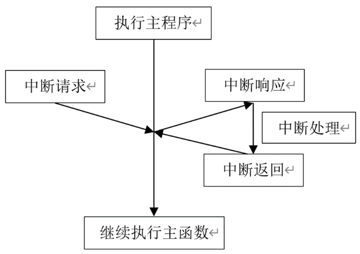

# 外部中断实验

## 前言

本章将介绍如何将GPIO引脚作为外部中断输入来使用。通过本章的学习，开发者将学习到GPIO作为外部中断输入的使用。

## 中断简介

在上一章节中，我们虽然实现了GPIO口输入功能的读取，但代码始终在检测IO输入口的变化，导致在代码量增加时，按键检测部分的轮询效率降低。尤其在某些特定场合，如按键可能一天才被按下一次，实时检测将造成大量时间浪费。为优化此问题，我们引入了外部中断的概念。外部中断即在按键被按下（触发中断）时执行相关功能，从而显著节省CPU资源，因此在实际项目中应用广泛。

#### 1，什么是外部中断

外部中断属于硬件中断，由微控制器外部事件触发。微控制器的特定引脚被设计为对特定事件（如按钮按压、传感器信号变化等）作出响应，这些引脚通常称为“外部中断引脚”。一旦外部中断事件发生，当前程序执行将立即暂停，并跳转到相应的中断服务程序（ISR）进行处理。处理完毕后，程序会恢复执行，从被中断的地方继续。下图是CPU中断处理过程。



对于嵌入式和实时系统而言，外部中断的使用至关重要，它能使系统对外部事件作出即时响应，极大提升系统效率和实时性。

#### 2，RP2350A外部中断

总的来说，RP2350A的外部中断具备两种触摸类型：
（1）电平触发：高、低电平触发，要求保持中断的电平状态直到CPU响应。
（2）边沿触发：上升沿和下降沿触发，这类型的中断一旦触发，CPU即可响应。
RP2350A的外部中断功能能够以非常精确的方式捕捉外部事件的触发。开发者可以通过配置中断触发方式（如上升沿、下降沿、任意电平、低电平保持、高电平保持等）来适应不同的外部事件，并在事件发生时立即中断当前程序的执行，转而执行中断服务函数。

## 硬件设计

### 例程功能

1. 按下KEY1按键可以控制LED状态翻转。  

### 硬件资源

1. LED:
LED-GPIO3
2. 按键:
KEY1-GPIO2

### 原理图

KEY1的原理图已在```按键输入实验```章节中详细阐述，为避免重复，此处不再赘述。

## 程序设计

### EXIT函数解析

PICO-SDK提供了丰富的GPIO EXIT函数，开发者可以在```pico-sdk\src\rp2_common\hardware_gpio```路径下找到相关的gpio.c和gpio.h文件。在gpio.h头文件中，你可以找到RP2350A的所有GPIO EXIT函数定义。接下来，作者将介绍一些常用的GPIO EXIT函数，这些函数的描述及其作用如下：

#### 中断设置函数

这是一个用于执行多次GPIO IRQ相关初始化的函数，其函数原型如下所示：

```
void gpio_set_irq_enabled_with_callback(uint gpio, 
                                        uint32_t event_mask,
                                        bool enabled, 
                                        gpio_irq_callback_t callback)
```

【参数】

gpio:GPIO引脚号

event_mask:导致中断的事件

enabled:使能或失能中断标志位

callback:这是一个用户定义的中断回调函数，将在中断发生时执行


【返回值】

无


#### 使能或失能中断函数

该函数用于使能或失能指定GPIO的特定中断事件，其函数原型如下所示：

```gpio_set_irq_enabled(uint gpio, uint32_t event_mask, bool enabled)```

【参数】

gpio:GPIO引脚号

event_mask:导致中断的事件

enabled:使能或失能中断标志位

【返回值】

无

该函数的形参描述如下表所示：

位掩码 | 中断标志位	        | 中断描述
----  |---------------------|------------------------------------
  0   | GPIO_IRQ_LEVEL_LOW  | 低电平时持续
  1   | GPIO_IRQ_LEVEL_HIGH | 高电平时持续
  2   | GPIO_IRQ_EDGE_FALL  | 电平由高到低变化时转换
  3   | GPIO_IRQ_EDGE_RISE  | 电平由低到高变化时转换

当我们在调用该函数时，可以使用到一些可用的结构体变量，如下所示：

```
enum gpio_irq_level {
    GPIO_IRQ_LEVEL_LOW  = 0x1u,  /* 当GPIO引脚为逻辑0时产生IRQ */
    GPIO_IRQ_LEVEL_HIGH = 0x2u,  /* 当GPIO引脚为逻辑1时产生IRQ */
    GPIO_IRQ_EDGE_FALL  = 0x4u,  /* 当GPIO从逻辑1转变为逻辑0时产生IRQ */
    GPIO_IRQ_EDGE_RISE  = 0x8u,  /* 当GPIO从逻辑0转变为逻辑1时产生IRQ */
};
```


### EXIT驱动解析

在SDK版本的03_exit例程中，作者在03_exit\BSP路径下新增了一个EXIT文件夹，exit.c和exit.h这两个文件。其中，exit.h文件负责声明EXIT相关的函数和变量，而exit.c文件则实现了EXIT的驱动代码。下面，我们将详细解析这两个文件的实现内容。

#### 1，exit.h文件

```
/* 引脚定义 */
#define KEY_INT_GPIO_PIN   2

/*IO操作*/
#define KEY1                gpio_get(KEY_INT_GPIO_PIN)

/* 函数声明 */
void exit_init(void);   /* 外部中断初始化程序 */
```

#### 2，exit.c文件

```
/**
 * @brief       外部中断服务函数
 * @param       gpio_num：中断引脚号
 *              events：触发中断事件
 * @note        NULL
 * @retval      无
 */
static void exit_gpio_isr_handler(uint32_t gpio_num, uint32_t events)
{    
    sleep_ms(20);   /* 消抖 */
    
    if (events & GPIO_IRQ_EDGE_FALL)
    {
        LED_TOGGLE();
    }
}

/**
 * @brief       外部中断初始化程序
 * @param       无
 * @retval      无
 */
void exit_init(void)
{
    gpio_init(EXIT_INT_GPIO_PIN);                /* 初始化引脚 */
    gpio_set_dir(EXIT_INT_GPIO_PIN, GPIO_IN);    /* 配置引脚为输入模式 */
    gpio_pull_up(EXIT_INT_GPIO_PIN);             /* 配置引脚上拉 */

    /* 设置中断类型（此处为下降沿） */
    gpio_set_irq_enabled_with_callback(EXIT_INT_GPIO_PIN, GPIO_IRQ_EDGE_FALL, true, (void *)exit_gpio_isr_handler);
}
```
代码是关于外部中断处理和初始化，涉及GPIO引脚的配置以及在GPIO引脚上按键按下和松开事件的处理。初始化代码中配置了一个GPIO引脚，用于检测按键的按下和松开事件。当GPIO引脚发生上升沿或下降沿时，会调用中断服务函数 exit_gpio_isr_handler，并执行相应的操作：切换LED状态和打印调试信息。

### CMakeLists.txt文件

打开本章节的实验（03_exit），在整个工程文件下包含了一个CMakeLists.txt文件。关于该实验的CMakeLists.txt文件的具体内容与上一章节并没有什么太大的不同，因此不再赘述。

###  实验应用代码

打开main.c文件，该文件定义了工程入口函数，名为main。该函数代码如下。
```
/**
 * @brief       程序入口
 * @param       无
 * @retval      无
 */
int main()
{
    uint8_t key;

    stdio_init_all();           /* 初始化标准库 */
    led_init();                 /* 初始化LED */
    exit_init();                /* 初始化外部中断 */

    while (1) 
    {
        tight_loop_contents();  /* 空循环，保持程序运行 */
    }
}
```
程序首先通过调用初始化函数来准备标准输出、LED和外部中断，然后进入一个while循环，通过一个空循环，调节程序的执行频率，避免过度占用CPU。由于外部中断已经通过 exit_init() 初始化，在按键按下或松开时，相应的中断服务函数会被调用，并进行LED灯状态的切换和打印信息等操作。

## 下载验证

下载完之后，可以通过开发板上的KEY1按键控制LED灯亮灭。


