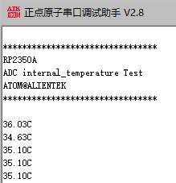

# 内部温度传感器实验

## 前言

本章，我们将介绍RP2350A的内部温度传感器并使用它来读取温度值，然后在LCD模块上显示出来。

## 内部温度传感器简介

温度传感器生成一个随温度变化的电压。内部ADC将传感器电压转化为一个数字量。温度传感器的测量范围为–20 °C 到110 °C。温度传感器适用于监测芯片内部温度的变化，该温度值会随着微控制器时钟频率或IO负载的变化而变化。一般来讲，芯片内部温度会高于外部温度。ESP32-S3温度传感器相关内容，请看《esp32-s3_technical_reference_manual_cn.pdf》技术手册39.4章节。
温度传感器的输出值需要使用转换公式转换成实际的温度值 (°C)。转换公式如下：
T(°C) = 0.4386 * VALUE –27.88 * offset –20.52
其中 VALUE 即温度传感器的输出值，offset 由温度偏移决定。温度传感器在不同的实际使用环境（测量温度范围）下，温度偏移不同，见下表所示。

测量范围（°C）  | 温度偏移（°C）
--------------|-------------
50 ~ 110      | -2
20 ~ 100      | -1
-10 ~ 80      |  0
-15 ~ 50      |  1
-20 ~ 20      |  2

## 硬件设计

### 例程功能

1. 本章实验功能简介：通过ADC的通道读取RP2350A内部温度传感器的电压值，并将其转换为温度值，最终通过串口打印该值。

### 硬件资源

1. LED:
	GPIO3
2. UARTR:
	uart0
3. 内部温度传感器
	通道4

### 原理图

本章实验使用的ADC为RP2350A的片上资源，因此并没有相应的连接原理图。

## 程序设计

### 内部温度传感器函数解析

PICO-SDK提供了丰富的ADC接口函数，开发者可以在```pico-sdk\src\rp2_common\hardware_adc```路径下找到相关的adc.c和adc.h文件。在adc.h头文件中，你可以找到RP2350A的所有ADC函数定义。部分函数在之前的ADC章节中，作者已经详细介绍过，因此不再赘述。

#### 从FIFO获取ADC结果

该函数是一个静态内联函数，其作用是从 ADC（模拟 - 数字转换器）的 FIFO（先进先出）缓冲区中获取转换后的数字值。静态内联函数的好处在于它可以避免函数调用的开销，提高代码的执行效率。其函数原型如下所示：

```
inline uint16_t adc_fifo_get(void)
```

【参数】

无

【返回值】

1. (uint16_t)adc_hw->fifo：将转换后的 adc_hw->fifo 的值作为函数的返回值返回。

### 内部温度传感器驱动解析

在SDK版本的10_2_internal_temperature例程中，作者在```10_2_internal_temperature\BSP```路径下新增了一个SENSOR文件夹，用于存放sensor.c和sensor.h这两个文件。其中，sensor.h文件负责声明LCD相关的函数和变量，sensor.c文件则实现了SENSOR的驱动代码。下面，我们将解析这两个文件的实现内容。

#### 1，sensor.h文件

```
#define ADC_ADCX_CH   	4
#define ADC_GPIO_PIN	29

/* 函数声明 */
void sensor_inter_init(void);					/* 初始化ADC */
```

#### 2，sensor.c文件

```
/**
 * @brief       初始化内部温度传感器
 * @param       无
 * @retval      ESP_OK:初始化成功
 */
void sensor_inter_init(void)
{
    adc_init();
    adc_set_temp_sensor_enabled(true);
    adc_select_input(ADC_ADCX_CH);
}
```
初始化内部温度传感器后，再将温度传感器使能以获取传感器数据，最终以返回值的形式将数据返回到数据处理的函数。

### CMakeLists.txt文件

打开本章节的实验（10_2_internal_temperature），在整个工程文件下包含了一个CMakeLists.txt文件。关于该实验的CMakeLists.txt文件的具体内容与上一章节并没有什么太大的不同，因此不再赘述。

###  实验应用代码

打开main.c文件，该文件定义了工程入口函数，名为main。该函数代码如下。
```
/**
 * @brief       显示实验信息
 * @param       无
 * @retval      无
 */
void rp2350a_show_mesg(void)
{
    /* 串口输出实验信息 */
    printf("\n");
    printf("********************************\r\n");
    printf("RP2350A\r\n");
    printf("ADC internal_temperature Test\r\n");
    printf("ATOM@ALIENTEK\r\n");
    printf("********************************\r\n");
    printf("\r\n");
}

/**
 * @brief       程序入口
 * @param       无
 * @retval      无
 */
int main()
{
    float voltage = 0;
    float data_tmp = 0;
    float conversion_factor = 3.3f / (1 << 12);

    stdio_init_all();                                   /* 初始化标准库 */
    led_init();                                         /* 初始化LED */
    rp2350a_show_mesg();                                /* 显示实验信息 */
    sensor_inter_init();                                /* 初始化温度传感器 */

    while (1) 
    {
        voltage = adc_read() * conversion_factor;      /* 数值转换为电压 */
        data_tmp = 27 - (voltage - 0.706) / 0.001721;

        printf("%.2fC\n", data_tmp);
        
        LED_TOGGLE();                                   /* LED翻转函数 */
        sleep_ms(1000);
    }
}
```
从上面的代码中可以看出，在初始化完内部传感器后，便通过串口显示一些本实验的相关信息，随后便每间隔1000毫秒打印一次温度数据。

## 下载验证

将程序下载到开发板后，实验内容如下图所示：



大家可以看看你的温度值与实际是否相符合（因为芯片会发热，所以一般会比实际温度偏高）？


