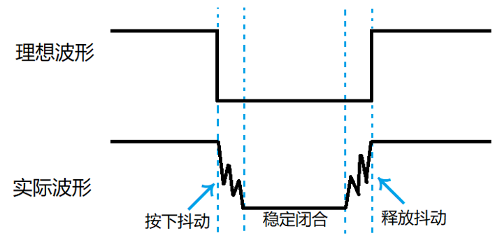
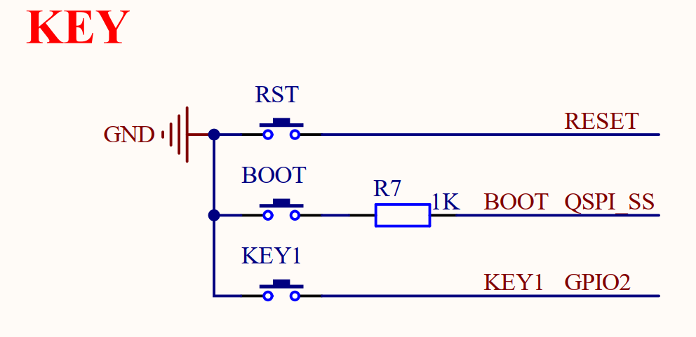

# 按键输入实验

## 前言

在上一章，我们详细讲解了GPIO的输出模式，并演示了如何利用它来控制LED的亮灭。而在本章中，我们将重点关注GPIO的输入模式配置，学会如何获取外部的输入信号，例如检测按键的状态。通过学习本章内容，开发者将能够掌握GPIO作为输入模式的使用方法，进一步扩展其在嵌入式系统开发中的应用能力。

## 独立按键基础知识

独立按键是一种简洁高效的输入设备，广泛应用于各类电子设备中，实现基础的用户交互功能。其工作原理主要基于机械开关的触发机制，当用户按下按键时，便能执行相应的操作。独立按键在尺寸、形状和颜色上都具有多样性，便于用户进行辨识和使用，满足不同场景下的需求。

#### 1，独立按键原理

独立按键的原理主要依赖于机械触点和电气触点之间的相互作用。在未被按下时，触点保持分离状态，电路处于断开状态。然而，当用户按下按键时，在弹簧和导电片的共同作用下，触点会闭合，从而使电路连通。此时，微控制器能够检测到按键触发的信号，进而执行相应的操作。这种基于物理触点的设计使得独立按键既稳定又可靠，广泛应用于各种电子设备中。

#### 2，消抖措施
机械按键在闭合与分开的过程中，由于机械振动（类似于弹簧效应）的存在，可能导致开关状态在短时间内频繁切换，这种现象被称为按键抖动。下图是独立按键抖动波形图。




图中的按下抖动和释放抖动的时间一般为5~10ms，如果在抖动阶段采样，其不稳定状态可能出现一次按键动作被认为是多次按下的情况。为了避免抖动可能带来的误操作，我们要做的措施就是给按键消抖（即采样稳定闭合阶段）。为了消除这种抖动，我们通常采用软件消抖和硬件消抖两种主要方法：

（1）软件消抖：主要是通过编程的方法，设定一个延迟或计时器，确保在一定的时间内只读取一次按键状态，避免抖动对程序的影响。

（2）硬件消抖：在按键电路中加入元器件如电阻、电容组成的RC低通滤波器，对按键信号进行平滑处理，降低抖动的影响。

我们例程中使用最简单的延时消抖。检测到按键按下后，一般进行10ms延时，用于跳过抖动的时间段，如果消抖效果不好可以调整这个10ms延时，因为不同类型的按键抖动时间可能有偏差。待延时过后再检测按键状态，如果没有按下，那我们就判断这是抖动或者干扰造成的；如果还是按下，那么我们就认为这是按键真的按下了。对按键释放的判断同理。


## 硬件设计

### 例程功能

1. 按下KEY1按键可控制LED状态翻转。

### 硬件资源

1. LED:
LED-GPIO3
2. 按键:
KEY1-GPIO2

### 原理图

本章实验使用的一个DNRP2350AM开发板板载按键：KEY1按键，其于板载MCU的连接原理图，如下图所示：



从上面的原理图中可以看出，KEY1按键的一端连接到了电源负极，而另一端分别与MCU的KEY1引脚相连接，因此当按键被按下时，MCU对应的引脚都能够读取到低电平的状态，而当松开按键后，MCU对应的引脚读取到的电平状态却是不确定的，因此用于读取KEY1按键的KEY1引脚不仅要配置为输入模式，还需要配置成上拉。

## 程序设计

### GPIO函数解析

GPIO函数已在一个章节中详细阐述，为避免重复，此处不再赘述。建议读者查阅LED灯实验的函数解析章节，以获取更多关于GPIO函数的信息。

### KEY驱动解析

在SDK版本的02_key例程中，作者在```02_key\BSP```路径下新增了一个KEY文件夹，用于存放key.c和key.h这两个文件。其中，key.h文件负责声明KEY相关的函数和变量，而key.c文件则实现了KEY的驱动代码。下面，我们将详细解析这两个文件的实现内容。

#### 1，key.h文件

```
/* 引脚定义 */
#define KEY_GPIO_PIN   2

/*IO操作*/
#define KEY1            gpio_get(KEY_GPIO_PIN)

/* 按键按下定义 */
#define KEY1_PRES       1       /* KEY1按键按下 */

/* 函数声明 */
void key_init(void);            /* 初始化按键 */
uint8_t key_scan(uint8_t mode); /* 按键扫描函数 */
```

此文件的核心内容已较为明确，无需过多阐述。它主要定义了KEY1按键的宏，用于获取GPIO2的状态，并声明了key_init和key_scan函数，以便外部文件能够调用这些函数。通过这些声明和定义，该文件为其他部分的代码提供了必要的接口和功能支持。

#### 2，key.c文件

```
/**
 * @brief       初始化按键
 * @param       无
 * @retval      无
 */
void key_init(void)
{
    gpio_config_t gpio_init_struct;

    gpio_init_struct.gpio_num = KEY_GPIO_PIN;   /* 设置GPIO引脚 */
    gpio_init_struct.direction = GPIO_IN;       /* 设置GPIO引脚方向 */
    gpio_init_struct.pull_up = true;            /* 使能GPIO引脚上拉 */
    gpio_init_struct.pull_down = false;         /* 失能GPIO引脚下拉 */
    gpio_config(&gpio_init_struct);             /* 配置GPIO */
}

/**
 * @brief       按键扫描函数
 * @param       mode:0 / 1, 具体含义如下:
 *              0,  不支持连续按(当按键按下不放时, 只有第一次调用会返回键值,
 *                  必须松开以后, 再次按下才会返回其他键值)
 *              1,  支持连续按(当按键按下不放时, 每次调用该函数都会返回键值)
 * @retval      键值, 定义如下:
 *              BOOT_PRES, 1, BOOT按下
 */
uint8_t key_scan(uint8_t mode)
{
    uint8_t keyval = 0;
    static uint8_t key_up = 1;    /* 按键松开标志 */

    if(mode)
    {
        key_up = 1;
    }

    if (key_up && (KEY1 == 0))    /* 按键松开标志为1，且有任意一个按键按下了 */
    {
        sleep_ms(10);               /* 去抖动 */
        key_up = 0;

        if (KEY1 == 0)
        {
            keyval = KEY1_PRES;
        }
    }
    else if (KEY1 == 1)
    {
        key_up = 1;
    }

    return keyval;                  /* 返回键值 */
}
```
key_init函数主要配置GPIO2管脚为输入模式，这样就可以获取GPIO2的电平状态了。而key_scan函数只有一个形参mode，用于设置按键是否支持连续按下模式。当mode为0时，表示按键不支持连续按下；反之，则支持连续按下。值得注意的是，该函数内部已经对按键进行了消抖延时处理，因此，在其他地方调用此函数时，无需再进行额外的按键消抖操作。

### CMakeLists.txt文件

打开本章节的实验（02_key），在整个工程文件下包含了一个CMakeLists.txt文件。关于该实验的CMakeLists.txt文件的具体内容与上一章节（01_led）并没有什么太大的不同，因此不再赘述。

###  实验应用代码

打开main.c文件，该文件定义了工程入口函数，名为main。该函数代码如下。
```
/**
 * @brief       程序入口
 * @param       无
 * @retval      无
 */
int main()
{
    uint8_t key;

    stdio_init_all();           /* 初始化标准库 */
    led_init();                 /* 初始化LED */
    key_init();                 /* 初始化KEY */

    while (1) 
    {
        key = key_scan(0);      /* 获取键值 */

        switch (key)
        {
            case KEY1_PRES:     /* BOOT被按下 */
            {
                LED_TOGGLE();   /* LED状态翻转 */
                break;
            }
            default:
            {
                break;
            }
        }

        sleep_ms(10);           /* 延时10ms */
    }
}
```
可以看到应用代码中，在初始化完LED和按键后，就进入了一个while循环，在循环中，每间隔10毫秒就调用key_scan()函数扫描以此按键的状态，如果扫描到KEY1按键被按下，则反转对应LED的亮灭状态。

## 下载验证

在完成编译和烧录操作后，可以看到板子上的LED是处于亮起的状态，若此时按下并释放一次KEY1按键，则能够看到LED的亮灭状态发生了一次翻转，与预期的实验现象效果相符。


