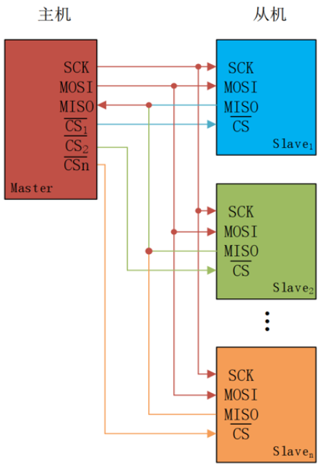
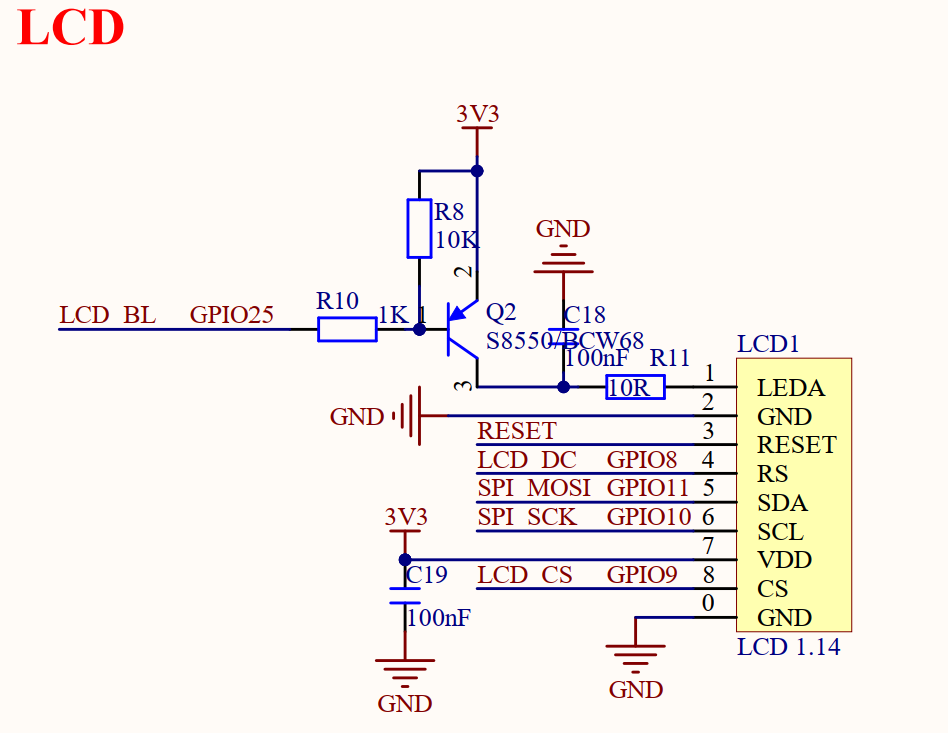
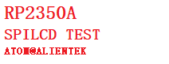

# SPI-LCD实验

## 前言

本章，我们将学习RP2350的硬件SPI接口，将会大家如何使用SPI接口去驱动LCD屏。
在本章中，实现和 LCD 屏之间的通信，实现 ASCII 字符、彩色的显示。

## SPI 及 LCD 介绍

### 1，SPI 简介

SPI， Serial Peripheral interface，顾名思义，就是串行外围设备接口，是由原摩托罗拉公司在其 MC68HCXX 系列处理器上定义的。 SPI 是一种高速的全双工、同步、串行的通信总线，已经广泛应用在众多 MCU、存储芯片、 AD 转换器和 LCD 之间。
SPI 通信跟 IIC 通信一样，通信总线上允许挂载一个主设备和一个或者多个从设备。为了跟从设备进行通信，一个主设备至少需要 4 跟数据线，分别为：
1. MOSI（Master Out / Slave In）：主数据输出，从数据输入，用于主机向从机发送数据。
2. MISO（Master In / Slave Out）：主数据输入，从数据输出，用于从机向主机发送数据。
3. SCLK（Serial Clock）：时钟信号，由主设备产生，决定通信的速率。
4. CS（Chip Select）：从设备片选信号，由主设备产生，低电平时选中从设备。多从机SPI通信网络连接如下图所示。



从上图可以知道，MOSI、MISO、SCLK引脚连接SPI总线上每一个设备，如果CS引脚为低电平，则从设备只侦听主机并与主机通信。 SPI主设备一次只能和一个从设备进行通信。如果主设备要和另外一个从设备通信，必须先终止和当前从设备通信，否则不能通信。

### 2，LCD介绍
RP2350A最小系统板板载1.14英寸高清SPI-LCD显示屏，其分辨率为 135RGB×240 像素（RGB 垂直条纹排列），4线SPI。该显示屏采用 ST7789V2作为驱动芯片，其内置RAM无需外部驱动器或存储器。
RP2350A芯片仅需通过SPI接口即可轻松驱动此显示屏。该屏幕通过8个引脚与 PCB 电路连接。引脚详细描述，如下表所示。

序号   | 名称	            | 说明
----  |---------------------|------------------------------------
  1   | LEDA | 背光正极
  2   | GND  | 地
  3   | RESET  | 复位（低电平有效）
  4   | RS  | 数据 / 命令选择（H = 数据，L = 命令）
  5   | SDA | SPI 数据输入 / 输出
  6   | SCL  | SPI 时钟
  7   | VDD  | 电源（2.5V~3.3V）
  8   | CS  | 片选（低电平使能）

1.14寸LCD屏在四线SPI通讯模式下，仅需四根信号线（CS、 SCL、 SDA、 RS（DC））就能够驱动。

## 硬件设计

### 例程功能

1. 本章实验功能简介：按下复位之后，就可以看到 SPI LCD 模块不停的显示一些信息并不断切换底色。 LED闪烁用于提示程序正在运行。

### 硬件资源

1. LED:
LED-GPIO3
2. 正点原子1.14寸SPI LCD模块

### 原理图

1.14寸LCD与板载MCU的连接原理图，如下图所示：



## 程序设计

### SPI LCD函数解析

对于使用SPI接口进行通信的LCD屏幕来说，PICO-SDK提供了丰富的SPI接口函数，开发者可以在```pico-sdk\src\rp2_common\hardware_spi```路径下找到相关的spi.c和spi.h文件。在spi.h头文件中，你可以找到RP2350A的所有SPI函数定义。接下来，作者将介绍一些常用的SPI函数，这些函数的描述及其作用如下：

#### SPI初始化函数

该函数的作用是对指定的SPI（Serial Peripheral Interface，串行外设接口）实例进行初始化，同时设置其波特率,其函数原型如下所示：

```
uint spi_init(spi_inst_t *spi, uint baudrate)
```

【参数】

1. spi_inst_t *spi: spi_inst_t类型的指针，用于指定要初始化的SPI实例
2. uint baudrate: 一个uint类型的参数，用于指定期望的波特率

【返回值】

1. baud：函数最终返回实际设置的波特率

#### 设置SPI数据传输格式函数

该函数用于设置SPI（串行外设接口）实例的数据传输格式,其函数原型如下所示：

```
void spi_set_format(spi_inst_t *spi, uint data_bits, spi_cpol_t cpol, spi_cpha_t cpha, __unused spi_order_t order)
```

【参数】

1. spi_inst_t *spi: 这是一个 spi_inst_t 类型的指针spi以指定要配置的SPI实例
2. uint data_bits: 数据位宽
3. spi_cpol_t cpol:时钟极性
4. spi_cpha_t cpha:时钟相位
5. spi_order_t order:数据传输顺序

【返回值】

1. 无

#### SPI数据写入函数

该函数用于通过 SPI（串行外设接口）以阻塞方式向外部设备写入数据。该函数会持续等待，直到数据成功写入SPI总线，并且会处理写入过程中的一些状态和异常情况,其函数原型如下所示：

```
int spi_write_blocking(spi_inst_t *spi, const uint8_t *src, size_t len)
```

【参数】

1. spi_inst_t *spi: 这是一个 spi_inst_t 类型的指针spi以指定要配置的SPI实例
2. const uint8_t *src: 指向 uint8_t 类型的常量指针 src 用于指定要写入的数据的源地址
3. size_t len: size_t 类型的参数 len 用于指定要写入的数据长度

【返回值】

1. (int)len:实际写入的数据长度

#### SPI数据写入函数

该函数用于通过 SPI（串行外设接口）以阻塞方式向外部设备写入数据。该函数会持续等待，直到数据成功写入SPI总线，并且会处理写入过程中的一些状态和异常情况,其函数原型如下所示：

```
int spi_write_blocking(spi_inst_t *spi, const uint8_t *src, size_t len)
```

【参数】

1. spi_inst_t *spi: 这是一个 spi_inst_t 类型的指针spi以指定要配置的SPI实例
2. const uint8_t *src: 指向 uint8_t 类型的常量指针 src 用于指定要写入的数据的源地址
3. size_t len: size_t 类型的参数 len 用于指定要写入的数据长度

【返回值】

1. (int)len:实际写入的数据长度

### SPI LCD驱动解析

在SDK版本的11_spilcd例程中，作者在```11_spilcd\BSP```路径下新增了一个LCD文件夹，用于存放lcd.c和lcd.h以及 lcdfont.h 这三个文件。其中，lcd.h文件负责声明LCD相关的函数和变量，lcd.c文件则实现了LCD的驱动代码,而 lcdfont.h 头文件存放了4 种字体大小不一样的ASCII字符集（12x12、 16x16、 24x24 和 32x32）。这个跟oledfont.h头文件一样的，只是这里多了32x32的ASCII字符集。下面，我们将详细解析这两个文件的实现内容。

#### 1，lcd.h文件

```
/* 引脚定义 */
#define LCD_NUM_BL      25
#define LCD_NUM_WR      8
#define LCD_NUM_CS      9

/* IO操作 */
#define LCD_WR(x)       do{ x ? \
                            (gpio_put(LCD_NUM_WR, 1)):    \
                            (gpio_put(LCD_NUM_WR, 0));    \
                        }while(0)

#define LCD_CS(x)       do{ x ? \
                            (gpio_put(LCD_NUM_CS, 1)):    \
                            (gpio_put(LCD_NUM_CS, 0));    \
                        }while(0)

#define LCD_PWR(x)       do{ x ? \
                            (gpio_put(LCD_NUM_BL, 1)):    \
                            (gpio_put(LCD_NUM_BL, 0));    \
                        }while(0)

/* 常用颜色值 */
#define WHITE           0xFFFF      /* 白色 */
#define BLACK           0x0000      /* 黑色 */
#define RED             0xF800      /* 红色 */
#define GREEN           0x07E0      /* 绿色 */
#define BLUE            0x001F      /* 蓝色 */ 
#define MAGENTA         0XF81F      /* 品红色/紫红色 = BLUE + RED */
#define YELLOW          0XFFE0      /* 黄色 = GREEN + RED */
#define CYAN            0X07FF      /* 青色 = GREEN + BLUE */  

/* 非常用颜色 */
#define BROWN           0XBC40      /* 棕色 */
#define BRRED           0XFC07      /* 棕红色 */
#define GRAY            0X8430      /* 灰色 */ 
#define DARKBLUE        0X01CF      /* 深蓝色 */
#define LIGHTBLUE       0X7D7C      /* 浅蓝色 */ 
#define GRAYBLUE        0X5458      /* 灰蓝色 */ 
#define LIGHTGREEN      0X841F      /* 浅绿色 */  
#define LGRAY           0XC618      /* 浅灰色(PANNEL),窗体背景色 */ 
#define LGRAYBLUE       0XA651      /* 浅灰蓝色(中间层颜色) */ 
#define LBBLUE          0X2B12      /* 浅棕蓝色(选择条目的反色) */ 

/* 扫描方向定义 */
#define L2R_U2D         0           /* 从左到右,从上到下 */
#define L2R_D2U         1           /* 从左到右,从下到上 */
#define R2L_U2D         2           /* 从右到左,从上到下 */
#define R2L_D2U         3           /* 从右到左,从下到上 */
#define U2D_L2R         4           /* 从上到下,从左到右 */
#define U2D_R2L         5           /* 从上到下,从右到左 */
#define D2U_L2R         6           /* 从下到上,从左到右 */
#define D2U_R2L         7           /* 从下到上,从右到左 */

#define DFT_SCAN_DIR    L2R_U2D     /* 默认的扫描方向 */

/* LCD信息结构体 */
typedef struct _lcd_obj_t
{
    uint16_t        width;          /* 宽度 */
    uint16_t        height;         /* 高度 */
    uint8_t         dir;            /* 横屏还是竖屏控制：0，竖屏；1，横屏。 */
    uint16_t        wramcmd;        /* 开始写gram指令 */
    uint16_t        setxcmd;        /* 设置x坐标指令 */
    uint16_t        setycmd;        /* 设置y坐标指令 */
    uint16_t        wr;             /* 命令/数据IO */
    uint16_t        cs;             /* 片选IO */
    uint16_t        bl;             /* 背光 */
    uint16_t        rst;            /* 复位 */
} lcd_obj_t;

/* LCD缓存大小设置，修改此值时请注意！！！！修改这两个值时可能会影响以下函数 lcd_clear/lcd_fill/lcd_draw_line */
#define LCD_TOTAL_BUF_SIZE      (240 * 135 * 2)
#define LCD_BUF_SIZE            6480

/* 导出相关变量 */
extern lcd_obj_t lcd_self;
extern uint8_t lcd_buf[LCD_TOTAL_BUF_SIZE];

/* 函数声明 */
void lcd_init(void);                                                                                                    /* 初始化LCD */
void lcd_clear(uint16_t color);                                                                                         /* 清屏函数 */
void lcd_scan_dir(uint8_t dir);                                                                                         /* 设置LCD的自动扫描方向(对RGB屏无效) */
void lcd_write_cmd(uint8_t cmd);                                                                                        /* 设置LCD的自动扫描方向 */
void lcd_write_data(const uint8_t data[], int len);                                                                     /* 发送数据到LCD */
void lcd_write_data16(uint16_t data);                                                                                   /* 发送16位数据到LCD */
void lcd_set_cursor(uint16_t xpos, uint16_t ypos);                                                                      /* 设置光标的位置 */
void lcd_set_window(uint16_t xstar, uint16_t ystar,uint16_t xend,uint16_t yend);                                        /* 设置窗口大小 */
void lcd_fill(uint16_t sx, uint16_t sy, uint16_t ex, uint16_t ey, uint16_t color);                                      /* 在指定区域内填充单个颜色 */
void lcd_show_num(uint16_t x, uint16_t y, uint32_t num, uint8_t len, uint8_t size, uint16_t color);                     /* 显示len个数字 */
void lcd_show_xnum(uint16_t x, uint16_t y, uint32_t num, uint8_t len, uint8_t size, uint8_t mode, uint16_t color);      /* 扩展显示len个数字 */
void lcd_show_string(uint16_t x, uint16_t y, uint16_t width, uint16_t height, uint8_t size, char *p, uint16_t color);   /* 显示字符串 */
void lcd_draw_rectangle(uint16_t x0, uint16_t y0, uint16_t x1, uint16_t y1,uint16_t color);                             /* 画一个矩形 */
void lcd_draw_hline(uint16_t x, uint16_t y, uint16_t len, uint16_t color);                                              /* 画水平线 */
void lcd_draw_line(uint16_t x1, uint16_t y1, uint16_t x2, uint16_t y2,uint16_t color);                                  /* 画线函数(直线、斜线) */
void lcd_draw_pixel(uint16_t x, uint16_t y, uint16_t color);                                                            /* 绘画一个像素点 */
void lcd_show_char(uint16_t x, uint16_t y, uint8_t chr, uint8_t size, uint8_t mode, uint16_t color);                    /* 在指定位置显示一个字符 */
```

#### 2，lcd.c文件

```
/**
 * @brief       发送命令到LCD，使用轮询方式阻塞等待传输完成(由于数据传输量很少，因此在轮询方式处理可提高速度。使用中断方式的开销要超过轮询方式)
 * @param       cmd 传输的8位命令数据
 * @retval      无
 */
void lcd_write_cmd(uint8_t cmd)
{
    LCD_WR(0);
    LCD_CS(0);
    spi_write_blocking(SPI_PORT, &cmd, 1);
    LCD_CS(1);
}

/**
 * @brief       发送数据到LCD，使用轮询方式阻塞等待传输完成(由于数据传输量很少，因此在轮询方式处理可提高速度。使用中断方式的开销要超过轮询方式)
 * @param       data 传输的8位数据
 * @retval      无
 */
void lcd_write_data(const uint8_t data[], int len)
{
    LCD_WR(1);
    LCD_CS(0);
    spi_write_blocking(SPI_PORT, data, len);
    LCD_CS(1);
}

/*...中间省略部分代码...*/

/**
 * @brief       LCD初始化
 * @param       无
 * @retval      无
 */
void lcd_init(void)
{
   int cmd = 0;
   
   lcd_self.dir = 0;
   lcd_self.wr = LCD_NUM_WR;              /* 配置WR引脚 */
   lcd_self.cs = LCD_NUM_CS;              /* 配置CS引脚 */
   lcd_self.bl = LCD_NUM_BL;              /* 配置BL引脚 */

   /* WR管脚 */
   gpio_init(lcd_self.wr);                /* 设置GPIO引脚 */
   gpio_pull_up(lcd_self.wr);             /* 使能GPIO引脚上拉 */
   gpio_set_dir(lcd_self.wr, GPIO_OUT);   /* 设置GPIO引脚方向 */

   /* BL管脚 */
   gpio_init(lcd_self.bl);                /* 设置GPIO引脚 */
   gpio_pull_down(lcd_self.bl);           /* 使能GPIO引脚下拉 */
   gpio_set_dir(lcd_self.bl, GPIO_OUT);   /* 设置GPIO引脚方向 */

   /* CS管脚 */
   gpio_init(lcd_self.cs);                /* 设置GPIO引脚 */
   gpio_pull_up(lcd_self.cs);             /* 使能GPIO引脚上拉 */
   gpio_set_dir(lcd_self.cs, GPIO_OUT);   /* 设置GPIO引脚方向 */

   LCD_CS(1);
   LCD_WR(1);
   sleep_ms(200);

   /* 1.14寸lcd屏幕初始化序列 */
   lcd_init_cmd_t ili_init_cmds[] =
   {
       {0x11, {0}, 0x80},
       {0x36, {0x70}, 1},
       {0x3A, {0x05}, 1},
       {0xB2, {0x0C, 0x0C, 0x00, 0x33, 0x33}, 5},
       {0xB7, {0x35}, 1},
       {0xBB, {0x19}, 1},
       {0xC0, {0x2C}, 1},
       {0xC2, {0x01}, 1},
       {0xC3, {0x12}, 1},
       {0xC4, {0x20}, 1},
       {0xC6, {0x01}, 1},
       {0xD0, {0xA4,0xA1}, 2},
       {0xE0, {0xD0, 0x04, 0x0D, 0x11, 0x13, 0x2B, 0x3F, 0x54, 0x4C, 0x18, 0x0D, 0x0B, 0x1F, 0x23}, 14},
       {0xE1, {0xD0, 0x04, 0x0C, 0x11, 0x13, 0x2C, 0x3F, 0x44, 0x51, 0x2F, 0x1F, 0x1F, 0x20, 0x23}, 14},
       {0x21, {0}, 0x80},
       {0x29, {0}, 0x80},
       {0, {0}, 0xff},
   };

   /* 发送初始化序列 */
   while (ili_init_cmds[cmd].databytes != 0xff)
   {
       lcd_write_cmd(ili_init_cmds[cmd].cmd);
       lcd_write_data(ili_init_cmds[cmd].data, ili_init_cmds[cmd].databytes & 0x1F);
       
       if (ili_init_cmds[cmd].databytes & 0x80)
       {
           sleep_ms(120);
       }
       
       cmd++;
   }

   lcd_display_dir(1);                                             /* 设置屏幕方向 */
   lcd_clear(WHITE);                                               /* 清屏 */
   lcd_on();
}
```
在上述代码中，lcd_write_cmd()和lcd_write_data()在调用spi的驱动函数前，按照LCD时序图，前者需要先将WR引脚电平信号置0，后者则需要置1。通过上面介绍的驱动函数就能够与SPILCD模块进行通讯了，而在SPILCD模块的显示屏上显示出特定的图案或字符或设置SPILCD模块的显示方向等等的操作都是能够通过 SPILCD模块规定的特定命令来完成的，想深究的读者可以产看正点原子SPILCD模块的用户手册或查看实际使用的SPILCD模块的相关文档。

### CMakeLists.txt文件

打开本章节的实验（11_spilcd），在整个工程文件下包含了一个CMakeLists.txt文件。关于该实验的CMakeLists.txt文件的具体内容与上一章节并没有什么太大的不同，因此不再赘述。
###  实验应用代码

打开main.c文件，该文件定义了工程入口函数，名为main。该函数代码如下。
```
/**
 * @brief       程序入口
 * @param       无
 * @retval      无
 */
int main()
{
    uint8_t x = 0;

    stdio_init_all();       /* 初始化标准库 */
    led_init();             /* 初始化LED */
    spi1_init();            /* 初始化SPI1 */
    lcd_init();             /* 初始化LCD */

    while (1) 
    {
        switch (x)
        {
            case 0:
            {
                lcd_clear(WHITE);
                break;
            }
            case 1:
            {
                lcd_clear(BLACK);
                break;
            }
            case 2:
            {
                lcd_clear(BLUE);
                break;
            }
            case 3:
            {
                lcd_clear(RED);
                break;
            }
            case 4:
            {
                lcd_clear(MAGENTA);
                break;
            }
            case 5:
            {
                lcd_clear(GREEN);
                break;
            }
            case 6:
            {
                lcd_clear(CYAN);
                break;
            }
            case 7:
            {
                lcd_clear(YELLOW);
                break;
            }
            case 8:
            {
                lcd_clear(BRRED);
                break;
            }
            case 9:
            {
                lcd_clear(GRAY);
                break;
            }
            case 10:
            {
                lcd_clear(LGRAY);
                break;
            }
            case 11:
            {
                lcd_clear(BROWN);
                break;
            }
        }

         lcd_show_string(0, 0, 240, 32, 32, "RP2350A", RED);
         lcd_show_string(0, 33, 240, 24, 24, "SPILCD TEST", RED);
         lcd_show_string(0, 60, 240, 16, 16, "ATOM@ALIENTEK", RED);
        x++;

        if (x == 12)
        {
            x = 0;
        }

        LED_TOGGLE();
        sleep_ms(500);
    }
}
```
从上面的代码中可以看出，在初始化完LCD后，便在LCD上显示一些本实验的相关信息，随后便每间隔500毫秒就更换一次LCD屏幕显示的背景色。

## 下载验证

在完成编译和烧录操作后，可以看到SPI LCD上不断变换着不同的颜色，LED灯闪烁。




