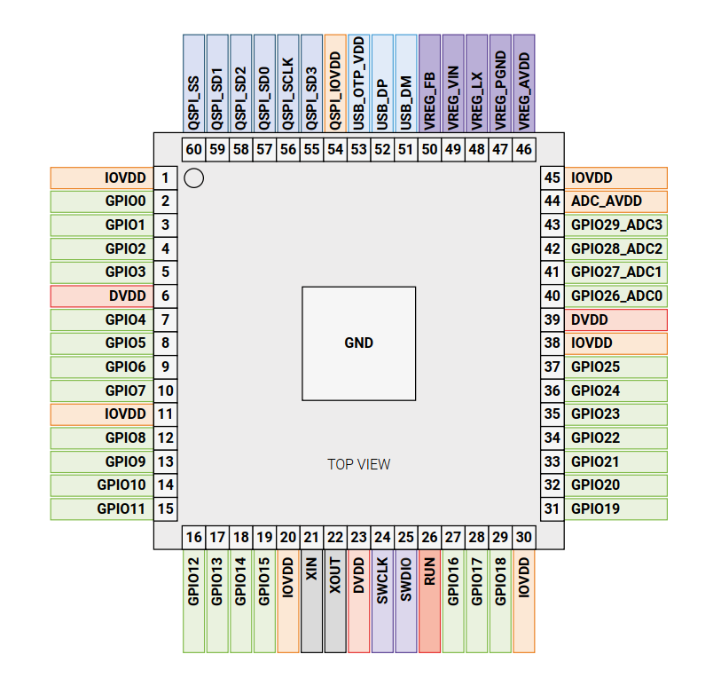
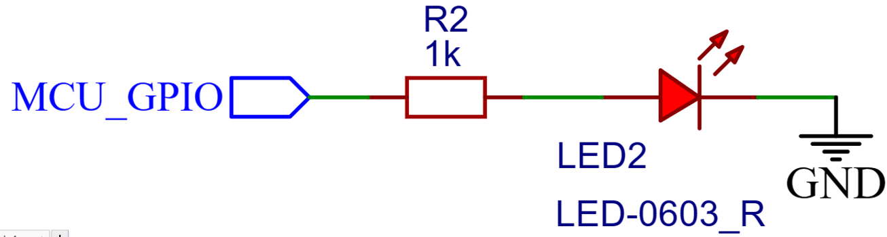
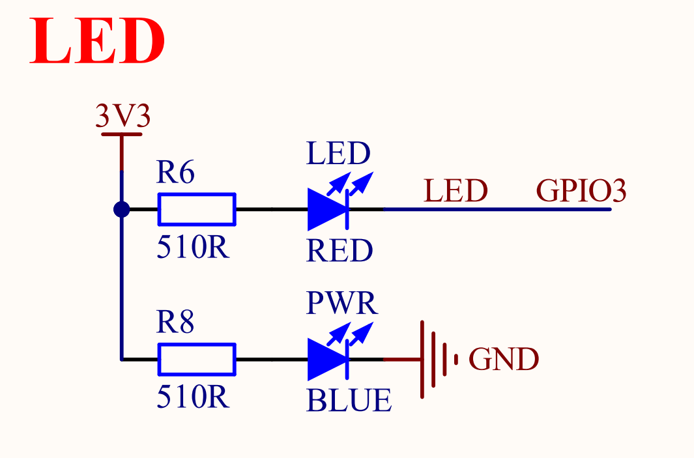

# LED实验

## 前言

本章将通过一个经典的点灯实验，带大家开启Raspberry Pi PICO-SDK 开发之旅。通过本章学习，我
们将会学习到如何实现 RP2350A 的 IO 作为输出功能。 

## GPIO & LED简介

### GPIO简介

GPIO是负责控制或采集外部器件信息的外设，主要负责输入输出功能。RP2350最多有54个多功能通用输入/输出（GPIO）引脚，分为两组：QFN-60封装中的```Bank 0``` 30个用户GPIO（RP2350A），或QFN-80封装中的48个用户GPIO ```Bank 1``` 6个QSPI IO，以及USB DP/DM引脚，以下我们展示的是RP2350A的引脚分布图：



从上面的图示中可见，绿色区域的管脚均可作为普通的IO端口使用。因此，在控制LED灯时，我们可以自由选择任意一个管脚进行操作。但需要开发者在操作过程中参考相关技术手册，以规避潜在的问题。在正点原子的DNRP2350AM开发板中，芯片的GPIO3被用来连接LED的负极，因此在本章的实验中，我们将主要对GPIO3进行操作。

### LED简介

LED，即发光二极管，其发光原理基于半导体的特性。在半导体中，有两类重要的载流子：电子，主要存在于n型半导体中；而空穴，则主要存在于p型半导体中。当n型半导体与p型半导体材料接触时，它们的交界处会形成一个特殊的层结。当对这个层结施加适当的电压时，层结中的空穴与电子会发生重组，并释放出能量。这些能量会以光子的形式被释放出来，从而产生可见光。这就是LED发光的基本原理。

#### 1，LED灯驱动原理

LED驱动是指通过稳定的电源为LED提供适宜的电流和电压，确保其正常发光。LED驱动方式主要有恒流和恒压两种，其中，恒流驱动因其能限定电流而备受青睐。由于LED灯对电流变化极为敏感，一旦电流超过其额定值，可能导致损坏。因此，恒流驱动通过确保电流的稳定性，进而保障LED的安全运行。

#### 2，LED灯驱动方式

下面，我们来看一下LED两种驱动方式：

（1）灌入电流接法。指的是LED的供电电流是由外部提供电流，将电流灌入我们的MCU；风险是当外部电源出现变化时，会导致MCU的引脚烧坏。其接法如下图所示：


（2）输出电流接法。指的是由MCU提供电压电流，将电流输出给LED；如果使用 MCU的GPIO 直接驱动 LED，则驱动能力较弱，可能无法提供足够的电流驱动 LED。其接法如下图所示：



DNRP2350AM开发板上的LED采用灌入电流接法，这种方式避免了MCU直接提供电压电流来驱动LED，从而有效减轻了MCU的负载。这使得MCU能够更加专注于执行其他核心任务，进而提升了整体系统的性能和稳定性。

## 硬件设计

### 例程功能

1. LED灯以500ms的频率交替闪烁。  

### 硬件资源

1. LED：
     LED-GPIO3

### 原理图

本章实验内容，需要控制LED灯以500ms的频率交替闪烁，正点原子DNRP2350AM开发板上LED的连接原理图，如下图所示：  



通过以上原理图可以看出，LED中对应的GPIO编号为GPIO3，且都是当GPIO输出低电平时LED亮起，当GPIO输出高电平时LED熄灭。

## 程序设计

### GPIO函数解析

PICO-SDK提供了丰富的GPIO操作函数，开发者可以在```pico-sdk\src\rp2_common\hardware_gpio```路径下找到相关的gpio.c和gpio.h文件。在gpio.h头文件中，你可以找到RP2350A的所有GPIO函数定义。接下来，作者将介绍一些常用的GPIO函数，这些函数的描述及其作用如下：

#### GPIO初始化函数

该函数用于初始化一个GPIO，其函数原型如下所示：

```gpio_init(uint gpio)```

【参数】

gpio:GPIO引脚号

【返回值】

无

#### GPIO输入输出配置函数

设置单个GPIO方向，其函数原型如下所示：

```gpio_set_dir(uint gpio, bool out)```

【参数】

gpio:GPIO引脚号

out:当该参数置1时，该引脚被设置为输出；当该参数置0时，该引脚被设置为输入。

【返回值】

无

当我们在调用该函数时，可以使用到一些可用的结构体变量，如下所示：

```
	enum gpio_dir {
		GPIO_OUT = 1u, /* 设置GPIO为输出状态 */ 
		GPIO_IN = 0u,  /* 设置GPIO为输入状态 */
	};
```
#### GPIO引脚输出电平配置函数

该函数用于配置某个管脚输出电平，该函数原型如下所示：

```gpio_put(uint gpio, bool value)```

【参数】

gpio:GPIO引脚号

value:当该参数置1时，该引脚被设置为输出高电平；当该参数置0时，该引脚被设置为输出低电平。

【返回值】

无

#### GPIO引脚功能配置函数

设置单个GPIO的功能，其函数原型如下所示：

```pio_set_function(uint gpio, gpio_function_t fn)```

【参数】

gpio:GPIO引脚号

fn:GPIO功能选择。

【返回值】

无

当我们在调用该函数时，可以使用到一些可用的```gpio_function_t```结构体变量，如下所示：

```
	typedef enum gpio_function_rp2350 {
		GPIO_FUNC_HSTX = 0,				/* 选择HSTX作为GPIO引脚功能 */
		GPIO_FUNC_SPI = 1,				/* 选择SPI作为GPIO引脚功能 */ 
		GPIO_FUNC_UART = 2,				/* 选择UART作为GPIO引脚功能 */
		GPIO_FUNC_I2C = 3,				/* 选择I2C作为GPIO引脚功能 */ 
		GPIO_FUNC_PWM = 4,				/* 选择PWM作为GPIO引脚功能 */
		GPIO_FUNC_SIO = 5,				/* 选择SIO作为GPIO引脚功能 */
		GPIO_FUNC_PIO0 = 6,				/* 选择PIO0作为GPIO引脚功能 */
		GPIO_FUNC_PIO1 = 7,				/* 选择PIO1作为GPIO引脚功能 */
		GPIO_FUNC_PIO2 = 8,				/* 选择PIO2作为GPIO引脚功能 */
		GPIO_FUNC_GPCK = 9,				/* 选择GPCK作为GPIO引脚功能 */
		GPIO_FUNC_XIP_CS1 = 9, 				/* 选择XIP_CS1作为GPIO引脚功能 */
		GPIO_FUNC_CORESIGHT_TRACE = 9,			/* 选择CORESIGHT_TRACE作为GPIO引脚功能 */
		GPIO_FUNC_USB = 10,				/* 选择USB作为GPIO引脚功能 */
		GPIO_FUNC_UART_AUX = 11,			/* 选择UART_AUX作为GPIO引脚功能 */
		GPIO_FUNC_NULL = 0x1f,				/* 该引脚不做功能选择 */
	} gpio_function_t;
```
#### GPIO初始化函数

该函数用于初始化一个GPIO，其函数原型如下所示：

```gpio_pull_up(uint gpio)```

【参数】

gpio:GPIO引脚号

【返回值】

无

上述函数，便是本实验所需的核心GPIO函数。对于其他未提及的GPIO函数，我们用到了再去了解。

### LED驱动解析

在SDK版本的01_led例程中，作者在01_led\BSP路径下新增了一个LED文件夹，用于存放led.c和led.h这两个文件。其中，led.h文件负责声明LED相关的函数和变量，而led.c文件则实现了LED的驱动代码。下面，我们将详细解析这两个文件的实现内容。

#### 1，led.h文件

```
/* 引脚定义 */
#define LED_GPIO_PIN    PICO_DEFAULT_LED_PIN    /* LED连接的GPIO端口 */

/* 引脚的输出的电平状态 */
enum GPIO_OUTPUT_STATE
{
    PIN_RESET,
    PIN_SET
};

/* LED端口定义 */
#define LED(x)          do { x ?                                \
                             gpio_put(LED_GPIO_PIN, PIN_SET) :  \
                             gpio_put(LED_GPIO_PIN, PIN_RESET); \
                        } while(0)  /* LED翻转 */

/* LED取反定义 */
#define LED_TOGGLE()    do { gpio_put(LED_GPIO_PIN, !gpio_get(LED_GPIO_PIN)); } while(0)  /* LED翻转 */

/* 函数声明*/
void led_init(void);    /* 初始化LED */

#endif
```

作者编写了LED(x)宏，用于控制GPIO3管脚的电平状态。当x为1时，该宏会设置GPIO3管脚输出高电平；反之，则输出低电平。此外，作者还定义了LED_TOGGLE()宏，它能够实现GPIO3管脚电平状态的快速翻转。这些宏的实现均基于之前小节所介绍的函数，使得对LED的控制变得简洁而高效。

#### 2，led.c文件

```
/**
 * @brief       初始化LED
 * @param       无 
 * @retval      无
 */
void led_init(void)
{
    gpio_init(PICO_DEFAULT_LED_PIN);
    gpio_set_dir(PICO_DEFAULT_LED_PIN, GPIO_OUT);
    LED(1);     /* 关闭LED */
}

```

在led.c文件中，作者先对GPIO功能进行初始化，并设置GPIO为输出模式。Pico-sdk提供了封装好的函数，我们直接调用即可。最后，通过调用LED(x)宏定义，实现了LED灯的关闭操作，即输出了高电平信号。整个流程清晰、简洁，有效地实现了对LED灯的控制。

### CMakeLists.txt文件

打开本章节的实验（01_led），我们发现，在整个工程文件下包含了一个CMakeLists.txt文件。此文件的作用是将BSP文件夹下的驱动程序添加到构建系统中，确保在编译项目工程时能够调用这些驱动程序。下面展示了该驱动CMakeLists.txt文件的具体内容。

```
# Generated Cmake Pico project file

cmake_minimum_required(VERSION 3.13)	/* 确保CMake的最低要求版本为3.13 */

set(CMAKE_C_STANDARD 11)		/* 指定要使用的C语言标准是C11 */
set(CMAKE_CXX_STANDARD 17)		/* 指定要使用的C++语言标准是C++17 */
set(CMAKE_EXPORT_COMPILE_COMMANDS ON)	/* 启用将编译命令导出到 compile_commands.json文件，它对IDE或分析工具很有用 */

/* 以下部分为树莓派PICO-SDK的设置，由VSCode集成，这部分我们可以不用管 */
# Initialise pico_sdk from installed location	
# (note this can come from environment, CMake cache etc)

# == DO NOT EDIT THE FOLLOWING LINES for the Raspberry Pi Pico VS Code Extension to work ==
if(WIN32)
    set(USERHOME $ENV{USERPROFILE})
else()
    set(USERHOME $ENV{HOME})
endif()
set(sdkVersion 2.1.0)
set(toolchainVersion 13_3_Rel1)
set(picotoolVersion 2.1.0)
set(picoVscode ${USERHOME}/.pico-sdk/cmake/pico-vscode.cmake)
if (EXISTS ${picoVscode})
    include(${picoVscode})
endif()
# ====================================================================================
set(PICO_BOARD pico2 CACHE STRING "Board type")	/* 启用将编译命令导出到 compile_commands.json文件，它对IDE或分析工具很有用 */

# Pull in Raspberry Pi Pico SDK (must be before project)
include(pico_sdk_import.cmake)

project(01_led C CXX ASM)

# Initialise the Raspberry Pi Pico SDK
pico_sdk_init()

# Add executable. Default name is the project name, version 0.1
#①这一部分为自行添加，目的在于：方便编译软件在添加组件后能够正常遍历组件目录下存放的驱动文件，从而避免编译失败
file(GLOB_RECURSE SRC_FILES BSP/*.c)
add_executable(01_led main.c ${SRC_FILES})

pico_set_program_name(01_led "01_led")
pico_set_program_version(01_led "0.1")

# Modify the below lines to enable/disable output over UART/USB
pico_enable_stdio_uart(01_led 1)
pico_enable_stdio_usb(01_led 1)

②设置依赖库
# Add the standard library to the build
target_link_libraries(01_led
        pico_stdlib)

# Add the standard include files to the build
target_include_directories(01_led PRIVATE
  ${CMAKE_CURRENT_LIST_DIR}
)

pico_add_extra_outputs(01_led)
```
从上述描述中，我们需要在①处添加相应的源文件。以本章节实验为例，在BSP文件夹下仅有一个LED驱动，因此我们需要在①的位置引入该LED驱动。而所提到的，是LED驱动所依赖的PICO-SDK中的具体驱动库。本实验中的LED驱动调用gpio.c和gpio.h文件下的函数实现的，这些文件均位于```pico-sdk\src\rp2_common\hardware_gpio```文件夹中，因此我们可以确定LED驱动所依赖的是pico_stdlib库，因此我们需要在②处添加相应的依赖库。通过这样的依赖关系，我们可以确保LED驱动的正确集成和调用。


###  实验应用代码

打开main.c文件，该文件定义了工程入口函数，名为main。该函数代码如下。
```
/**
 * @brief       程序入口
 * @param       无
 * @retval      无
 */
int main()
{
    stdio_init_all();       /* 初始化标准库 */
    led_init();             /* 初始化LED */

    while (1) 
    {
        LED_TOGGLE();
        sleep_ms(500);      /* 延时500ms */
    }
}
```
上述应用代码中，作者首先通过调用stdio_init_all函数来初始化标准库。紧接着，代码调用led_init函数来初始化LED。在随后的while循环中，利用LED_TOGGLE()宏定义来定期翻转LED的电平状态，每次翻转间隔为500毫秒，从而实现了LED的闪烁效果。

## 下载验证

下载完之后，可以看到 LED（红灯）以每次500ms闪烁。


