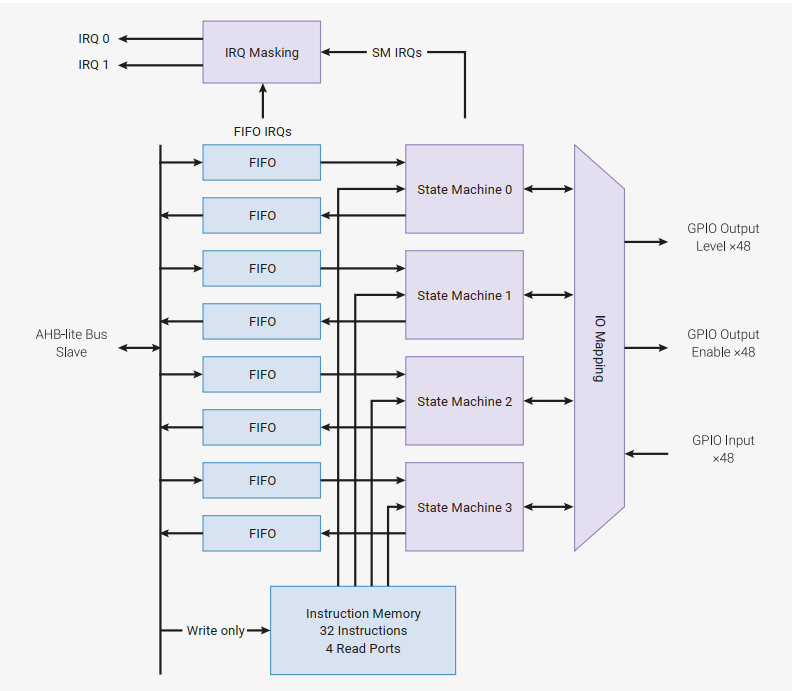
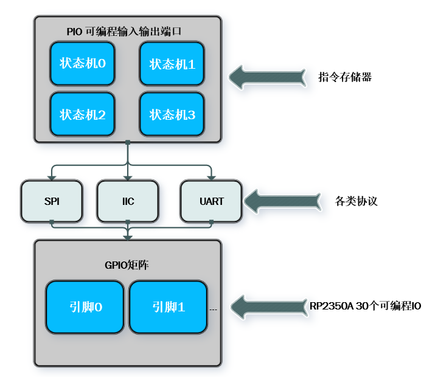

# PIO实验

## 前言

本章将介绍独具创新性的可编程I/O（PIO）架构，这一设计不仅实现了硬件级并行处理能力，更使其在嵌入式开发领域展现出与传统微控制器截然不同的技术优势。通过本章的学习，开发者将学习到可编程I/O(PIO)的使用。

## PIO简介

学习PIO前，我们先来了解关于它的一些基础概念。

#### 1，可编程I/O的基础概念

RP2350集成三个完全独立的可编程I/O（PIO）模块。每个PIO模块均通过专用通道与总线架构、通用输入输出（GPIO）接口及中断控制器实现物理直连。单个PIO块的示意图如下图所示：



RP2350集成三个完全独立的PIO模块，每个模块配备四个可编程状态机。四个状态机可并行执行来自共享指令存储器的程序，通过先进先出（FIFO）数据队列实现PIO模块与系统总线间的数据缓冲传输。创新的GPIO映射逻辑支持每个状态机独立监控及驱动多达32个通用输入输出（GPIO）引脚。

#### 2，状态机

这是RP2350的一个特殊外设，可以基于RP2350的设备上创建新的或者额外的硬件接口。



PIO其本质接近FPGA，通过状态机来模拟各种协议接口，当然前提是满足对应的时钟频率。

其具体应用场景有：

场景一：硬件外设的协议适配困境
当目标系统需实现特定通信协议（如高速串行传输或定制化数据交互），而片上现有硬件模块（如SPI、I2C控制器）因架构限制无法满足时序精度或带宽需求。

场景二：非标接口的硬件支持缺失
当项目需集成特殊功能接口（如单总线传感器协议、VGA视频信号生成、DVI数字显示输出等），而微控制器原生外设资源中缺乏对应硬件加速单元。

面对上述场景，RP2350A的可编程I/O（PIO）的优势便体现出来了。其通过硬件状态机与精简指令集架构，允许开发者以硬件重构的方式自主定义接口逻辑，精准实现各类协议时序控制。另外，不同于软件模拟，PIO并不会占用内核时间。

## 硬件设计

### 例程功能

1. 通过PIO模拟GPIO,控制LED灯的亮灭。实现现象与LED实验无异。

### 硬件资源

1. LED：
     LED-GPIO3
2. PIO：
	 pio0


### 原理图

本章实验使用的定时器为RP2350A的片上资源，因此并没有相应的连接原理图。

## 程序设计

### PIO函数解析

Pico-sdk提供了一套API来配置PIO。那么下面作者将介绍一下在实验中调用到的API函数：

#### PIO加载程序

该函数是RP2350的 PIO 子系统的一部分，用于向 PIO 实例添加程序，其函数原型如下所示：

```int pio_add_program(PIO pio, const pio_program_t *program)```

【参数】

PIO pio：指向 PIO 实例的指针。

const pio_program_t *program：指向要添加的 PIO 程序的指针。

【返回值】

程序在 PIO 指令存储器中的偏移量（非负整数），失败时触发断言（根据注释）。

#### LED程序初始化

这一部分需要着重讲一下。该函数是有存放在工程目录下的```led.pio```文件生成的。这个文件是由汇编语言编写而成，用于实现LED控制的底层逻辑。当工程进行编译后，系统会根据存放在工程路径下的汇编文件生成```led_program_init()```的C语言代码并存放在```bulid```文件目录下，生成后的文件名称为```led.pio.h```。汇编语言整体部分如下所示：

```
.pio_version 0 // only requires PIO version 0

.program led

; Repeatedly get one word of data from the TX FIFO, stalling when the FIFO is
; empty. Write the least significant bit to the OUT pin group.

loop:
    pull
    out pins, 1
    jmp loop

% c-sdk {
static inline void led_program_init(PIO pio, uint sm, uint offset, uint pin) {
    pio_sm_config c = led_program_get_default_config(offset);

    // Map the state machine's OUT pin group to one pin, namely the `pin`
    // parameter to this function.
    sm_config_set_out_pins(&c, pin, 1);
    // Set this pin's GPIO function (connect PIO to the pad)
    pio_gpio_init(pio, pin);
    // Set the pin direction to output at the PIO
    pio_sm_set_consecutive_pindirs(pio, sm, pin, 1, true);

    // Load our configuration, and jump to the start of the program
    pio_sm_init(pio, sm, offset, &c);
    // Set the state machine running
    pio_sm_set_enabled(pio, sm, true);
}
%}
```

上述 PIO 汇编程序```led.pio```是整个 PIO 编程体系中不可或缺的部分。它定义了状态机执行的底层指令，控制硬件的具体行为。在树莓派 PICO 的 PIO 编程模型中，C 代码负责初始化和配置，而实际的硬件操作是由 PIO 汇编程序定义的。

#### 1.为什么需要 PIO 汇编程序？

	硬件级控制：PIO 汇编允许直接控制 GPIO 引脚，实现精确的时序操作，这是普通 C 代码难以做到的。

	并行执行：PIO 状态机可以独立于 CPU 运行，不占用主处理器资源。

#### 2.PIO 汇编与 C 代码的关系

	C 代码：负责初始化 PIO 系统、加载程序、配置状态机参数（如时钟分频、引脚映射等）。

	PIO 汇编：定义具体的硬件操作逻辑，如引脚电平控制、数据移位、条件跳转等。

#### 3.代码生成流程

在构建过程中，led.pio 文件会通过 Pico-sdk 提供的工具（如 pioasm）编译为 C 头文件（如 led.pio.h），其中包含：

	指令序列的机器码

	程序长度和偏移量
	
	初始化函数(如： led_program_init())

#### 4.如果没有PIO汇编程序会怎样？

	没有 led.pio，就没有定义 LED 闪烁的核心逻辑，C 代码将无法完成以下操作：

	控制 GPIO 引脚输出高低电平

	实现精确的延时

	构建无限循环逻辑

通俗来说，PIO 汇编程序视为一个 "微型程序"，它运行在 PIO 硬件中，而 C 代码则是这个 "微型程序" 的加载器和配置器。两者结合才能实现完整的功能。

介绍了```led_program_init()```的来龙去脉，作者接下来讲解一下该函数的一些参数，该函数原型如下所示：

```static inline void led_program_init(PIO pio, uint sm, uint offset, uint pin)```

【参数】

pio：指定使用哪个 PIO 实例（pio0 或 pio1）

sm：指定使用哪个状态机（0-3 共 4 个状态机）

offset：PIO 程序在指令内存中的起始偏移量

pin：连接 LED 的 GPIO 引脚号

【返回值】

无

#### 向PIO状态机写入数据

这是向 PIO 状态机的 Tx FIFO 写入数据的一个阻塞式函数。其函数原型如下所示：

```static inline void pio_sm_put_blocking(PIO pio, uint sm, uint32_t data)```

【参数】

pio：指定使用哪个 PIO 实例（pio0 或 pio1）

sm：指定使用哪个状态机（0-3 共 4 个状态机）

data：要写入到状态机 Tx FIFO 的 32 位数据。

【返回值】

无

#### 清理和释放 PIO 状态机资源

该函数用于清理和释放 PIO 系统中已分配的资源，确保系统状态恢复到使用前。这个函数通常在程序结束或不再需要特定 PIO 程序时调用。其函数原型如下所示：

```void pio_remove_program_and_unclaim_sm(const pio_program_t *program, PIO pio, uint sm, uint offset)```

【参数】

program：指向 pio_program_t 结构的指针，表示要移除的 PIO 程序。

pio：指定使用哪个 PIO 实例（pio0 或 pio1）

sm：指定使用哪个状态机（0-3 共 4 个状态机）

offset：程序在 PIO 指令内存中的起始偏移量

【返回值】

无

### PIO 驱动解析

由于该例程依赖于PIO的汇编语言，并没有像之前的例程一样添加属于PIO的驱动文件，而关于 PIO的汇编语言内容在前面的章节已经介绍过了，因此在此不再赘述。

### CMakeLists.txt文件

打开本章节的实验（05_pio），在整个工程文件下包含了一个CMakeLists.txt文件。关于该实验的CMakeLists.txt文件的具体内容与上一章节并没有什么太大的不同，因此不再赘述。

###  实验应用代码

打开main.c文件，该文件定义了工程入口函数，名为main。该函数代码如下。
```
#define PIO_INSTANCE0   pio0                    /* 选择使用的 PIO 实例 */
#define STATE_MACHINE   0                       /* 选择使用的状态机编号 */
#define PIO_PIN         PICO_DEFAULT_LED_PIN    /* 选择 LED 引脚 */

/**
 * @brief       程序入口
 * @param       无
 * @retval      无
 */
int main()
{
    stdio_init_all();                           /* 初始化标准库 */
    
    /* 查找空闲的 PIO 状态机并加载 PIO 程序 */
    int offset = pio_add_program(PIO_INSTANCE0, &led_program);
    led_program_init(PIO_INSTANCE0, STATE_MACHINE, offset, PIO_PIN);

    while (getchar_timeout_us(0) == PICO_ERROR_TIMEOUT)   /* 循环控制 LED 闪烁 */
    {
        /* 点亮 LED */
        pio_sm_put_blocking(PIO_INSTANCE0, STATE_MACHINE, 1);
        sleep_ms(500);

        /* 熄灭 LED */
        pio_sm_put_blocking(PIO_INSTANCE0, STATE_MACHINE, 0);
        sleep_ms(500);
    }
    pio_remove_program_and_unclaim_sm(&led_program, PIO_INSTANCE0, STATE_MACHINE, offset);
}
```
本实验通过pio_add_program()将编写好的PIO汇编程序加载到硬件PIO模块，led_program_init()完成状态机配置，确保GPIO引脚和PIO指令正确关联，再利用PIO状态机的FIFO队列传递控制信号（1或0），由PIO程序直接操作GPIO电平，最后在退出前需释放状态机和PIO程序占用的硬件资源，避免内存泄漏或硬件冲突。

## 下载验证

程序下载后，可以看见LED灯以500ms的间隔进行闪烁。

