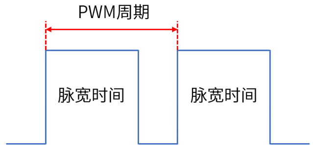
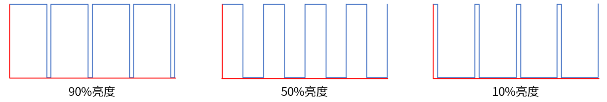

# PWM实验

## 前言

本章，我们将学习看门狗，基于定时器功能，教大家如何用定时器模拟看门狗功能。

## PWM简介

#### 1,PWM原理解析

PWM（Pulse Width Modulation），简称脉宽调制，是一种将模拟信号变为脉冲信号的计数。PWM可以控制LED亮度、直流电机的转速等。
PWM的主要参数如下：
①：PWM频率。PWM频率是PWM信号在1s内从高电平到低电平再回到高电平的次数，也就是说1s内有多少个PWM周期，单位为Hz。
②：PWM周期。PWM周期是PWM频率的倒数，即T=1/f，T是PWM周期，f是PWM频率。如果PWM频率为50Hz，也就是说PWM周期为20ms，即1s由50个PWM周期。
③：PWM占空比。PWM占空比是指在一个PWM周期内，高电平的时间与整个周期时间的比例，取值范围为0%~100%。PWM占空比如下图所示。



PWM周期是一个PWM信号的时间：脉宽时间是指高电平时间；脉宽时间占PWM周期的比例就是占空比。例如，如果PWM周期是10ms，而脉宽时间为8ms，那么PWM占空比就是8/10=80%，此时的PWM信号就是占空比为80%的PWM信号。PWM名为脉冲宽度调制，顾名思义，就是通过调节PWM占空比来调节PWM脉宽时间。
在使用PWM控制LED时，亮1s后灭1s，往复循环，就可以看到LED在闪烁。如果把这个周期缩小到200ms，亮100ms后灭100ms，往复循环，就可以看到LED灯在高频闪烁。继续把这个周期持续缩小，总有一个临界值使人眼分辨不出LED在闪烁，此时LED的亮度处于灭与亮之间亮度的中间值，达到了1/2亮度。PWM占空比和亮度的关系如下图所示。



#### 2,RP2350的PWM介绍

RP2350 的 PWM 模块包含 12 个相同的切片。每个切片可以驱动两个 PWM 输出信号，或测量输入信号的频率或占空比。每个切片上的两个输出具有相同的周期，占空比可以独立变化。

## 硬件设计

### 例程功能

1. LED 由亮到暗，再由暗到亮，依次循环。

### 硬件资源

1. LED:
LED-GPIO3
2. PWM
PWM - PWM_CHAN_B

### 原理图

本章实验使用的定时器为RP2350A的片上资源，因此并没有相应的连接原理图。

## 程序设计

### PWM函数解析

#### PWM默认配置函数

该函数是一个静态内联函数，它的主要功能是创建并返回一个 pwm_config 类型的结构体，该结构体存储了脉宽调制（PWM）的默认配置参数。其函数原型如下所示：

```pwm_config pwm_get_default_config(void)```

【参数】

无

【返回值】

1.c:把配置好的 pwm_config 结构体 c 返回

该函数使用 pwm_config 类型的结构体变量传入，该结构体的定义如下所示：

```
typedef struct {
    uint32_t csr;
    uint32_t div;
    uint32_t top;
} pwm_config;
```

#### 获取PWM切片函数

该函数是一个静态内联函数，其主要目的是根据传入的 GPIO（通用输入输出）引脚编号，返回对应的 PWM（脉冲宽度调制）切片编号。PWM 切片是用于生成 PWM 信号的硬件单元，在某些硬件平台上，每个 GPIO 引脚可能关联到一个特定的 PWM 切片。其函数原型如下所示：

```uint pwm_gpio_to_slice_num(uint gpio)```

【参数】

1.gpio:函数的参数，是一个无符号整数，代表要查询的 GPIO 引脚编号。

【返回值】

1.PWM_GPIO_SLICE_NUM(gpio):这是一个宏或函数，用于根据传入的 GPIO 引脚编号计算并返回对应的 PWM 切片编号。该宏或函数的具体实现依赖于硬件平台的设计。

#### PWM初始化函数

该函数是一个静态内联函数，其作用是对指定的 PWM（脉冲宽度调制）切片进行初始化操作。其函数原型如下所示：

```void pwm_init(uint slice_num, pwm_config *c, bool start)```

【参数】

1.uint slice_num:这是一个无符号整数类型的参数，代表 PWM 切片的编号。在硬件里，PWM 功能一般会被划分成多个切片，每个切片都有独立的控制和配置寄存器。借助这个参数，能够指定要初始化的具体切片。

2.pwm_config *c:这是一个指向 pwm_config 结构体的指针。pwm_config 结构体包含了 PWM 切片的各项配置信息，例如计数器上限、分频系数、控制状态寄存器的值等。通过传入这个指针，函数可以从该结构体中获取配置信息，进而对 PWM 切片进行设置。

3.bool start:这是一个布尔类型的参数，用于决定在初始化完成之后是否立即启动 PWM 切片。若 start 为 true，则在初始化结束后会启动 PWM；若为 false，则不会启动。


【返回值】

1.无

#### 设置PWM时钟分频系数函数

该函数是一个静态内联函数，其用途是为指定的 PWM（脉冲宽度调制）切片设置时钟分频系数。其函数原型如下所示：

```void pwm_set_clkdiv(uint slice_num, float divider)```

【参数】

1.uint slice_num:这是一个无符号整数类型的参数，代表 PWM 切片的编号。在硬件中，PWM 功能通常会被划分成多个切片，每个切片都有独立的控制和配置寄存器。利用这个参数，能够明确要设置时钟分频系数的具体切片。

2.float divider:这是一个浮点数类型的参数，代表要设置的时钟分频系数。时钟分频系数用于对输入的时钟信号进行分频，进而控制 PWM 信号的频率。

【返回值】

1.无

#### 设置PWM环绕值函数

该函数是一个静态内联函数，其主要作用是为指定的 PWM（脉冲宽度调制）切片设置计数器的上限值，也就是所谓的 “环绕值（wrap value）”。其函数原型如下所示：

```void pwm_set_wrap(uint slice_num, uint16_t wrap)```

【参数】

1.uint slice_num:这是一个无符号整数类型的参数，代表 PWM 切片的编号。在硬件设计里，PWM 功能通常会被分割成多个独立的切片，每个切片都有各自的控制和配置寄存器。借助这个参数，就可以明确具体要操作的是哪个 PWM 切片。

2.uint16_t wrap:这是一个无符号 16 位整数类型的参数，它表示要为指定 PWM 切片设置的计数器上限值。当 PWM 计数器的值达到这个上限时，会重新从 0 开始计数，这一过程就是所谓的 “环绕”。

【返回值】

1.无

#### 设置PWM使能/失能函数

该函数是一个静态内联函数，用于控制指定 PWM（脉冲宽度调制）切片的使能或失能状态。其函数原型如下所示：

```void pwm_set_enabled(uint slice_num, bool enabled)```

【参数】

1.uint slice_num:这是一个无符号整数类型的参数，代表 PWM 切片的编号。在硬件系统中，PWM 功能通常被划分为多个独立的切片，每个切片都有自己的控制和配置寄存器。通过该参数可以指定要操作的具体 PWM 切片。

2.bool enabled:这是一个布尔类型的参数，用于指定是否启用该 PWM 切片。如果 enabled 为 true，则启用该 PWM 切片；如果为 false，则禁用该 PWM 切片。

【返回值】

1.无

#### 设置PWM电平值函数

该函数是一个静态内联函数，其主要功能是为指定 PWM（脉冲宽度调制）切片的某个通道设置比较值（也称为电平值），这个比较值会影响 PWM 信号的占空比。其函数原型如下所示：

```void pwm_set_chan_level(uint slice_num, uint chan, uint16_t level)```

【参数】

1.uint slice_num:这是一个无符号整数类型的参数，代表 PWM 切片的编号。在硬件设计中，PWM 功能通常会被分成多个独立的切片，每个切片都有自己的控制和配置寄存器。通过这个参数可以明确要操作的具体 PWM 切片。

2.uint chan:这是一个无符号整数类型的参数，用于指定要操作的 PWM 通道。一般来说，每个 PWM 切片会包含两个通道（通道 A 和通道 B），chan 的值通常为 0 或 1，0 代表通道 A，1 代表通道 B。

3.uint16_t level:这是一个无符号 16 位整数类型的参数，表示要设置的通道比较值。该值会与 PWM 计数器的值进行比较，从而决定 PWM 信号的占空比。

【返回值】

1.无

### PWM驱动解析

在SDK版本的08_pwm例程中，作者在```08_pwm\BSP```路径下新增了一个PWM文件夹，用于存放pwm.c和pwm.h这两个文件。其中，pwm.h文件负责声明PWM相关的函数和变量，而pwm.c文件则实现了PWM的驱动代码。下面，我们将详细解析这两个文件的实现内容。

#### 1，pwm.h文件

```
/* 引脚以及重要参数定义 */
#define LED_PWM_CHB_GPIO       PICO_DEFAULT_LED_PIN    /* LED控制器通道对应GPIO */
#define LED_PWM_CHB_CHANNEL    PWM_CHAN_B              /* LED控制器通道号 */

/* 函数声明 */
void pwm_set_init(uint8_t clk_div, uint16_t freq);      /* 初始化PWM */
void pwm_set_duty(uint16_t duty);                       /* PWM占空比设置 */
```

#### 2，pwm.c文件

```
uint slice_num;

/**
 * @brief       初始化PWM
 * @param       resolution： PWM占空比分辨率
 *              freq： PWM信号频率
 * @retval      无
 */
void pwm_set_init(uint8_t clk_div, uint16_t freq)
{
    pwm_config config = pwm_get_default_config();
    slice_num = pwm_gpio_to_slice_num(LED_PWM_CHB_GPIO);

    pwm_init(slice_num, &config, true);                 /* 初始化PWM，可直接调用 */
    gpio_set_dir(LED_PWM_CHB_GPIO, GPIO_OUT);           /* 设置PWM输出引脚 */
    gpio_set_function(LED_PWM_CHB_GPIO, GPIO_FUNC_PWM); /* 设置引脚为PWM模式 */
    
    pwm_set_clkdiv(slice_num, clk_div);                 /* 设置PWM时钟分频 */
    pwm_set_wrap(slice_num, freq);                      /* 设置PWM的频率，1000Hz */ 
    pwm_set_enabled(slice_num, true);                   /* 使能PWM */
}

/**
 * @brief       PWM占空比设置
 * @param       duty：PWM占空比
 * @retval      无
 */
void pwm_set_duty(uint16_t duty)
{
    pwm_set_chan_level(slice_num, LED_PWM_CHB_CHANNEL, duty);   /* 设置并更新占空比 */
}
```
pwm_set_init()函数的主要功能是对PWM（脉冲宽度调制）进行初始化设置，包括获取默认配置、确定PWM切片编号、初始化PWM、设置GPIO引脚、设置时钟分频、设置PWM频率并最终使能PWM。

pwm_set_duty()函数的主要功能是设置PWM信号的占空比。

### CMakeLists.txt文件

打开本章节的实验（08_pwm），在整个工程文件下包含了一个CMakeLists.txt文件。关于该实验的CMakeLists.txt文件的具体内容与上一章节并没有什么太大的不同，因此不再赘述。
###  实验应用代码

打开main.c文件，该文件定义了工程入口函数，名为main。该函数代码如下。
```
int main()
{
    uint8_t key;
    uint8_t dir = 1;
    uint16_t ledpwmval = 0;

    stdio_init_all();           /* 初始化标准库 */
    led_init();                 /* 初始化LED */
    key_init();                 /* 初始化KEY */
    pwm_set_init(10, 1000);     /* 初始化PWM */

    while (1) 
    {
        sleep_ms(10);           /* 延时10ms */

        if (dir == 1)
        {
            ledpwmval += 5;     /* dir==1 ledpwmval递增 */
        }
        else
        {
            ledpwmval -= 5;     /* dir==0 ledpwmval递减 */
        }

        if (ledpwmval > 1023)
        {
            dir = 0;            /* ledpwmval到达1005后，方向为递减 */
        }

        if (ledpwmval < 5)
        {
            dir = 1;            /* ledpwmval递减到5后，方向改为递增 */
        }

        /* 设置占空比 */
        pwm_set_duty(ledpwmval);
    }
}
```
从上面的代码中可以看到，在初始化PWM后，就不断地改变PWM的值，以达到改变PWM占功比的目的。又因为PWM由GPIO3引脚输出，GPIO3引脚连接至LED，所以LED的亮度也会随之发生变化，从而实现呼吸灯的效果。

## 下载验证

在完成编译和烧录后，可以看到板子上的LED先由暗再逐渐变亮，以此循环，实现了呼吸灯的效果。


