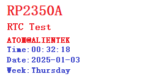

# RTC实验

## 前言

本章介绍RP2350A实时时钟（RTC）的使用，实时时钟能为系统提供一个准确的时间，即时系统复位或主电源断电，RTC依然能够运行，因此 RTC也经常用于各种低功耗场景。通过本章的学习，读者将学习到 RTC 的使用。

## RTC 时钟简介
RTC（实时时钟）是指安装在电子设备或实现其功能的 IC（集成电路）上的时钟。当您在数字电路中称其为“时钟”时，您可能会想到周期信号，但在英语中， clock 也意味着“时钟”。那为什么我们需要一个单独的 RTC?原因是 CPU 的定时器时钟功能只在“启动”即“通电时”运行，断电时停止。当然，如果时钟不能连续跟踪时间，则必须手动设置时间。通常， RTC 配备一个单独分离的电源，如纽扣电池（备用电池），即使 RP2350A 最小系统板电源关闭，它也能保持运作，随时可以实时显示时间。然后，当 RP2350A 最小系统板再次打开时，计算机内置的定时器时钟从 RTC 读取当前时间，并在此基础上供电的同时，时间在其自身机制下显示。顺便说一句，由于纽扣电池相对便宜且使用寿命长，因此 RTC 可以以极低的成本运行。基于此这个作用，它也可以用作内存。

### 1， RP2350A 的 RTC
在 RP2350A 中，并没有像 STM32 芯片一样，具有 RTC 外设，但是存在一个系统时间，利用系统时间，也可以实现实时时钟的功能效果。
RP2350A 使用两种硬件时钟源建立和保持系统时间。根据应用目的及对系统时间的精度要求，既可以仅使用其中一种时钟源，也可以同时使用两种时钟源。这两种硬件时钟源为 RTC 定时器和高分辨率定时器。默认情况下，是使用这两种定时器。下面我们将逐一介绍。

## 硬件设计

### 例程功能

1. 通过 LCD 实时显示 RTC 时间
2. LED 闪烁，指示程序正在运行

### 硬件资源

1. LED:
LED-GPIO3
2. 正点原子1.14寸SPI LCD模块
3. RTC

### 原理图

本章实验使用的RTC为RP2350A的片上资源，因此没有相应的连接原理图。

## 程序设计

### RTC 函数解析

由于RP2350A并未给出RTC相关的API函数，因而笔者在设计例程时调用了C库中的一些函数来配置RTC时钟，这些函数的描述及其作用如下:

#### 获取当前时间

该函数用于获取当前时间，其函数原型如下所示：

```
struct tm *localtime(const time_t *timer)
```

【参数】

1. timer:这是指向表示日历时间的 time_t 值的指针

【返回值】

1. 无

#### 设置当前时间

该函数用于设置当前时间，其函数原型如下所示：

```
int settimeofday(const struct timeval *tv, const struct timezone *tz);
```

【参数】

1. tv: 设置当前时间结构体
2. tz: 设置时区信息

【返回值】

1. 无

### RTC 驱动解析

在SDK版本的12_rtc例程中，作者在```12_rtc\BSP```路径下新增了一个RTC文件夹，分别用于存放rtc.c、 rtc.h 两个文件。其中，rtc.h 文件负责声明 RTC，而rtc.c 文件则实现了 RTC 的驱动代码。下面，我们将详细解析这两个文件的实现内容。

#### 1，rtc.h文件

```
/* 时间结构体, 包括年月日周时分秒等信息 */
typedef struct
{
    uint8_t hour;       /* 时 */
    uint8_t min;        /* 分 */
    uint8_t sec;        /* 秒 */
    /* 公历年月日周 */
    uint16_t year;      /* 年 */
    uint8_t  month;     /* 月 */
    uint8_t  date;      /* 日 */
    uint8_t  week;      /* 周 */
} _calendar_obj;

extern _calendar_obj calendar;                                          /* 时间结构体 */

/* 函数声明 */
void rtc_set_time(int year,int mon,int mday,int hour,int min,int sec);  /* 设置时间 */
void rtc_get_time(void);                                                /* 获取时间 */
uint8_t rtc_get_week(uint16_t year, uint8_t month, uint8_t day);        /* 获取周几 */
```

#### 2，rtc.c文件

```
_calendar_obj calendar;         /* 时间结构体 */

/**
 * @brief       RTC设置时间
 * @param       year    :年
 * @param       mon     :月
 * @param       mday    :日
 * @param       hour    :时
 * @param       min     :分
 * @param       sec     :秒
 * @retval      无
 */
void rtc_set_time(int year,int mon,int mday,int hour,int min,int sec)
{
    struct tm datetime;
    /* 设置时间 */
    datetime.tm_year = year - 1900;
    datetime.tm_mon = mon - 1;
    datetime.tm_mday = mday;
    datetime.tm_hour = hour;
    datetime.tm_min = min;
    datetime.tm_sec = sec;
    datetime.tm_isdst = -1;
    /* 获取1970.1.1以来的总秒数 */
    time_t second = mktime(&datetime);
    struct timeval val = { .tv_sec = second, .tv_usec = 0 };
    /* 设置当前时间 */
    settimeofday(&val, NULL);
}
/...省略部分代码.../
```
以上函数获取、设置RTC时间、日期的函数，均是对Pico-sdk中RTC驱动的简单封装。

### CMakeLists.txt文件

打开本章节的实验（12_rtc），在整个工程文件下包含了一个CMakeLists.txt文件。关于该实验的CMakeLists.txt文件的具体内容与上一章节并没有什么太大的不同，因此不再赘述。

###  实验应用代码

打开main.c文件，该文件定义了工程入口函数，名为main。该函数代码如下。
```
/* 定义字符数组用于显示周 */
char* weekdays[]={"Sunday","Monday","Tuesday","Wednesday",
    "Thursday","Friday","Saterday"};

/**
 * @brief       程序入口
 * @param       无
 * @retval      无
 */
int main()
{
    uint8_t tbuf[40];
    uint8_t t = 0;

    stdio_init_all();                   /* 初始化标准库 */
    led_init();                         /* 初始化LED */
    spi1_init();                        /* 初始化SPI1 */
    lcd_init();                         /* 初始化LCD */
    rtc_set_time(2025,1,03,00,00,00);   /* 设置RTC时间 */

    lcd_show_string(0, 0, 240, 32, 32, "RP2350A", RED);
    lcd_show_string(0, 33, 240, 24, 24, "RTC Test", RED);
    lcd_show_string(0, 60, 240, 16, 16, "ATOM@ALIENTEK", RED);

    while (1) 
    {
        t++;

        if ((t % 10) == 0)              /* 每100ms更新一次显示数据 */
        {
            rtc_get_time();
            sprintf((char *)tbuf, "Time:%02d:%02d:%02d", calendar.hour, calendar.min, calendar.sec);
            printf("Time:%02d:%02d:%02d", calendar.hour, calendar.min, calendar.sec);
            lcd_show_string(0, 78, 210, 16, 16, (char *)tbuf,BLUE);
            sprintf((char *)tbuf, "Date:%04d-%02d-%02d", calendar.year, calendar.month, calendar.date);
            printf("Date:%02d-%02d-%02d", calendar.year,  calendar.month,  calendar.date);
            lcd_show_string(0, 93, 210, 16, 16, (char *)tbuf,BLUE);
            sprintf((char *)tbuf, "Week:%s", weekdays[calendar.week - 1]);
            lcd_show_string(0, 108, 210, 16, 16, (char *)tbuf,BLUE);
        }

        if ((t % 20) == 0)
        {
            LED_TOGGLE();               /* 每200ms,翻转一次LED */
        }
        sleep_ms(10);
    }
}
```
从上面的代码中可以看到，在初始化完RTC后便每间隔100毫秒获取一次 RTC的时间和日期，并在LCD上进行显示。

## 下载验证

在完成编译和烧录操作后，可以看到 LCD 上实时地显示着 RTC 的时间。




