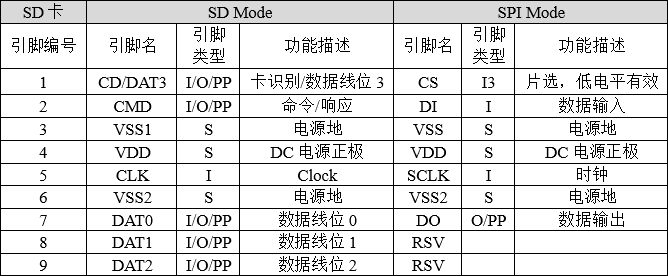

# SPI_SDCARD实验

## 前言

很多单片机系统都需要大容量存储设备，以存储数据。目前常用的有U盘，FLASH芯片，SD卡等。他们各有优点，综合比较，最适合单片机系统的莫过于SD卡了，它不仅容量可以做到很大（32GB以上），支持SPI/SDIO驱动，而且有多种体积的尺寸可供选择（标准的SD卡尺寸及Micro SD卡尺寸等），能满足不同应用的要求。只需要少数几个IO口即可外扩一个高达32GB或以上的外部存储器，容量从几十M到几十G选择范围很大，更换也很方便，编程也简单，是单片机大容量外部存储器的首选。
正点原子DNRP2350AM最小系统板使用的接口是Micro SD卡接口，卡座带自锁功能。SPI主机驱动程序将处理来自不同任务的独占访问。在本章中，我们将向大家介绍，如何在正点原子DNRP2350AM系统板上实现Micro SD卡的读取。

## SD卡简介

### 1，SD卡物理结构

SD卡的规范由SD卡协会明确，可以访问https://www.sdcard.org查阅更多标准。SD卡主要有SD、Mini SD和microSD(原名TF卡，2004年正式更名为Micro SD Card，为方便本文用microSD表示)三种类型，Mini SD已经被microSD取代，使用得不多，根据最新的SD卡规格列出的参数如下所示：


上述表格的“脚位数”，对应于实卡上的“金手指”数，不同类型的卡的触点数量不同，访问的速度也不相同。SD卡允许了不同的接口来访问它的内部存储单元。最常见的是SDIO模式和SPI模式，根据这两种接口模式，我们也列出SD卡引脚对应于这两种不同的电路模式的引脚功能定义，如下所示：



我们对比着来看一下microSD引脚，可见只比SD卡少了一个电源引脚VSS2，其它的引脚功能类似。


SD卡和Micro SD只有引脚和形状大小不同，内部结构类似，操作时序完全相同，可以使用完全相同的代码驱动，下面以9’Pin SD卡的内部结构为为例，展示SD卡的存储结构。


SD卡有自己的寄存器，但它不能直接进行读写操作，需要通过命令来控制，SDIO协议定义了一些命令用于实现某一特定功能，SD卡根据收到的命令要求对内部寄存器进行修改。下图中描述的SD卡的寄存器是我们和SD卡进行数据通讯的主要通道，如下：


关于SD卡的更多信息和硬件设计规范可以参考SD卡协议《Physical Layer Simplified Specification Version 2.00》的相关章节。

## 硬件设计

### 例程功能

1. 本章实验功能简介：经过一系列初始化之后，通过一个while循环以SD卡初始化为条件，以检测SD卡是否初始化成功，若初始化SD卡成功，则会通过串口或者VSCode终端输出SD卡的相关参数，并在LCD上显示SD卡的总容量以及剩余容量。此时LED闪烁，表示程序正在运行。

### 硬件资源

1. LED:
LED-GPIO3
2. 正点原子1.14寸SPI LCD模块
3. SD（采用SPI接口协议）

    SDIO_SCK-GPIO10(SCK)

    SDIO_CMD-GPIO11(MOSI)

    SDIO_D0-GPIO12(MISO)

    SDIO_D1-GPIO13(该引脚可用作模拟SDIO接口协议，在该例程中未用到)

    SDIO_D2-GPIO14(该引脚可用作模拟SDIO接口协议，在该例程中未用到)

    SDIO_D3-GPIO15(CS)

### 原理图

着重说明：本章实验使用SPI接口协议与SD卡进行连接，为了保证例程的可拓展性，作者在硬件上多引出了GPIO13与GPIO14两个引脚，这两个引脚可以用于在PIO机制中对SDIO接口协议进行模拟。因此，对于SD卡的驱动来说，SDK版本有着两种方式进行驱动（一种SPI，一种通过PIO机制模拟SDIO）。开发板板载了一个Micro SD卡座用于连接SD卡，SD卡与RP2350A的连接原理图，如下图所示：


## 程序设计

### SPI_SD卡函数解析

PICO-SDK提供了丰富的SPI接口函数，开发者可以在```pico-sdk\src\rp2_common\hardware_spi```路径下找到相关的spi.c和spi.h文件。在spi.h头文件中，你可以找到RP2350A的所有SPI函数定义。接下来，作者将介绍一些常用的SPI函数，这些函数的描述及其作用如下：

#### SPI初始化函数

该函数的作用是对指定的SPI（Serial Peripheral Interface，串行外设接口）实例进行初始化，同时设置其波特率,其函数原型如下所示：

```
uint spi_init(spi_inst_t *spi, uint baudrate)
```

【参数】

1. spi_inst_t *spi: spi_inst_t类型的指针，用于指定要初始化的SPI实例
2. uint baudrate: 一个uint类型的参数，用于指定期望的波特率

【返回值】

1. baud：函数最终返回实际设置的波特率

#### 设置SPI数据传输格式函数

该函数用于设置SPI（串行外设接口）实例的数据传输格式,其函数原型如下所示：

```
void spi_set_format(spi_inst_t *spi, uint data_bits, spi_cpol_t cpol, spi_cpha_t cpha, __unused spi_order_t order)
```

【参数】

1. spi_inst_t *spi: 这是一个 spi_inst_t 类型的指针spi以指定要配置的SPI实例
2. uint data_bits: 数据位宽
3. spi_cpol_t cpol:时钟极性
4. spi_cpha_t cpha:时钟相位
5. spi_order_t order:数据传输顺序

【返回值】

1. 无

#### SPI数据写入函数

该函数用于通过 SPI（串行外设接口）以阻塞方式向外部设备写入数据。该函数会持续等待，直到数据成功写入SPI总线，并且会处理写入过程中的一些状态和异常情况,其函数原型如下所示：

```
int spi_write_blocking(spi_inst_t *spi, const uint8_t *src, size_t len)
```

【参数】

1. spi_inst_t *spi: 这是一个 spi_inst_t 类型的指针spi以指定要配置的SPI实例
2. const uint8_t *src: 指向 uint8_t 类型的常量指针 src 用于指定要写入的数据的源地址
3. size_t len: size_t 类型的参数 len 用于指定要写入的数据长度

【返回值】

1. (int)len:实际写入的数据长度

#### SPI数据写入函数

该函数用于通过 SPI（串行外设接口）以阻塞方式向外部设备写入数据。该函数会持续等待，直到数据成功写入SPI总线，并且会处理写入过程中的一些状态和异常情况,其函数原型如下所示：

```
int spi_write_blocking(spi_inst_t *spi, const uint8_t *src, size_t len)
```

【参数】

1. spi_inst_t *spi: 这是一个 spi_inst_t 类型的指针spi以指定要配置的SPI实例
2. const uint8_t *src: 指向 uint8_t 类型的常量指针 src 用于指定要写入的数据的源地址
3. size_t len: size_t 类型的参数 len 用于指定要写入的数据长度

【返回值】

1. (int)len:实际写入的数据长度

### SPI_SD卡驱动解析

在SDK版本的14_sdio例程中，作者在```14_sdio\BSP```路径以及```Middlewares```路径下分别新增了两个文件夹一个是```SDIO```,一个是```FatFs_SPI```。前者用于存放spi_sdcard.c和spi_sdcard.h这两个文件，后者用于存放便于系统调用的第三方SD卡库。其中，spi_sdcard.h文件负责声明与SD卡相关的函数和变量，spi_sdcard.c文件实现了SD卡的驱动代码。另外，值得一提的是，PICO-SDK并没有直接提供与SD卡相关的API，因此作者引入了除官方外的一个第三方库。这一个第三方库将SD卡驱动时所需要用到的命令与驱动步骤进行了一个封装，我们只需调用封装好的函数即可。下面，我们将详细解析这两个文件的实现内容。

#### 1，spi_sdcard.c文件

sd_init的设计就比较简单了，函数首先获取SD卡实例，然后配置文件系统挂载。根据外设的情况，我们可以设置SPI的使用端口为SPI1端口。

```
static sd_card_t *pSD = NULL;

/**
 * @brief       定义SPI硬件配置数组
 * @details     每个SPI的硬件配置信息存储在该数组中，多个SD卡可由一个SPI驱动，只要使用不同的从设备选择引脚
 * @note        目前只定义了一个SPI的配置
 */
static spi_t spis[] = {
    {
        .hw_inst = spi1,                /* 使用的SPI硬件实例,指定为spi1 */
        .miso_gpio = 12,                /* SPI的MISO引脚对应的GPIO编号,注意这里是GPIO编号而非引脚编号 */
        .mosi_gpio = 11,                /* SPI的MOSI引脚对应的GPIO编号 */
        .sck_gpio = 10,                 /* SPI的SCK引脚对应的GPIO编号 */
        .baud_rate = 25 * 1000 * 1000,  /* SPI的波特率 */
    }
};

/**
 * @brief       定义SD卡硬件配置数组
 * @details     每个SD卡的硬件配置信息存储在该数组中
 * @note        目前只定义了一个SD卡的配置
 */
static sd_card_t sd_cards[] = {
    {
        .pcName = "0:",             /* SD卡挂载时使用的名称，用于标识该SD卡设备 */
        .spi = &spis[0],            /* 指向驱动该SD卡的SPI对象的指针，表明该SD卡由spis数组中的第一个SPI对象驱动 */
        .ss_gpio = 15,              /* 该SD卡的SPI从设备选择引脚对应的GPIO编号，用于选中该SD卡进行通信 */
        .use_card_detect = false,   /* 是否使用卡检测功能,false表示不使用卡检测功能 */
        .card_detect_gpio = -1,     /* 卡检测引脚对应的GPIO编号,由于不使用卡检测功能，设置为 -1 */
        .card_detected_true = 1     /* 当使用卡检测功能时，卡存在时GPIO读取的值,这里由于不使用卡检测功能，该值无实际意义 */
    }
};

/**
 * @brief       获取SD卡对象的数量
 * @param       无
 * @retval      size_t : SD卡对象的数量
 */
size_t sd_get_num() 
{
    return count_of(sd_cards);
}

/**
 * @brief       根据编号获取对应的SD卡对象指针
 * @param       num : SD卡的编号
 * @retval      sd_card_t* : 对应的SD卡对象指针，若编号超出范围则返回NULL
 */
sd_card_t *sd_get_by_num(size_t num) 
{
    if (num < sd_get_num()) 
    {
        return &sd_cards[num];
    } 
    else 
    {
        return NULL;
    }
}

/**
 * @brief       获取SPI对象的数量
 * @param       无
 * @retval      size_t : SPI对象的数量
 */
size_t spi_get_num() 
{
    return count_of(spis);
}

/**
 * @brief       根据编号获取对应的SPI对象指针
 * @param       num : SPI的编号
 * @retval      spi_t* : 对应的SPI对象指针，若编号超出范围则返回NULL
 */
spi_t *spi_get_by_num(size_t num) 
{
    if (num < spi_get_num()) 
    {
        return &spis[num];
    } 
    else 
    {
        return NULL;
    }
}

/**
 * @brief       SD卡初始化
 * @param       无
 * @retval      esp_err_t
 */
void sd_init(uint32_t *free, uint32_t *total)
{
    pSD = sd_get_by_num(0);     /* 获取SD卡实例 */
    uint8_t fr = f_mount(&pSD->fatfs, pSD->pcName, 1);

    if (FR_OK != fr)
    {
        panic("f_mount error: %s (%d)\n", FRESULT_str(fr), fr);
    }

    uint32_t fre_clust = 0, fre_sect = 0, tot_sect = 0;

    FATFS *fs;                  /* FatFs文件系统结构体 */

    fr = f_getfree(pSD->pcName, &fre_clust, &fs);   /* 获取剩余空间（单位：簇） */

    if (FR_OK == fr)            /* 计算剩余空间（单位：字节） */
    {
        fre_sect = fre_clust * fs->csize;
        tot_sect = (fs->n_fatent - 2) * fs->csize;
        *free = fre_sect >> 1;	/* 单位为KB */
        *total = tot_sect >> 1;	/* 单位为KB */
    } 
    else 
    {
        printf("f_getfree error: %s (%d)\n", FRESULT_str(fr), fr);
    }

    f_unmount(pSD->pcName);     /* 卸载文件系统 */
}
```

### CMakeLists.txt文件

打开本章节的实验（14_sdio），在整个工程文件下包含了一个CMakeLists.txt文件。此文件的作用是将BSP文件夹下的驱动程序添加到构建系统中，确保在编译项目工程时能够调用这些驱动程序。关于该实验的CMakeLists.txt文件的具体内容与上一章节并没有什么太大的不同，因此不再赘述。

###  实验应用代码

打开main.c文件，该文件定义了工程入口函数，名为main。该函数代码如下。
```
/**
 * @brief       程序入口
 * @param       无
 * @retval      无
 */
int main()
{
   uint8_t t = 0;
   uint32_t free, total;               /* SD卡的总空间与剩余空间 */
   stdio_init_all();                   /* 初始化标准库 */
   led_init();                         /* 初始化LED */
   spi1_init();                        /* 初始化SPI1 */
   lcd_init();                         /* 初始化LCD */
   sd_init(&free, &total);             /* 初始化SD卡 */

   lcd_show_string(0, 0, 240, 32, 32, "RP2350A", RED);
   lcd_show_string(0, 33, 240, 24, 24, "SD TEST", RED);
   lcd_show_string(0, 60, 240, 16, 16, "ATOM@ALIENTEK", RED);
   lcd_show_string(0, 80, 240, 16, 16, "SD Free Size:       MB", RED);
   lcd_show_string(0, 100, 240, 16, 16, "SD Total Size:      MB", RED);
   lcd_show_num(113 , 80, (int)free >> 10, 5, 16, BLUE);
   lcd_show_num(113, 100, (int)total >> 10 ,5,16, BLUE);
    
   while (1) 
   {
       LED_TOGGLE();
       sleep_ms(200);
   }
}
```
可以看到，本实验的应用代码中，通过初始化SD卡判断与SD卡的连接是否有误，SD卡初始化成功后便通过函数sd_get_fatfs_usage()获取容量等信息，同时也在LCD上显示了SD的容量信息。

## 下载验证

程序下载到开发板后，可以看到LCD显示SD卡总容量与剩余容量，LED灯闪烁。如下图所示：


