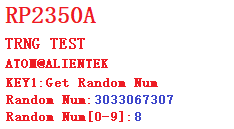

# TRNG随机数实验

## 前言

本章，我们将介绍RP2350A的硬件随机数发生器。我们使用KEY1按键来获取硬件随机数，并且将获取到的随机数值显示在LCD上面。同时，使用LED指示程序运行状态。

## 随机数发生器简介

### 1，TRNG 简介

RP2350A 的 TRNG 模块基于环形振荡器（ROSC）的相位抖动生成真随机数，符合 FIPS 140-2 安全标准。其核心特性包括：

1. 熵源：利用环形振荡器的固有相位噪声作为随机数种子。
2. 输出：32 位随机数，通过硬件加密算法增强随机性。
3. 安全特性：支持硬件自检（HMAC 验证）和故障检测。
4. 低功耗：支持休眠模式下持续生成随机数。

## 硬件设计

### 例程功能

1. 实验使用 RP2350A 自带的硬件随机数生成器（TRNG），获取随机数，并显示在 LCD 屏幕上。按KEY1按键可以获取一次随机数。同时程序自动获取 0~9范围内的随机数，显示在屏幕上。LED闪烁用于提示程序正在运行。

### 硬件资源

1. LED:
LED-GPIO3
2. 按键:
KEY1-GPIO2
3. 正点原子1.14寸SPI LCD模块
4. TRNG

### 原理图

TRNG 属于RP2350A内部资源，通过软件设置好就可以了。本实验通过配合按键获取随机数和通过LCD显示。

## 程序设计

### TRNG函数解析

PICO-SDK提供了丰富的TRNG接口函数，开发者可以在```pico-sdk\src\rp2_common\pico_rand```路径下找到相关的rand.c和rand.h文件。在rand.h头文件中，你可以找到RP2350A的所有SPI函数定义。接下来，作者将介绍一些常用的SPI函数，这些函数的描述及其作用如下：

#### 获取随机数

该函数的主要功能是获取一个 32 位的随机数,它通过调用 get_rand_64()函数获取一个 64 位的随机数，然后将这个 64 位随机数强制转换为 32 位无符号整数类型并返回。其函数原型如下所示：

```
uint spi_init(spi_inst_t *spi, uint baudrate)
```

【参数】

1. 无

【返回值】

1. 将经过类型强制转换后的 32 位随机数作为函数的返回值返回给调用者。

### TRNG驱动解析

在SDK版本的13_trng例程中，作者在```13_trng\BSP```路径下新增了一个TRNG文件夹，用于存放trng.c和trng.h这两个文件。其中，trng.h文件负责声明TRNG相关的函数和变量，trng.c文件则实现了TRNG的驱动代码。下面，我们将详细解析这两个文件的实现内容。

#### 1，trng.h文件

```
/* 函数声明 */
uint32_t trng_get_random_num(void);          /* 得到随机数 */
int trng_get_random_range(int min, int max); /* 得到某个范围内的随机数 */
```

#### 2，trng.c文件

```
/**
 * @brief       得到随机数
 * @param       无
 * @retval      获取到的随机数(32bit)
 */
uint32_t trng_get_random_num(void)
{
    uint32_t randomnum;
    
    randomnum = get_rand_32();
    
    return randomnum;
}

/**
 * @brief       得到某个范围内的随机数
 * @param       min,max: 最小,最大值.
 * @retval      得到的随机数(rval),满足:min<=rval<=max
 */
int trng_get_random_range(int min, int max)
{ 
    uint32_t randomnum;
    
    randomnum = get_rand_32();
    
    return randomnum % (max - min + 1) + min;
}
```
从上述代码中，我们不难看出，对于RNG我们并没有相应的初始化函数，RP2350A提供了相应的API函数，我们只需调用即可，具体的在之前的内容里我们已经介绍过了，在此不做出赘述。

### CMakeLists.txt文件

打开本章节的实验（13_trng），在整个工程文件下包含了一个CMakeLists.txt文件。关于该实验的CMakeLists.txt文件的具体内容与上一章节并没有什么太大的不同，因此不再赘述。

###  实验应用代码

打开main.c文件，该文件定义了工程入口函数，名为main。该函数代码如下。
```
/**
 * @brief       程序入口
 * @param       无
 * @retval      无
 */
int main()
{ 
    uint8_t key = 0;
    uint32_t random = 0;
    uint8_t t = 0;

    stdio_init_all();       /* 初始化标准库 */
    led_init();             /* 初始化LED */
    key_init();             /* 初始化KEY */
    spi1_init();            /* 初始化SPI1 */
    lcd_init();             /* 初始化LCD */

    lcd_show_string(0, 0, 240, 32, 32, "RP2350A", RED);
    lcd_show_string(0, 33, 240, 24, 24, "TRNG TEST", RED);
    lcd_show_string(0, 60, 240, 16, 16, "ATOM@ALIENTEK", RED);

    lcd_show_string(0, 78, 200, 16, 16, "KEY1:Get Random Num", RED);
    lcd_show_string(0, 93, 200, 16, 16, "Random Num:", RED);
    lcd_show_string(0, 108, 200, 16, 16, "Random Num[0-9]:", RED);

    while(1)
    {
        key = key_scan(0);
        
        if (key == KEY1_PRES)    
        {
            random = trng_get_random_num();                      /* 获取随机数 */
            lcd_show_num(118, 93, random, 10, 16, BLUE);
        }
        
        if ((t % 20) == 0)                                      
        {                                             
            random = trng_get_random_range(0, 9);                /* 取[0,9]区间的随机数 */
            lcd_show_num(158, 108, random, 1, 16, BLUE);

            LED_TOGGLE(); 
        }

        sleep_ms(10);
        t++;
    }
}
```
该部分代码也比较简单，在所有外设初始化成功后，进入死循环，等待KEY1按键按下，如果按下，则调用 trng_get_random_num 函数，读取随机数值，并将读到的随机数显示在 LCD 上面。每隔 200ms 获取一次区间[0,9]的随机数，并实时显示在液晶上。同时 LED，周期性闪烁，400ms 闪烁一次。

## 下载验证

程序下载到开发板后，可以看到 LED 不停的闪烁，提示程序已经在运行了。然后我们按下 KEY1，就可以在屏幕上看到获取到的随机数。同时，就算不按 KEY1，程序也会自动的获取 0~9区间的随机数显示在 LCD 上面。实验结果如下图所示：




