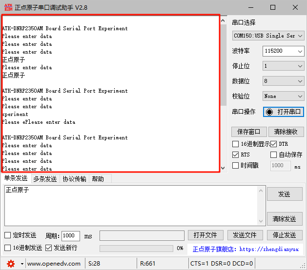

# 串口实验

## 前言

本章将介绍使用串口进行数据的收发操作，具体实现RP2350A与上位机软件的数据通信，RP2350A将接受自上位机软件的数据原原本本地发送回给上位机软件。通过本章的学习，开发者将学习到UART和GPIO引脚的使用。

## 串口简介

学习串口前，我们先来了解一下数据通信的一些基础概念。

### 数据通信的基础概念

在单片机的应用中，数据通信是必不可少的一部分，比如：单片机和上位机、单片机和外围器件之间，它们都有数据通信的需求。由于设备之间的电气特性、传输速率、可靠性要求各不相同，于是就有了各种通信类型、通信协议，我们最常的有：USART、IIC、SPI、CAN、USB等。

#### 1，数据通信方式

按数据通信方式分类，可分为串行通信和并行通信两种。串行和并行的对比如下图所示：


串行通信的基本特征是数据逐位顺序依次传输，优点是传输线少、布线成本低、灵活度高等优点，一般用于近距离人机交互，特殊处理后也可以用于远距离，缺点就是传输速率低。
而并行通信是数据各位可以通过多条线同时传输，优点是传输速率高，缺点就是布线成本高，抗干扰能力差因而适用于短距离、高速率的通信。

#### 2，数据传输方向
根据数据传输方向，通信又可分为全双工、半双工和单工通信。全双工、半双工和单工通信的比较如下图所示：


单工是指数据传输仅能沿一个方向，不能实现反方向传输，如校园广播。
半双工是指数据传输可以沿着两个方向，但是需要分时进行，如对讲机。
全双工是指数据可以同时进行双向传输，日常的打电话属于这种情形。
这里注意全双工和半双工通信的区别：半双工通信是共用一条线路实现双向通信，而全双工是利用两条线路，一条用于发送数据，另一条用于接收数据。

#### 3，数据同步方式

根据数据同步方式，通信又可分为同步通信和异步通信。同步通信和异步通信比较如下图所示：


同步通信要求通信双方共用同一时钟信号，在总线上保持统一的时序和周期完成信息传输。优点：可以实现高速率、大容量的数据传输，以及点对多点传输。缺点：要求发送时钟和接收时钟保持严格同步，收发双方时钟允许的误差较小，同时硬件复杂。
异步通信不需要时钟信号，而是在数据信号中加入开始位和停止位等一些同步信号，以便使接收端能够正确地将每一个字符接收下来，某些通信中还需要双方约定传输速率。优点：没有时钟信号硬件简单，双方时钟可允许一定误差。缺点：通信速率较低，只适用点对点传输。

#### 4，通信速率

在数字通信系统中，通信速率（传输速率）指数据在信道中传输的速度，它分为两种：传信率和传码率。

```传信率```:每秒钟传输的信息量，即每秒钟传输的二进制位数，单位为bit/s（即比特每秒），因而又称为比特率。

```传码率```：每秒钟传输的码元个数，单位为Baud（即波特每秒），因而又称为波特率。

另外，比特率和波特率也是有一定的关系的。
比特率和波特率的关系可以用以下式子表示：```比特率 = 波特率 * log2M```，其中M表示码元承载的信息量。我们也可以理解M为码元的进制数。

### RP2350A的UART简介

RP2350具有基于Arm Primecell UART（PL011）的两个相同的UART外围设备，每个外设具有以下特征：

特征	        		| 描述
--------------------|------------------------------------
Separate 32×8 TX and 32×12 RX FIFOs  | 用于发送（TX）和接收（RX）的专用FIFO，分别具有32×8和32×12的大小。
Programmable baud rate generator, clocked by clk_peri | 允许使用时钟信号调整波特率（ clk_peri)
Standard asynchronous communication bits (start, stop, parity) added on transmit and removed on receive  | 标准异步通信比特，包括在传输过程中添加并在接收过程中移除的开始位、停止位和奇偶位。
Line break detection  | 检测数据传输中的线路中断
Programmable serial interface (5, 6, 7, or 8 bits)  | 可配置的串行数据位宽（5、6、7或8位）
1 or 2 stop bits  | 可配置的数据传输停止位数（1或2）
Programmable hardware flow control  | 允许设置硬件流量控制（RTS/CTS）

同时，每个 UART 都可以连接到多个 GPIO 引脚，详细内容请参照[**数据手册**](https://datasheets.raspberrypi.com/rp2350/rp2350-datasheet.pdf)中的第 9.4 节的 GPIO 多路复用表。

## 硬件设计

### 例程功能

1. 回显串口接收到的数据
2. 每间隔一定时间，串口发送一段提示信息
3. LED闪烁，提示程序正在运行

### 硬件资源

1. LED：
     LED-GPIO3
2. uart0:（UART0_TX、UART0_RX连接至板载USB转串口芯片上）

	UART0_TX-GPIO0

	UART0_RX-GPIO1


### 原理图

板载的USB转串口芯片的USB接口通过板载的USB UART端口引出，其原理图如下图所示：


从以上原理图可以看出，TXD引脚和RXD引脚分别作为发送和接收引脚分别与USB转串口芯片的接收和发送引脚进行连接，USB转串口芯片再通过一对USB差分信号连接至USB UART的接口，这样一来，RP2350A就可以通过USB与PC上位机软件进行串口通信了。
另外RP2350A有两个串口，即 uart0、uart1。

## 程序设计

### UART函数解析

Pico-sdk提供了一套API来配置串口，值得一提的是，串口的初始化函数已经封装进stdio_init_all()函数中，因此我们并不需要对串口进行额外的配置，直接调用API提供的函数即可。那么下面作者将介绍一下在实验中调用到的API函数：

#### UART初始化函数

该函数用于初始化一个串口，其函数原型如下所示：

```uart_init(uart_inst_t *uart, uint baudrate)```

【参数】

uart_inst_t *uart：指向UART硬件实例的指针，如：uart0或uart1

baudrate:它代表串口的波特率，即数据传输速率，具体指的是每秒传输的位数。

【返回值】

无

#### UART接收数据就绪

该函数用于检测指定UART接口的接收缓冲区中是否有数据可读。具体来说，它通过查询UART硬件标志寄存器中的RXFE（Receive FIFO Empty，接收FIFO空）位，判断接收缓冲区是否为空。其函数原型如下所示：

```uart_is_readable(uart_inst_t *uart)```

【参数】

uart_inst_t *uart：指向UART硬件实例的指针，如：uart0或uart1

【返回值】

!(uart_get_hw(uart)->fr & UART_UARTFR_RXFE_BITS)

【返回值解析】

uart_get_hw(uart)->fr：获取UART硬件标志寄存器（Flag Register）的值。

UART_UARTFR_RXFE_BITS：是接收FIFO空（RXFE）位的掩码。当该位为1时，表示接收FIFO为空；为0时，表示FIFO中有数据。

【返回值逻辑】

若 RXFE 位为 1 → 接收FIFO为空 → 函数返回 false（不可读）

若 RXFE 位为 0 → 接收FIFO非空 → 函数返回 true（可读）

#### UART读取单字节

该函数的作用是阻塞式地读取UART接口的一个字节数据，并将其作为`char`类型返回。其函数原型如下所示：

```uart_getc(uart_inst_t *uart)```

【参数】

uart_inst_t *uart：指向UART硬件实例的指针，如：uart0或uart1

【返回值】

char c：从UART接收缓冲区读取的1字节数据

#### UART发送单字节

该函数用于向指定UART接口发送一个字符，并根据配置决定是否在发送特定字符时自动插入回车符（\r），以支持CRLF（Carriage Return + Line Feed）格式的换行兼容性。其函数原型如下所示：

```uart_putc(uart_inst_t *uart, char c)```

【参数】

uart_inst_t *uart：指向UART硬件实例的指针，如：uart0或uart1

char c：待发送的字符

【返回值】

无

#### 配置UART硬件流控制模式

该函数用于配置UART（通用异步收发器）的硬件流控制模式，通过设置CTS（Clear To Send）和RTS（Request To Send）信号使能位，控制数据流的启停，防止通信过程中的数据丢失或溢出。其函数原型如下所示：

```static inline void uart_set_hw_flow(uart_inst_t *uart, bool cts, bool rts)```

【参数】

uart_inst_t *uart：指向UART硬件实例的指针，如：uart0或uart1

cts：该参数为bool类型。若为true，则启用CTS流控制，发送方根据CTS信号状态决定是否发送数据。

rts：该参数为bool类型。若为true，则启用RTS流控制，接收方通过RTS信号通知发送方暂停传输。

【返回值】

无

#### 配置UART通信格式

该函数用于配置UART（通用异步收发器）的通信格式，包括数据位长度、停止位数量和奇偶校验类型。其核心操作是通过修改UART的线控制寄存器的特定位域，实现参数设置。其函数原型如下所示：

```void uart_set_format(uart_inst_t *uart, uint data_bits, uint stop_bits, uart_parity_t parity)```

【参数】

uart_inst_t *uart：指向UART硬件实例的指针，如：uart0或uart1

data_bits：数据位长度，取值范围为5、6、7或8。

stop_bits：停止位数量，取值为1或2。

parity：奇偶校验类型，可选UART_PARITY_NONE、UART_PARITY_EVEN或UART_PARITY_ODD。

【返回值】

无

#### 配置UART FIFO功能

该函数的作用是开启或者关闭 UART的 FIFO（先进先出缓冲区）功能。其函数原型如下所示：

```void uart_set_fifo_enabled(uart_inst_t *uart, bool enabled)```

【参数】

uart_inst_t *uart：指向UART硬件实例的指针，如：uart0或uart1

bool enabled：这是一个布尔类型的参数，若为 true，则开启 FIFO 功能；若为 false，则关闭 FIFO 功能。

【返回值】

无

#### 配置中断处理程序

该函数的主要功能是为指定的中断请求（IRQ）设置一个独占的处理程序。独占意味着该中断号之前没有被其他处理程序占用，或者已经被当前要设置的处理程序占用，以确保中断处理的唯一性。其函数原型如下所示：

```void uart_set_fifo_enabled(uart_inst_t *uart, bool enabled)```

【参数】

uint num：这是一个无符号整数类型的参数，代表要设置处理程序的中断号。

irq_handler_t handler：这是一个函数指针类型的参数，指向要为该中断设置的处理程序。

【返回值】

无

#### 配置指定编号的中断请求

该函数的主要功能是启用或禁用指定编号的中断请求（IRQ）。通过设置相应的标志位，可以控制某个特定中断是否能够触发中断服务程序。其函数原型如下所示：

```void irq_set_enabled(uint num, bool enabled)```

【参数】

uint num：这是一个无符号整数类型的参数，代表要设置处理程序的中断号。

bool enabled：这是一个布尔类型的参数，若为 true，则启用指定中断；若为 false，则禁用指定中断。

【返回值】

无

#### 配置UART中断使能状态

该函数的主要功能是设置 UART的中断使能状态。具体来说，它可以分别控制接收数据中断（当接收缓冲区有数据时触发）和发送数据中断（当发送缓冲区需要数据时触发）是否启用。其函数原型如下所示：

```static inline void uart_set_irq_enables(uart_inst_t *uart, bool rx_has_data, bool tx_needs_data) ```

【参数】

uart_inst_t *uart：指向UART硬件实例的指针，如：uart0或uart1

bool rx_has_data：这是一个布尔类型的参数，用于控制接收数据中断的使能状态。如果为 true，则启用接收数据中断；如果为 false，则禁用该中断。

bool tx_needs_data：这也是一个布尔类型的参数，用于控制发送数据中断的使能状态。如果为 true，则启用发送数据中断；如果为 false，则禁用该中断。

【返回值】

无

### UART驱动解析

在SDK版本的04_uart例程中，作者在```04_uart\BSP```路径下新增了一个UART文件夹，用于存放uart.c和uart.h这两个文件。其中，uart.h文件负责声明PWM相关的函数和变量，而uart.c文件则实现了UART的驱动代码。下面，我们将详细解析这两个文件的实现内容。

#### 1，uart.h文件

```
/* 引脚和串口定义 */
#define UART_UX            uart0
#define UART_BAUD_RATE     115200
#define UART_TX_GPIO_PIN   0
#define UART_RX_GPIO_PIN   1

/* 串口接收相关定义 */
#define RX_BUF_SIZE         1024         /* 自定义环形缓冲区大小 */

extern uint8_t rx_buffer[RX_BUF_SIZE];
extern volatile size_t rx_head;
extern volatile size_t rx_tail;

/* 函数声明 */
void uartx_init(uint32_t baudrate);      /* 初始化串口 */
size_t uartx_get_buffered_data_len();    /* 获取缓冲区数据长度 */
void uartx_rx_int();                     /* UART中断处理 */
```

#### 2，uart.c文件

```
uint8_t rx_buffer[RX_BUF_SIZE]; /* 自定义环形缓冲区 */
volatile size_t rx_head = 0;
volatile size_t rx_tail = 0;

/**
 * @brief       获取缓冲区数据长度
 * @param       无
 * @note        无
 * @retval      无
 */
size_t uartx_get_buffered_data_len() 
{
    return (rx_head - rx_tail + RX_BUF_SIZE) % RX_BUF_SIZE;
}

/**
 * @brief       UART中断处理
 * @param       无
 * @note        无
 * @retval      无
 */
void uartx_rx_int() 
{
    while (uart_is_readable(UART_UX)) 
    {
        uint8_t ch = uart_getc(UART_UX);
        size_t next_head = (rx_head + 1) % RX_BUF_SIZE;

        if (next_head != rx_tail)   /* 防止溢出 */
        {
            rx_buffer[rx_head] = ch;
            rx_head = next_head;
        }
    }
}

/**
 * @brief       初始化串口
 * @param       baudrate: 波特率, 根据自己需要设置波特率值
 * @note        注意: 必须设置正确的时钟源, 否则串口波特率就会设置异常.
 * @retval      无
 */
void uartx_init(uint32_t baudrate)
{
    uart_init(UART_UX, baudrate);
    gpio_set_function(UART_TX_GPIO_PIN, GPIO_FUNC_UART);
    gpio_set_function(UART_RX_GPIO_PIN, GPIO_FUNC_UART);
    uart_set_hw_flow(UART_UX, false, false);
    uart_set_format(UART_UX, 8, 1, UART_PARITY_NONE);
    uart_set_fifo_enabled(UART_UX, true);

    /* UART中断处理 */
    irq_set_exclusive_handler(UART0_IRQ, uartx_rx_int);
    irq_set_enabled(UART0_IRQ, true);
    uart_set_irq_enables(UART_UX, true, false);
}
```

```rx_buffer```是一个大小为 RX_BUF_SIZE 的无符号 8 位整数数组，用作环形缓冲区。环形缓冲区是一种常见的数据结构，用于在有限的内存空间内循环存储数据，常用于处理数据流，如串口数据接收。```rx_head```是一个 volatile 修饰的 size_t 类型变量，用于指示环形缓冲区中数据写入的位置。```rx_tail```同样是 volatile 修饰的 size_t 类型变量，用于指示环形缓冲区中数据读取的位置。结合以上内容，代码实现了一个 UART 接收功能，包括初始化 UART、处理接收中断以及计算缓冲区数据长度。通过环形缓冲区存储接收到的数据，方便后续处理。

### CMakeLists.txt文件

打开本章节的实验（04_uart），在整个工程文件下包含了一个CMakeLists.txt文件。关于该实验的CMakeLists.txt文件的具体内容与上一章节并没有什么太大的不同，因此不再赘述。

###  实验应用代码

打开main.c文件，该文件定义了工程入口函数，名为main。该函数代码如下。
```
/**
 * @brief       程序入口
 * @param       无
 * @retval      无
 */
int main()
{
    uint16_t times = 0;
    uint8_t data[RX_BUF_SIZE];
    
    stdio_init_all();                               /* 初始化标准库 */
    led_init();                                     /* 初始化LED */
    uartx_init(115200);                             /* 初始化UART */

    while (1) 
    {
        size_t len = uartx_get_buffered_data_len();

        if (len > 0)
        {
            memset(data, 0, RX_BUF_SIZE);

            for (size_t i = 0; i < len; i++)          /* 从缓冲区读取数据 */
            {
                data[i] = rx_buffer[rx_tail];
                rx_tail = (rx_tail + 1) % RX_BUF_SIZE;
            }

            uart_write_blocking(UART_UX, data, len);  /* 阻塞式写回 */
        }
        else
        {
            times++;

            if (times % 200 == 0)
            {
                printf("\nATK-DNRP2350AM Board Serial Port Experiment\r\n");
            }

            if (times % 50 == 0)
            {
                printf("Please enter data\r\n");
            }

            if (times % 30 == 0)
            {
                LED_TOGGLE();
            }

            sleep_ms(10);                   /* 延时10ms */
        }
    }
}
```
本实验的实验代码很简单，在完成初始化后，就不断地通过串口通信驱动提供的数据接收并判断数据长度大小，若还未完成数据接收，则每间隔一段时间就使用printf通过uart0打印一段提示信息，若数据接收完毕，则将数据原原本本地使用printf通过uart0打印出去，实现数据的回显功能。

## 下载验证

在完成编译和烧录操作后，需要将开发板的USB UART接口与PC的USB接口通过具有数据传输功能的数据线进行连接。接着打开PC上的ATK-XCOM串口调试助手软件，选择好正确的COM端口和相关的配置后，就能看到串口调试助手上每间隔一段时间就打印一次“请输出数据，以回车键结束”，接下来就可以根据提示通过串口调试助手发送一段任意的数据（以回车换行结束），随后立马就能看到串口调试助手上显示发送出去的数据，这就是本实验实现的数据回显功能。



