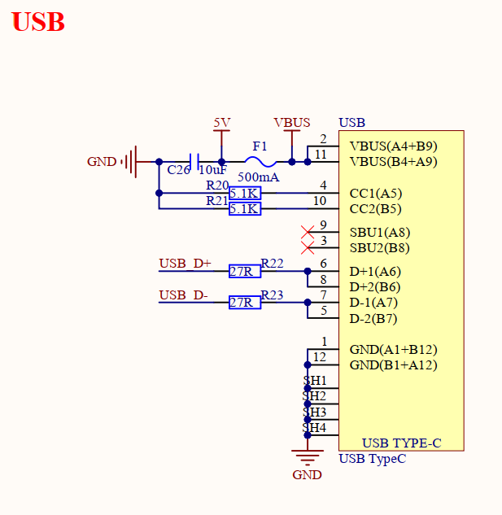
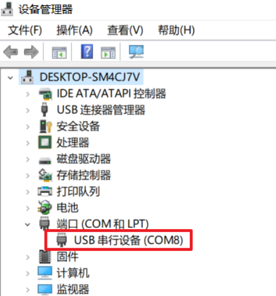
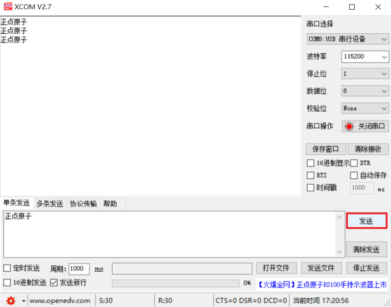

# USB虚拟串口实验

## 前言

本章将介绍如何使用RP2350A开发板的USB功能。通过本章的学习，读者将学习到如何使用Pico-sdk驱动RP2350A实现USB CDC功能。

## USB虚拟串口介绍

### 1，USB虚拟串口简介

USB虚拟串口，简称VCP，是Virtual COM Port的简写，它是利用USB的CDC类来实现的一种通信接口。

我们可以利用RP2350A自带的USB功能，来实现一个USB虚拟串口，从而通过USB，实现电脑与RP2350A的数据互传。上位机无需编写专门的USB程序，只需要一个串口调试助手即可调试，非常实用。

## 硬件设计

### 例程功能

1. 本实验利用 RP2350 自带的 USB 功能，连接电脑 USB，虚拟出一个 USB 串口，实现电脑和开发板的数据通信。本例程功能完全同实验 4（串口通信实验），只不过串口变成了 RP2350 的USB 虚拟串口。当 USB 连接电脑（USB 线插入 USB 接口），开发板将通过 USB 和电脑建立连接，并虚拟出一个串口。
LED 闪烁，提示程序运行。

### 硬件资源

1. LED:
	LED-GPIO3
2. 正点原子1.14寸SPI LCD模块
3. USB

### 原理图

USB与板载MCU的连接原理图，如下图所示：



## 程序设计

### USB函数解析

Pico-sdk提供了一套API来配置PIO。那么下面作者将介绍一下在实验中调用到的API函数：

#### USB读取数据

该函数 tud_cdc_read() 是 TinyUSB 库提供的一个内联函数，用于从 CDC（通用串行通信设备）接口读取数据。其函数原型如下所示：

```
TU_ATTR_ALWAYS_INLINE static inline uint32_t tud_cdc_read(void* buffer, uint32_t bufsize) 
```

【参数】

1. buffer：指向用于存储读取数据的缓冲区

2. bufsize：缓冲区的大小（以字节为单位）

【返回值】

1. 实际读取到的字节数

#### USB发送数据

该函数 tud_cdc_read() 是 TinyUSB 库提供的一个内联函数，用于从 CDC（通用串行通信设备）接口发送数据。其函数原型如下所示：

```
TU_ATTR_ALWAYS_INLINE static inline uint32_t tud_cdc_write(void const* buffer, uint32_t bufsize) 
```

【参数】

1. buffer：指向包含要发送数据的缓冲区

2. bufsize：缓冲区的大小（以字节为单位）

【返回值】

1. 实际成功写入到发送缓冲区的字节数

#### 确保 CDC 发送缓冲区中的数据

该函数 tud_cdc_write_flush() 是 TinyUSB 库中用于确保 CDC 发送缓冲区中的数据被实际发送出去的内联函数。它在进行 USB 串口通信时非常重要，特别是在需要确保数据完整性或实时性的场景中。其函数原型如下所示：

```
TU_ATTR_ALWAYS_INLINE static inline uint32_t tud_cdc_write_flush(void) 
```

【参数】

无

【返回值】

1. 通常为发送缓冲区中剩余的未发送字节数（如果有）

### USB驱动解析

在SDK版本的15_usb例程中，作者在```15_usb\BSP```路径下新增了一个LCD文件夹，用于存放usb_cdc.c和usb_cdc.h这三个文件。其中，usb_cdc.h文件负责声明USB相关的函数和变量，usb_cdc.c文件则实现了USB的驱动代码。下面，我们将详细解析这两个文件的实现内容。

#### 1，usb_cdc.h文件

```
/* 函数声明 */
void tud_usb_uart();	/* 初始化USB */
```

#### 2，usb_cdc.c文件

```
/**
 * @brief       接收回调
 * @param       itf     :设置的简要CDC端口
 * @retval      无
 */
void tud_cdc_rx_cb(uint8_t itf) 
{
    char buf[64];

	/* 读取串口数据 */
    uint32_t count = tud_cdc_read(buf, sizeof(buf));

	/* 发送数据 */
    if (count) 
	{
        tud_cdc_write(buf, count);	/* 回显接收到的数据 */
        tud_cdc_write_flush();
    }
}

/**
 * @brief       初始化USB
 * @param       无
 * @retval      无
 */
void tud_usb_uart(void) 
{
    tusb_init();	/* 初始化USB设备 */
	printf("USB initialization DONE");
}
```
这两段代码实现了基于 TinyUSB 库的 USB 虚拟串口功能，让设备可以通过 USB 与计算机进行串口通信。这是一个典型的 USB 虚拟串口（CDC 类设备）实现，包含两个核心函数：```tud_cdc_rx_cb```和```tud_usb_uart```。当计算机通过 USB 向设备发送数据时，TinyUSB 库会调用这个回调函数，函数从 USB 接收缓冲区读取最多 64 字节的数据。如果成功读取到数据，则将这些数据原样写回发送缓冲区。同时，调用 tud_cdc_write_flush() 确保数据立即通过 USB 发送，而不是等待缓冲区满。

### CMakeLists.txt文件

打开本章节的实验（15_usb），在整个工程文件下包含了一个CMakeLists.txt文件。此文件的作用是将BSP文件夹下的驱动程序添加到构建系统中，确保在编译项目工程时能够调用这些驱动程序。
###  实验应用代码

打开main.c文件，该文件定义了工程入口函数，名为main。该函数代码如下。
```
/**
 * @brief       程序入口
 * @param       无
 * @retval      无
 */
int main()
{
   uint8_t t = 0;
   uint32_t free, total;               /* SD卡的总空间与剩余空间 */
   stdio_init_all();                   /* 初始化标准库 */
   led_init();                         /* 初始化LED */
   spi1_init();                        /* 初始化SPI1 */
   lcd_init();                         /* 初始化LCD */

   /* 显示实验信息 */
   lcd_show_string(0, 0, 240, 32, 32, "RP2350A", RED);
   lcd_show_string(0, 33, 240, 24, 24, "USB UART TEST", RED);
   lcd_show_string(0, 60, 240, 16, 16, "ATOM@ALIENTEK", RED);
   tud_usb_uart();                     /* 初始化USB */
    
   while (1) 
   {
       LED_TOGGLE();
       sleep_ms(500);
   }
}
```
此部分代码比较简单，通过 tud_usb_usart()等函数初始化USB，在该函数中需要注册一个调用 CDC事件的回调函数。此时，如果回调已经注册，那么它将会被覆盖。同时，LCD显示实验信息，LED 闪烁以示程序正在运行。

## 下载验证

本例程的测试，不需要安装特定的 USB 驱动，开发者只需用数据线将 USB 接口（ 不是UART接口） 与 PC端连接起来即可，并打开串口助手，选择对应的端口号进行数据发送操作。我们打开设备管理器（我用的是 WIN10），在端口（COM 和 LPT）里面可以发现多出了一个COM8 的设备，这就是 USB 虚拟的串口设备端口，如下图所示：



然后我们打开 XCOM，选择 COM8（需根据自己的电脑识别到的串口号选择），并打开串口（注意：波特率可以随意设置），就可以进行测试了，如下图所示：



可以看到，我们的串口调试助手，按发送按钮，可以收到电脑发送给 RP2350 的数据（原样返回），说明我们的实验是成功的。

