# 开发环境搭建

## 开发系统的选择

选择MicroPython进行Raspberry RP2350A开发，确实需要准备相应的开发环境和工具。根据开发系统的不同，需选择适合的开发工具。例如，在Windows系统下开发，可以选择Thonny或VS Code等开发工具，这些工具都支持MicroPython插件，可以方便地编写和调试MicroPython代码。同样，在Linux和MAC系统下开发，也可以选择相应的开发工具进行MicroPython开发。

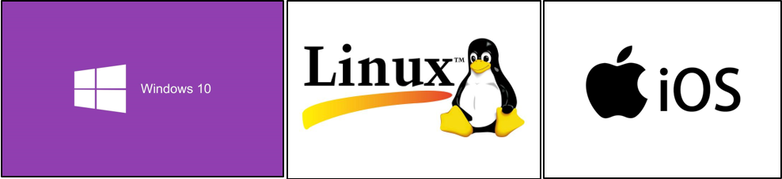

Linux系统开发对于初学者来说也是不容易的，虽然目前的Linux系统像Windows系统一样都具备图形化配置，但对于经常使用电脑的人来说，Windows系统还是他们日常的首选，因此本书仅介绍在Windows系统下开发。

## Thonny软件的下载&安装

### 概述

如果您是一位Python初学者小白，那最适合Thonny它了，如果不是初学者，请选择PyDev和Pycharm等工具。Thonny是一款面向Python初学者的小型集成开发环境（IDE）。它的特点是轻量级，易于使用，且完全基于Python的内置图形库tkinter开发。这款IDE可以帮助初学者更快地上手Python，避免在环境设置上浪费过多的时间。它能够让初学者更好地理解每一行代码的运行细节，并且解决了初学者可能会遇到的一些繁杂的环境问题。本书就是使用Thonny来开发的，所以下面作者会详细介绍这个软件的安装与软件框架。

### Thonny软件下载

下载Thonny的步骤如下：

首先，您可以在[Thonny的官方网站](https://thonny.org/)上直接下载安装包，如下图所示：

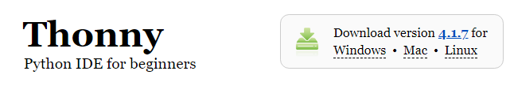

如果您的电脑是Windows系统，则选择Windows版本；如果是苹果系统，则选择mocOS。然后再根据自己的电脑配置选择适合的Python版本，如下图所示：

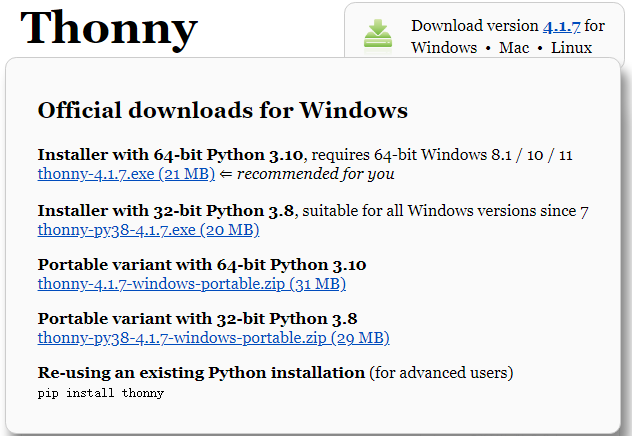

这里作者选择“Installer with 64-bit Python 3.10”这个版本的Thonny工具（本书编写时最新的Thonny版本，如有新版本，请下载最新版本），点击下载即可，最后在电脑下载目录下找到该安装文件。

### Thonny软件安装

双击下好的thonny-4.1.7.exe文件（也可以在正点原子提供的软件资料找到安装文件），如下图所示：

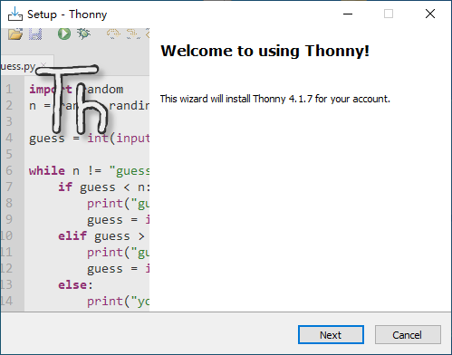

点击上图中的“Next”按键，进入许可协议界面，如下图所示：

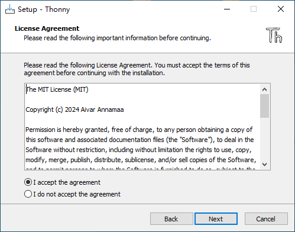

选择“I accept the agreement”接受许可协议，接着点击“Next”按键，进入选择程序安装位置界面，如下图所示：

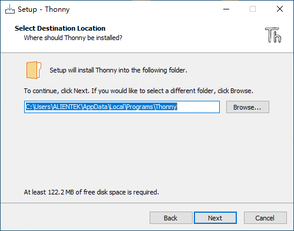

我这里选择默认位置安装，接着点击“Next”按键，进入选择菜单文件夹界面，如下图所示

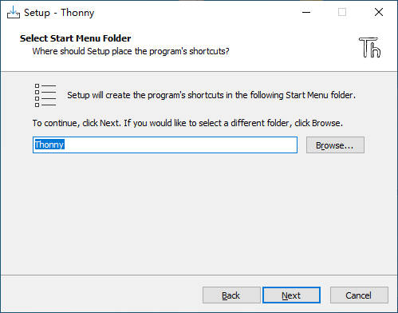

这里不用管它，直接点击“Next”按键，进入选择创建桌面图标界面，如下图所示：

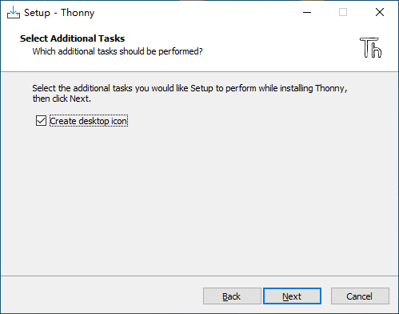

我们选择“create desktop icon”选项，接着继续点击“Next”按键，进入安装界面，如下图所示：

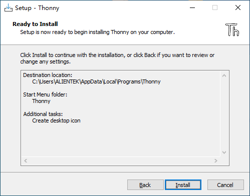

点击“Install”按键安装Thonny工具，安装成功后，便会在Windows桌面上自动生成Thonny程序图标。点击该图标便可以运行该软件。在第一次运行的时候，它会让您选择界面语言和初始化设置。这里就选择简体中文和标准（Standard）设置。最后进入程序标准运行界面。打开Thonny主界面如下所示：

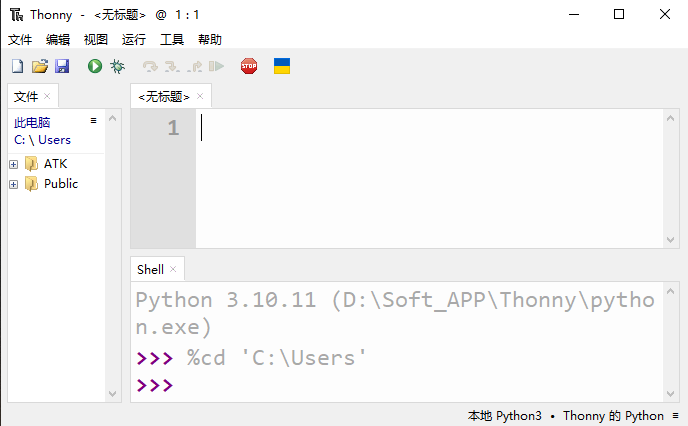

上图提示Thonny的Python版本是3.10.11，我们可以我们可在Shell交互界面或者文件下测试Python例程，如下图所示：

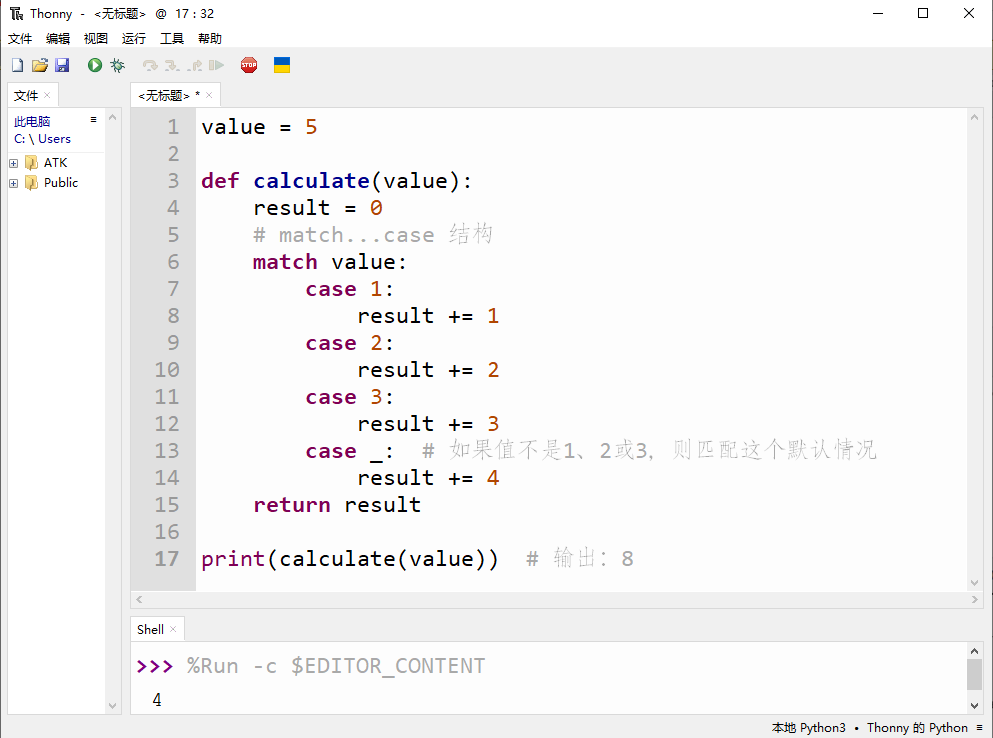

可以看到，Shell交互界面显示Python例程的输出结果，到了这里，Windows系统下的Thonny工具安装完成。