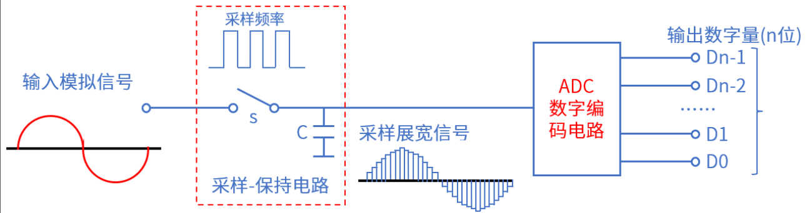

# ADC实验

## 前言

本章将介绍machine模块中的ADC类。通过本章的学习，读者将学习到machine模块中ADC类的使用。

## ADC介绍

### 1，ADC 简介

生活中接触到的大多数信息是随着时间连续变化的物理量，如声音、温度、压力等。表达这些信息的电信号，称为模拟信号（Analog Signal）。为了方便存储、处理，在计算机系统中，都是数字0和1信号，将模拟信号（连续信号）转换为数字信号（离散信号）的器件就叫模数转换器（Analog-to-Digital Convert，ADC）。ADC转换器可分为：并行比较型A/D转换器(FLASH ADC)、逐次比较型A/D转换器(SARADC)和双积分式A/D转换器(Double Integral ADC)。A/D转换过程通常为4步：采样、保持、量化和编码，如下图所示。



采样：把时间连续变化的信号变换为时间离散的信号。

保持：保持采样信号，使有充分时间转换为数字信号。

量化：把采样保持电路的输出信号用单位量化电压的整数倍表示。

编码：把量化的结果用二进制代码表示。

### 2，RP2350A ADC介绍

RP2350A的ADC（模数转换器）模块支持多通道模拟输入，主要特性包括：
1. 12位SAR ADC：逐次逼近型架构，支持单端输入。
2. 4个模拟输入通道：QFN-60封装的GPIO26-29（ADC0-3）。
3. 采样率：最高1MSPS（兆样本每秒）。
4. 参考电压：内部固定1.2V或外部参考电压（需通过ADC_CTRL配置）。
5. 温度传感器：集成温度测量功能，精度±2℃（典型值）。

## ADC模块介绍

### 概述

RP2350 的 PWM 模块包含 12 个相同的切片。每个切片可以驱动两个 PWM 输出信号，或测量输入信号的频率或占空比。每个切片上的两个输出具有相同的周期，占空比可以独立变化。

### API描述

ADC类位于machine模块下，ADC类提供了一个模数转换器的接口，代表了一个可以采样连续电压并将其转换为离散值的单端点。

#### 构造函数

```python
adc = ADC(id,...)
```

【参数】

- id：启用ADC功能的引脚号，为pin对象

#### read_u16

读取ADC对应引脚的电压模拟值

【参数】

无

【返回值】

返回0-66535范围内的整数

更多用法请阅读MicroPython官方API手册：

https://docs.micropython.org/en/latest/library/machine.ADC.html#machine.ADC

## 硬件设计

### 例程功能

1. 启用ADC0引脚的GPIO26的ADC功能，然后通过该引脚连接测试点测试电压值，同时在屏幕上显示。

### 硬件资源

1. 正点原子1.14寸SPI LCD模块

    LCD_BL - GPIO25
   
    LCD_DC - GPIO8
   
    SPI_MOSI - GPIO11
   
    SPI_SCK - GPIO10
   
    LCD_CS - GPIO9

2. ADC

   ADC0 - CPIO26

### 原理图

本章实验内容，主要讲解RP2350A内部ADC模块的使用，无需关注原理图。

##  实验代码

``` python
from machine import ADC,Pin
import LCD,time


"""
 * @brief       ADC取平均值
 * @param       times：次数
 * @retval      返回：ADC平均值
"""
def adc_get_result_average(times):
    
    temp_val = 0
    
    for i in range(0,times):
        temp_val += adc.read_u16()
        
    return temp_val / times

"""
 * @brief       程序入口
 * @param       无
 * @retval      无
"""
if __name__ == '__main__':
    lcd = LCD.LCD_init()
    adc = ADC(Pin(26))
    lcd.string("ATK-DNRP2350AM", 10, 10, lcd.red)
    lcd.string("ADC TEST", 10, 30, lcd.red)
    lcd.string("ATOM@ALIENTEK", 10, 50, lcd.red)
    while True:
        # 读取ADC值
        adcdata = adc_get_result_average(20)
        # 转换为电压值
        number = float(adcdata * (3.3 / 65535))
        print("ADC:{} V".format(number))
        lcd.hcolor_fill(10, 70, 20 * 8, 16, lcd.white)
        lcd.string("ADC:{} V".format(number), 10, 70, lcd.red) # 显示ADC读取的电压值
        lcd.display()
        time.sleep(1)
```

可以看到，首先声明函数adc_get_result_average(times)，用于获取times次ADC采集的平均值，这样可以让ADC读取的值更精确稳定，然后在入口函数main构建lcd对象和adc对象，接着在屏幕显示实验信息，最后在一个while循环不断转换ADC读取的模拟值，转化为电压值，并在屏幕上显示。

## 运行验证

将DNRP2350AM开发板连接到Thonny，然后添加需要运行的实验例程，并点击Thonny左上角的“运行当前脚本”绿色按钮后，此时，GPIO26引脚悬空，可以看到屏幕上显示ADC电压约为0V，如果将GPIO26接入板子上的3.3V，此时屏幕显示约3.3V，和理论结果一致。

