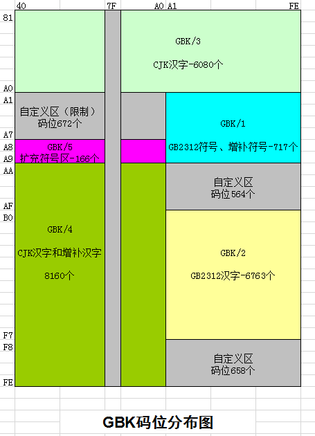
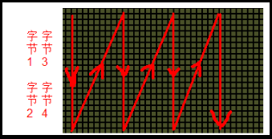
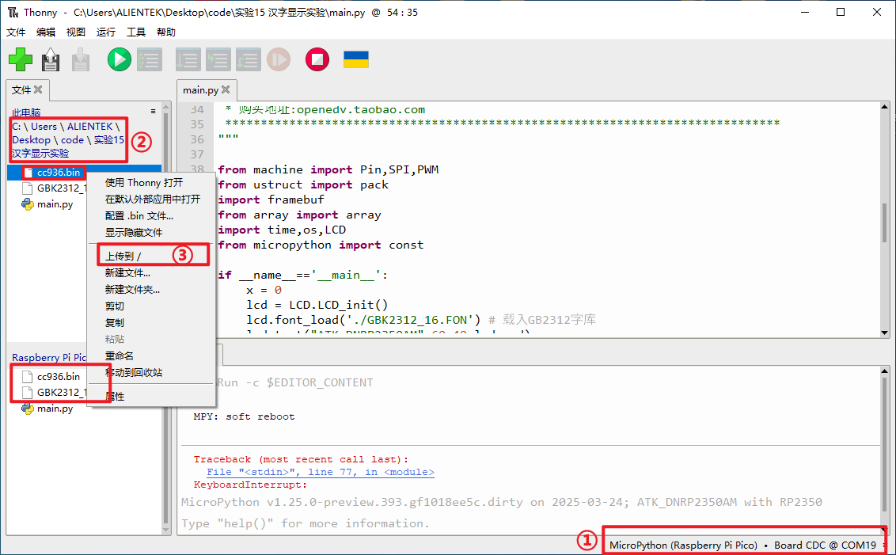

# 汉字显示实验

## 前言

本章将介绍如何使用MicroPython方式实现RP2350A开发板的汉字显示功能。通过本章的学习，读者将学习到如何使用MicroPython实现RP2350A的中文汉字显示功能。

## 汉字显示介绍介绍

### 1，字符编码简介

众所周知，计算机只能识别0和1，所有信息都是以0和1的形式在计算机里面进行存储，文字信息也是一样。那么如何进行区分文字信息呢？这里就引出了字符编码这个概念，就是对字符进行编码，用规定的01数字串来表示特定的文字，最简单的字符编码例子是ASCII码。此外还有中文编码，中文编码又可以细分GB2312，GB13000，GBK，BIG5（繁体）等几种，此外还有全球统一编码Unicode、UTF-8、UTF-16、UTF-32等，本章主要讲解了GBK编码、Unicode码及UTF-8编码的使用及相互转换，大家可以通过网上查阅相关资料，下面我们重点介绍下GBK编码。

GBK编码即汉字内码扩展规范，完全兼容GB2312，在GB2312的基础上，支持繁体字、人名、古汉语等方面出现的罕用字。GBK采用的是双字节表示，总体编码范围为0x8140 - 0xFEFE，第一个字节在0x81 - 0xFE之间，第二个字节分为两个部分，一是0x40 - 0x7E，二是0x80 - 0xFE。其中和GB2312相同的区域，字完全相同，可表示的汉字数达到了2万多个，完全能满足我们的一般应用的要求。码位分布图如下图所示：



### 2，字库简介

通过编码转换和GBK的码位图，便可以确定GBK编码所对应的汉字字符。系统默认使用的是UTF-8编码，通过MicroPython自带的ord()函数便可将UTF-8编码转化为Unicode码，但是MicroPython并没有将Unicode码转化为GBK编码的方法（UTF-8转GBK也不行），需要借助GBK转码表才能够完成编码转换，我们这里使用cc936.c文件用于转码以支持中文，通过正点原子C2B转换助手 V2.2.exe可以将cc936.c文件转化为cc936.bin文件，转化方法这里不详细叙述，借助cc936.bin文件通过对应的查表方法，便可以通过Unicode码获得对应的GBK码。

GBK内码高字节范围为0x81 - 0xFE，GBK内码低字节范围为0x40 - 0x7E、0x80 - 0xFE，也就是说这个范围内都有唯一对应的汉字，但是，我们日常看到的汉字都是图形化输出的字符，并不是它的中文编码，这里呢，就需要我们提供配套的字符图形。字符图形又称为字模，多个字模组成的文件就叫做字库。当我们为计算机提供了编码和字库的前提下，计算机就可以把字符编码转化成对应的字符图形，我们才能清晰识别。

 在前面GB2312也说到，第一字节称为区，那么GBK里面总共就有126个区（0xFE-0x81+1），第二个字节称为位，我们也可以理解为每个区里面包含的汉字即190个汉字（0xFE-0X80+0X7E-0X40+2），GBK字库总共就126*190=23940个汉字。字模是字符的图形结构，字模的实质就是一个个像素点数据。为了方便处理，我们把字模定义成方块形状的像素点阵，像素点只有0和1两种状态。在单色图像数据中，像素点数值置1时，点亮了该像素点，若像素点数值置0时，熄灭该像素点。“汉字”字模图，如下图所示：


这两个字模的大小都是16*16，计算机要表示这样的图形，只需要16x16个二进制数据位即可，需要使用16x16/8=32个字节保存字模数据。这里存在一个问题，字模数据是从哪里标记为第一个字节呢？我们知道了第一个字节以及字模的走向，我们就可以把生成的点阵数据和字模图像上的小方块进行匹配，更好了解两者的关系。下面我们解密一下，如下图取模方式（从上到下，从左到右）进行取模。



这样就能准确的获得一个16*16的汉字字模，比如汉字“汉”的字模为

```python
{0x08,0x20,0x06,0x20,0x40,0x3E,0x30,0xC0,0x03,0x01,0x40,0x01,0x78,0x02,

0x47,0x04,0x40,0xC8,0x40,0x30,0x40,0xC8,0x47,0x04,0x78,0x02,0x00,0x01, 0x00,0x01,0x00,0x00},/*"汉",0*/
```

下面我们借助正点原子团队开发的软件：ATK_XFONT，直接生成指定大小和排序的GBK字库，我们这里不详细叙述，生成的字库文件GBK2312_16.FON已放在对应的实验文件下。

### 3，汉字显示原理

汉字在液晶上的显示其实就是一些点的显示与不显示，这就相当于我们的笔一样，有笔经过的地方就画出来，没经过的地方就不画。所以要显示汉字，我们首先要知道汉字的点阵数据，这些数据可以由专门的软件来生成，在前面字库生成已经有讲到如何生成字模与字库了。

在我们前面制作的1个GBK字库和一个GBK转码表，我们需要先通过Thonny这个工具，将字库文件和GBK转码表下载到开发板的外部Flash的NORFLASH里，这样，NORFLASH就相当于一个汉字字库芯片了，同时开发板还具备了Unicode码转GBK编码的能力。

单片机要显示汉字的步骤：汉字内码（GBK/GB2312）→查找点阵库→解析→显示。所以只要我们有了整个汉字库的点阵，就可以把字符图形在单片机上显示出来了。

## LCD模块介绍

### 概述

LCD模块用于驱动DNRP2350AM开发板自带的1.14寸LCD显示器，这个库是自己编写封装的，存放于MicroPython的源文件下，路径：micropython->ports->rp2->modules，编译时会将库编译到固件中，我们直接引用LCD模块即可使用，为了方便大家学习，我们在main.py也写了LCD驱动的主要函数。

### API描述

LCD库位于MicroPython下rp2板卡的modules文件夹下。

#### font_load

```python
lcd.font_load(path)
```

用于加载汉字字库。

【参数】

- path：字库文件存放路径

【返回值】

无

#### chinese_text

```python
lcd.chinese_text(str, x, y, color)
```

自写的汉字显示函数，用于16*16的汉字显示。

【参数】

- str：要显示的汉字字符
- x：显示的x轴坐标
- y：显示的y坐标
- color：字体颜色、以RGB565排列

【返回值】

无

其他有关LCD模块的介绍，请见[LCD实验的LCD模块介绍](lcd.md#LCD模块介绍)

## 硬件设计

### 例程功能

1. 使用LCD模块初始化板载的LCD显示器，DNRP2350AM开发板板载的LCD分辨率大小为135* 240，然后在屏幕中显示三行不同大小的英文字符、中文字符，并不停地刷新屏幕颜色。

### 硬件资源

1. 正点原子1.14寸SPI LCD模块

      LCD_BL - GPIO25

      LCD_DC - GPIO8

      SPI_MOSI - GPIO11

      SPI_SCK - GPIO10

      LCD_CS - GPIO9


### 原理图

本章实验内容，原理图与LCD实验一致，请见[LCD实验的原理图](lcd.md#原理图)

##  实验代码

``` python
from machine import Pin,SPI,PWM
from ustruct import pack
import framebuf
from array import array
import time,os,LCD
from micropython import const
   
if __name__=='__main__':
    x = 0
    lcd = LCD.LCD_init()
    lcd.font_load('./GBK2312_16.FON') # 载入GB2312字库
    lcd.text("ATK-DNRP2350AM",60,40,lcd.red)
    lcd.chinese_text("汉字显示实验",60,60,lcd.green)
    lcd.text("ATOM@ALIENTEK",60,80,lcd.blue)  
    
    lcd.display()
    time.sleep(0.1) # 停留0.1秒后，全屏刷新
    while(1):
        #创建字典
        seasondict = {
        0: lcd.black,
        1: lcd.blue,
        2: lcd.red,
        3: lcd.green,
        4: lcd.cyan,
        5: lcd.magenta,
        6: lcd.yellow}

        #刷新颜色
        lcd.fill(seasondict[x])
        #显示字体
        lcd.string("ATK-DNRP2350AM",60,40,lcd.red)
        lcd.chinese_text("汉字显示实验",60,60,lcd.green)
        lcd.text("ATOM@ALIENTEK",60,80,lcd.blue)
        x += 1
        
        if x == 7:
            x = 0
        lcd.display()
        time.sleep(1)
```

可以看到，首先构建LCD对象，然后通过lcd.font_load()函数加载汉字字库，通过lcd.display()函数可以显存的数据刷新到LCD显示器上，最后在一个while循环中不断刷新英文字符、中文字符以及屏幕底色填充。

## 运行验证

将DNRP2350AM开发板连接到Thonny，连接上开发板之后，要先借助Thonny将前面提到的GBK转码表和字库文件加载到DNRP2350AM开发板的NOR Flash上，具体操作如下图所示：



​	①电脑连接DNRP2350A开发板

​	②在此电脑的文件中找到实验15的中文汉字显示实验文件夹，选中文件夹下的cc936.bin文件和GBK2312_16.FON文件，然后右击鼠标，将文件上传

​	③直接点击上传/，等待两个文件上传成功即可。

然后添加需要运行的实验例程，并点击Thonny左上角的“运行当前脚本”绿色按钮后，此时屏幕被点亮，然后在屏幕中显示中英文字符、不停刷新屏幕底色等，这与理论结果一致。

