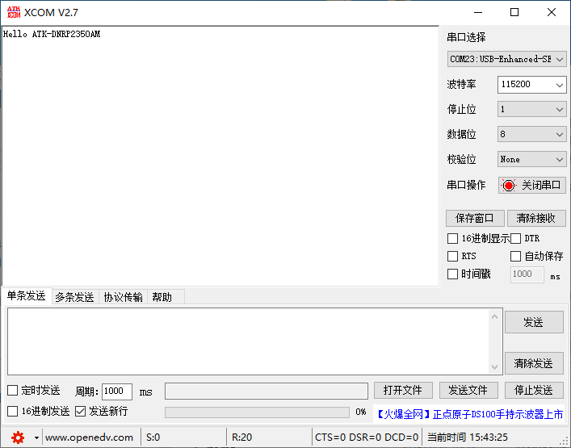

# DMA实验

## 前言

本章将介绍如何使用RP2350A开发板的DMA功能。通过本章的学习，读者将学习到如何使用MicroPython驱动RP2350A的DMA功能。

## DMA介绍

### 1，DMA简介

DMA，全称为：Direct Memory Access，即直接存储器访问。DMA传输方式无需CPU直接控制传输，也没有中断处理方式那样保留现场和恢复现场的过程，通过硬件为RAM与I/O设备开辟一条直接传送数据的通路，能使CPU的效率大为提高 。

## DMA模块介绍

### 概述

DMA类提供访问RP2350A的直接内存访问（DMA）控制器，提供在内存块和/或IO寄存器之间移动数据的能力。

### API描述

DMA类提供访问RP2350A的DMA控制器的API

#### 构造函数

```python
dma = rp2.DMA()
```

要求一个DMA控制器通道独占使用

#### pack_ctrl

```python
DMA.pack_ctrl(...)
```

将关键字参数中提供的值打包到新的控制寄存器值的命名字段中。任何未提供的字段将被设置为默认值。

【参数】

- enable：布尔型，设置通道开启
- high_pri：布尔型，将该通道设置为高优先级
- size：传输大小: 0=byte, 1=half word, 2=word，默认值为2
- inc_read：布尔型，每次传输后增加读地址，默认为True
- inc_write：布尔型，每次传输后增加写地址，默认为True

【返回值】

无

#### config

```python
DMA.config(read=None, write=None, count=None, ctrl=None, trigger=False)
```

为通道配置DMA寄存器，并可选择启动传输。

【参数】

- read：DMA读取数据的地址
- write：DMA写入数据的地址
- count：DMA通道停止前的传输数（非字节数）
- ctrl：DMA控制寄存器的值，通常由pack_ctrl()打包
- trigger：是否立即开始传输

【返回值】

无

#### active

```python
DMA.active()
```

获取或设置DMA通道当前是否正在运行。

【参数】

无

【返回值】

1：DMA运行中，0：DMA未运行

更多用法请阅读MicroPython官方API手册：

https://docs.micropython.org/en/latest/library/rp2.DMA.html#rp2.DMA

## 硬件设计

### 例程功能

1. 创建DMA，将数据通过DMA发送到串口中，每按下KEY1，就会将定义的缓存区数据以DMA的方式发送到串口。打开串口调试助手XCOM，可以收到DMA发送的内容。

### 硬件资源

1. uart0:（UART0_TX、UART0_RX连接至板载USB转串口芯片上

     UART0_TX - GPIO0

     UART0_RX - GPIO1

2. 独立按键

   KEY1 - GPIO2

3. LED

   LED - GPIO3

### 原理图

本章实验内容，主要讲解RP2350A内部DMA模块的使用，无需关注原理图。

##  实验代码

``` python
from machine import Pin,UART
import time

uart_base_txbuf = 0x40070000  # 对应UART0的数据寄存器地址，低八位用于存放数据

"""
 * @brief       程序入口
 * @param       无
 * @retval      无
"""
if __name__ == '__main__':
    led = Pin(3, Pin.OUT)
    key1 = Pin(2, Pin.IN, Pin.PULL_UP)
    uart = UART(0, baudrate=115200, tx=Pin(0), rx=Pin(1))
    uart_dma = rp2.DMA()
    src_data = bytearray(b'Hello ATK-DNRP2350AM')

    uart_ctrl = uart_dma.pack_ctrl(size=0, inc_write=False)  # 传输大小：字节，写入地址不递增
    # The count is in 'transfers', which defaults to four-byte words, so divide length by 4
    uart_dma.config(read=src_data, write=uart_base_txbuf, count=len(src_data), ctrl=uart_ctrl, trigger=True)
    # 等待传输完成
    while uart_dma.active():
        led.value(1)
        time.sleep_ms(20)
        led.value(0)
        time.sleep_ms(20)
    while True:
        # 读取按键状态，并做相应的按键解释
        if key1.value() == 0:               # 判断KEY是否按下
            
            time.sleep_ms(10)               # 该延时为按键消抖
            
            if key1.value() == 0:           # 再一次判断是否按下
                uart_dma.config(read=src_data, write=uart_base_txbuf, count=len(src_data), ctrl=uart_ctrl, trigger=True)
                while uart_dma.active():
                    time.sleep_ms(20)
                while not key1.value():     # 检测按键是否松开
                    pass
```

可以看到，首先构建led、key1、uart和DMA对象，然后定义一个数据缓存区src_data，内容为"Hello ATK-DNRP2350AM"，配置DMA，然后立即开启DMA传输，等待DMA传输完成后进入while循环。

最后在一个while循环读取按键KEY1状态，当Key被按下时，重新开启DMA传输，将缓存区src_data数据发送到UART0数据发送寄存器。

## 运行验证

将DNRP2350AM开发板连接到Thonny，然后添加需要运行的实验例程，并点击Thonny左上角的“运行当前脚本”绿色按钮后，此时，我们将开发板的UART Type-C接口连接电脑，打开XCOM串口调试助手，我们每按下KEY1，串口调试助手可以看到输出"Hello ATK-DNRP2350AM"数据，如下图所示：



这与理论结果一致。

