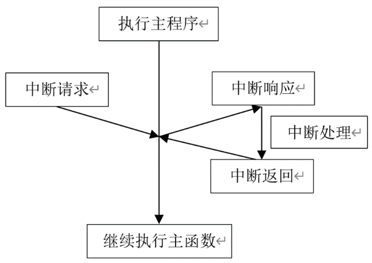

# 外部中断实验

## 前言

在上一章，我们详细讲解了GPIO的输出模式，并演示了如何利用它来控制LED的亮灭。而在本章中，我们将重点关注GPIO的输入模式配置，学会如何获取外部的输入信号，例如检测按键的状态，介绍如何使用MicroPython让Raspberry RP2350A获取板载按键的状态。通过本章的学习，读者将学习到如何使用MicroPython读取RP2350A的GPIO上的高低电平状态。 

## 中断简介

在上一章节中，我们实现了通过GPIO口输入功能读取引脚电平，但是是通过轮询方式检测IO引脚的电平变化，会导致在代码量增加时，按键检测部分的轮询效率降低。如果我们按下时按键代码未被执行，则会出现按键无效的情况，就不符合程序设计要求了。为优化此问题，我们引入了外部中断的概念。外部中断即在按键被按下（触发中断）时执行相关功能，从而显著节省CPU资源，因此在实际项目中应用广泛。

### 1，什么是外部中断

外部中断属于硬件中断，由微控制器外部事件触发。微控制器的特定引脚被设计为对特定事件（如按钮按压、传感器信号变化等）作出响应，这些引脚通常称为“外部中断引脚”。一旦外部中断事件发生，当前程序执行将立即暂停，并跳转到相应的中断服务程序（ISR）进行处理。处理完毕后，程序会恢复执行，从被中断的地方继续。下图是CPU中断处理过程。



对于嵌入式和实时系统而言，外部中断的使用至关重要，它能使系统对外部事件作出即时响应，极大提升系统效率和实时性。

### 2，RP2350A外部中断

总的来说，RP2350A的外部中断具备两种触摸类型：

（1）电平触发：高、低电平触发，要求保持中断的电平状态直到CPU响应。

（2）边沿触发：上升沿和下降沿触发，这类型的中断一旦触发，CPU即可响应。

RP2350A的外部中断功能能够以非常精确的方式捕捉外部事件的触发。开发者可以通过配置中断触发方式（如上升沿、下降沿、任意电平、低电平保持、高电平保持等）来适应不同的外部事件，并在事件发生时立即中断当前程序的执行，转而执行中断服务函数。

## Pin模块介绍

### value

```python
Pin.irq(handler=None, trigger，hard)
```

配置一个中断处理程序，当引脚的触发源处于活动状态时调用。

【参数】

- handler：中断触发时调用，处理函数需要接收一个Pin实例
- trigger：中断事件，可以是：Pin.IRQ_FALLING、Pin.IRQ_RISING
- hard：如果为真，则使用硬件中断。

【返回值】

这个方法返回一个回调对象。

其他有关Pin模块的介绍，请见[跑马灯实验的Pin模块介绍](led.md#pin模块介绍)

## 硬件设计

### 例程功能

1. 当KEY1按键被按下后，LED灯的状态翻转

### 硬件资源

1. LED: LED-GPIO3
2. 按键: KEY1-GPIO2

### 原理图

此部分与[按键输入实验](key.md#原理图)一致，这里不再叙述。

## 实验代码

``` python
from machine import Pin
import time

"""
 * @brief       按键中断服务函数
 * @param       无
 * @retval      无
"""
def key_irq_cb():
    led.toggle()                # LED灯翻转
    time.msleep(20)

"""
 * @brief       程序入口
 * @param       无
 * @retval      无
"""
if __name__ == '__main__':
    p2 = Pin(2, Pin.IN, Pin.PULL_UP)
    p2.irq(lambda pin: key_irq_cb(),Pin.IRQ_FALLING)
    led = Pin("LED", Pin.OUT)

    while True:
        pass
```

可以看到，首先创建一个Pin实例，GPIO引脚为与按键KEY1连接的GPIO2，然后通过函数irq注册中断功能，中断回调函数为key_irq_cb()，下降沿触发，接着创建一个led对象，最后进入一个空循环，当我们按下KEY1时，触发中断，进入到回调函数key_irq_cb()执行LED灯翻转一次，然后延时20ms

## 运行验证

将DNRP2350AM开发板连接到Thonny，然后添加需要运行的实验例程，并点击Thonny左上角的“运行当前脚本”绿色按钮后，此时，若按下板载的KEY1按键，则能看到LED灯的状态翻转一次，释放KEY1按键后，LED灯的状态不变，这与理论推断的结果一致。  
