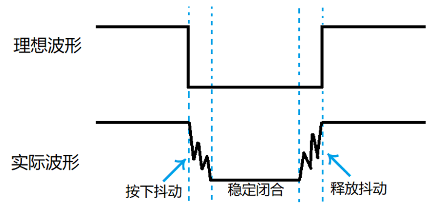
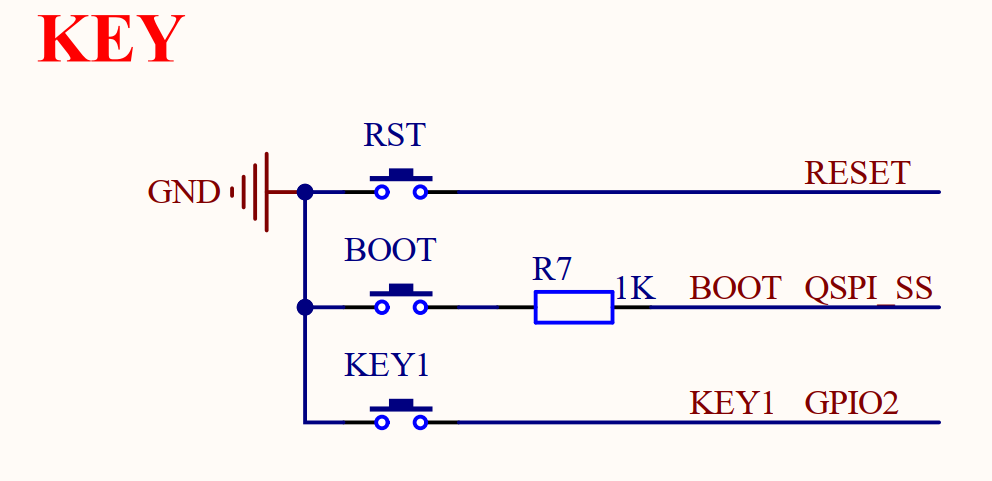

# 按键输入实验

## 前言

在上一章，我们详细讲解了GPIO的输出模式，并演示了如何利用它来控制LED的亮灭。而在本章中，我们将重点关注GPIO的输入模式配置，学会如何获取外部的输入信号，例如检测按键的状态，介绍如何使用MicroPython让Raspberry RP2350A获取板载按键的状态。通过本章的学习，读者将学习到如何使用MicroPython读取RP2350A的GPIO上的高低电平状态。 

## 独立按键基础知识

独立按键是一种简洁高效的输入设备，广泛应用于各类电子设备中，实现基础的用户交互功能。其工作原理主要基于机械开关的触发机制，当用户按下按键时，便能执行相应的操作。独立按键在尺寸、形状和颜色上都具有多样性，便于用户进行辨识和使用，满足不同场景下的需求。

### 1，独立按键原理

独立按键的原理主要依赖于机械触点和电气触点之间的相互作用。在未被按下时，触点保持分离状态，电路处于断开状态。然而，当用户按下按键时，在弹簧和导电片的共同作用下，触点会闭合，从而使电路连通。此时，微控制器能够检测到按键触发的信号，进而执行相应的操作。这种基于物理触点的设计使得独立按键既稳定又可靠，广泛应用于各种电子设备中。

### 2，消抖措施

机械按键在闭合与分开的过程中，由于机械振动（类似于弹簧效应）的存在，可能导致开关状态在短时间内频繁切换，这种现象被称为按键抖动。下图是独立按键抖动波形图。



图中的按下抖动和释放抖动的时间一般为5~10ms，如果在抖动阶段采样，其不稳定状态可能出现一次按键动作被认为是多次按下的情况。为了避免抖动可能带来的误操作，我们要做的措施就是给按键消抖（即采样稳定闭合阶段）。为了消除这种抖动，我们通常采用软件消抖和硬件消抖两种主要方法：

（1）软件消抖：主要是通过编程的方法，设定一个延迟或计时器，确保在一定的时间内只读取一次按键状态，避免抖动对程序的影响。

（2）硬件消抖：在按键电路中加入元器件如电阻、电容组成的RC低通滤波器，对按键信号进行平滑处理，降低抖动的影响。

我们例程中使用最简单的延时消抖。检测到按键按下后，一般进行10ms延时，用于跳过抖动的时间段，如果消抖效果不好可以调整这个10ms延时，因为不同类型的按键抖动时间可能有偏差。待延时过后再检测按键状态，如果没有按下，那我们就判断这是抖动或者干扰造成的；如果还是按下，那么我们就认为这是按键真的按下了。对按键释放的判断同理。

## Pin模块介绍

有关Pin模块的介绍，请见[跑马灯实验的Pin模块介绍](led.md#pin模块介绍)

## 硬件设计

### 例程功能

1. 当KEY1按键被按下后，LED灯的状态翻转

### 硬件资源

1. LED: LED-GPIO3
2. 按键: KEY1-GPIO2

### 原理图

本章实验使用的一个DNRP2350AM开发板板载按键：KEY1按键，其于板载MCU的连接原理图，如下图所示 ：



从上面的原理图中可以看出，KEY1按键的一端连接到了GND，而另一端则与MCU的GPIO2引脚相连接，因此当按键被按下时，MCU对应的引脚都能够读取到低电平的状态，而当松开按键后，MCU对应的引脚读取到的电平状态是不确定的（悬空状态），因此需要设置用于读取KEY1按键的GPIO2引脚设置为输入上拉模式，当按键不被按下时（悬空状态），读取到GPIO2的状态为高电平，从而能够判断按键是否被按下。

## 实验代码

``` python
from machine import Pin
import time

"""
 * @brief       程序入口
 * @param       无
 * @retval      无
"""
led = Pin("LED", Pin.OUT)
key1 = Pin(2, Pin.IN, Pin.PULL_UP)

# 设置输出为高，熄灭LED灯
led.value(1)

while True:
    # 读取按键状态，并做相应的按键解释
    if key1.value() == 0:               # 判断KEY是否按下
        
        time.sleep_ms(10)               # 该延时为按键消抖
        
        if key1.value() == 0:           # 再一次判断是否按下
            led.toggle()                # LED灯翻转
            
            while not key1.value():     # 检测按键是否松开
                pass
```

可以看到，首先构建key和led的GPIO对象，特别的，独立按键key1的GPIO对象都被初始化为上拉输入模式，以读取独立按键的状态，最后在一个循环中读取KEY1按键对应的GPIO输入电平，以判断独立按键是否被按下，若KEY1按键被按下，则翻转LED灯的亮灭状态。

## 运行验证

将DNRP2350AM开发板连接到Thonny，然后添加需要运行的实验例程，并点击Thonny左上角的“运行当前脚本”绿色按钮后，此时，若按下板载的KEY1按键，则能看到LED灯的状态翻转一次，释放KEY01按键后，LED灯的状态不变，这与理论推断的结果一致。  
