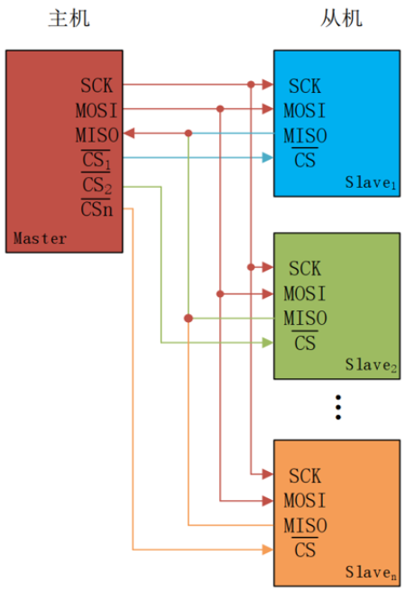
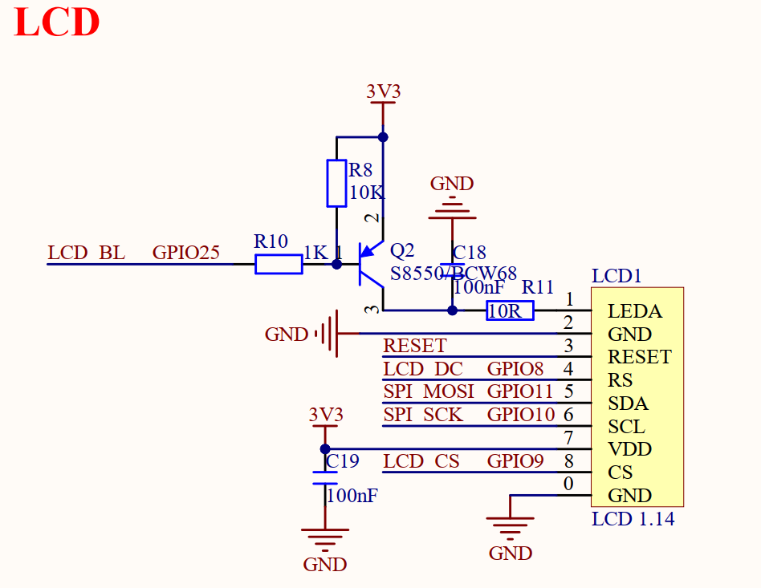

# LCD实验

## 前言

本章将介绍在MicroPython下驱动LCD显示器的使用，通过SPI接口驱动板载LCD实现简单的字符串显示功能。通过本章的学习，读者将学习到通过MicroPython驱动板载LCD的简单使用。

## SPI 及 LCD 介绍

### 1，SPI 简介

SPI，Serial Peripheral interface，顾名思义，就是串行外围设备接口，是由原摩托罗拉公司在其MC68HCXX系列处理器上定义的。SPI是一种高速的全双工、同步、串行的通信总线，已经广泛应用在众多MCU、存储芯片、AD转换器和LCD之间。
SPI通信跟IIC通信一样，通信总线上允许挂载一个主设备和一个或者多个从设备。为了跟从设备进行通信，一个主设备至少需要4跟数据线，分别为：

1. MOSI（Master Out / Slave In）：主数据输出，从数据输入，用于主机向从机发送数据。
2. MISO（Master In / Slave Out）：主数据输入，从数据输出，用于从机向主机发送数据。
3. SCLK（Serial Clock）：时钟信号，由主设备产生，决定通信的速率。
4. CS（Chip Select）：从设备片选信号，由主设备产生，低电平时选中从设备。多从机SPI通信网络连接如下图所示。



从上图可以知道，MOSI、MISO、SCLK引脚连接SPI总线上每一个设备，如果CS引脚为低电平，则从设备只侦听主机并与主机通信。SPI主设备一次只能和一个从设备进行通信。如果主设备要和另外一个从设备通信，必须先终止和当前从设备通信，否则不能通信。

### 2，LCD介绍

RP2350A最小系统板板载1.14英寸高清SPI-LCD显示屏，其分辨率为135×240 像素（RGB垂直条纹排列），4线SPI。该显示屏采用 ST7789V2作为驱动芯片，其内置RAM无需外部驱动器或存储器。

RP2350A芯片仅需通过SPI接口即可轻松驱动此显示屏。该屏幕通过8个引脚与 PCB 电路连接。引脚详细描述，如下表所示。

序号  | 名称        | 说明

----  |---------------------|------------------------------------

 1  | LEDA | 背光正极

 2  | GND  | 地

 3  | RESET  | 复位（低电平有效）

 4  | RS  | 数据 / 命令选择（H = 数据，L = 命令）

 5  | SDA | SPI 数据输入 / 输出

 6  | SCL  | SPI 时钟

 7  | VDD  | 电源（2.5V~3.3V）

 8  | CS  | 片选（低电平使能）

1.14寸LCD屏在四线SPI通讯模式下，仅需四根信号线（CS、 SCL、 SDA、 RS（DC））就能够驱动。

# LCD模块介绍

### 概述

LCD模块用于驱动DNRP2350AM开发板自带的1.14寸LCD显示器，这个库是自己编写封装的，存放于MicroPython的源文件下，路径：micropython->ports->rp2->modules，编译时会将库编译到固件中，我们直接引用LCD模块即可使用，为了方便大家学习，我们在main.py也写了LCD驱动的主要函数。

### API描述

LCD库位于MicroPython下rp2板卡的modules文件夹下。

#### 构造函数

【描述】

创建一个LCD对象，LCD类继承了**FrameBuffer** 类，用于存放LCD的显存

```python
lcd = LCD_init()
```

【参数】

无

【返回值】

无

#### Init

【描述】

初始化lcd屏幕参数

```python
init()
```

【参数】

无

【返回值】

无

#### string

在屏幕上显示16x16的ascii码。

```python
string(self, str, x, y, color)
```

设置引脚的功能

【参数】

- self：显示的图像
- str：要显示的字符
- x：起始坐标的x值
- y：起始坐标的y值
- color：显示ascii码的RGB565颜色值

【返回值】

无

关于**FrameBuffer**内容的介绍请阅读MicroPython官方API手册：

https://docs.micropython.org/en/latest/library/framebuf.html#framebuf.FrameBuffer

## 硬件设计

### 例程功能

1. 使用LCD模块初始化板载的LCD显示器，DNRP2350AM开发板板载的LCD分辨率大小为135* 240，然后在显存中绘制矩形、圆、椭圆等形状，然后显示到LCD显示器上、5秒后，在显示器上显示一段字符，并不停地刷新屏幕颜色。

### 硬件资源

1. 正点原子1.14寸SPI LCD模块

   ​	LCD_BL - GPIO25

   ​	LCD_DC - GPIO8

   ​	SPI_MOSI - GPIO11

   ​	SPI_SCK - GPIO10

   ​	LCD_CS - GPIO9

### 原理图

正点原子DNRP2350AM开发板上的LCD模块接口的连接原理图，如下图所示：



## 实验代码

``` python
if __name__=='__main__':
    x = 0
    lcd = LCD_init()
    
    lcd.hline(5,5,230,lcd.blue)
    lcd.hline(5,130,230,lcd.blue)
    lcd.vline(5,5,125,lcd.blue)
    lcd.vline(235,5,125,lcd.blue)
    
    lcd.ellipse(120,67,45,30,lcd.green)
    
     
    lcd.rect(12,12,20,20,lcd.red)
    lcd.ellipse(22,113,10,10,lcd.red)
    lcd.rect(208,12,20,20,lcd.red)
    lcd.ellipse(218,113,10,10,lcd.red)
    
    lcd.display()
    time.sleep(5) # 停留5秒后，全屏刷新
    while(1):
        #创建字典
        seasondict = {
        0: lcd.black,
        1: lcd.blue,
        2: lcd.red,
        3: lcd.green,
        4: lcd.cyan,
        5: lcd.magenta,
        6: lcd.yellow}

        #刷新颜色
        lcd.fill(seasondict[x])
        #显示字体
        lcd.string("ATK-DNRP2350AM",60,40,lcd.red)
        lcd.text("LCD Test",60,60,lcd.green)
        lcd.text("ATOM@ALIENTEK",60,80,lcd.blue)
        x += 1
        
        if x == 7:
            x = 0
        lcd.display()
        time.sleep(1)
```

可以看到，首先构建lcd对象，LCD类会继承FrameBuffer类，然后我们就可以使用FrameBuffer类的功能了，如hline()、vline()、ellipse()、rect()、text()等函数均来自FrameBuffer类，功能是往一定大小的显存中填充不同的数据，然后调用display()函数便可将显存数据刷新到LCD显示器上。

5秒后，进入一个while循环，在循环中反复刷新7种不同的颜色，同时调用string()函数和text()函数显示两种不同大小的字符串。

## 运行验证

将DNRP2350AM开发板连接到Thonny，然后添加需要运行的实验例程，并点击Thonny左上角的“运行当前脚本”绿色按钮后，屏幕被点亮，然后显示矩形、椭圆、圆等形状，约5秒后，屏幕刷新不同的颜色，并在屏幕中心显示"ATK-DNRP2350AM"等字符串。
