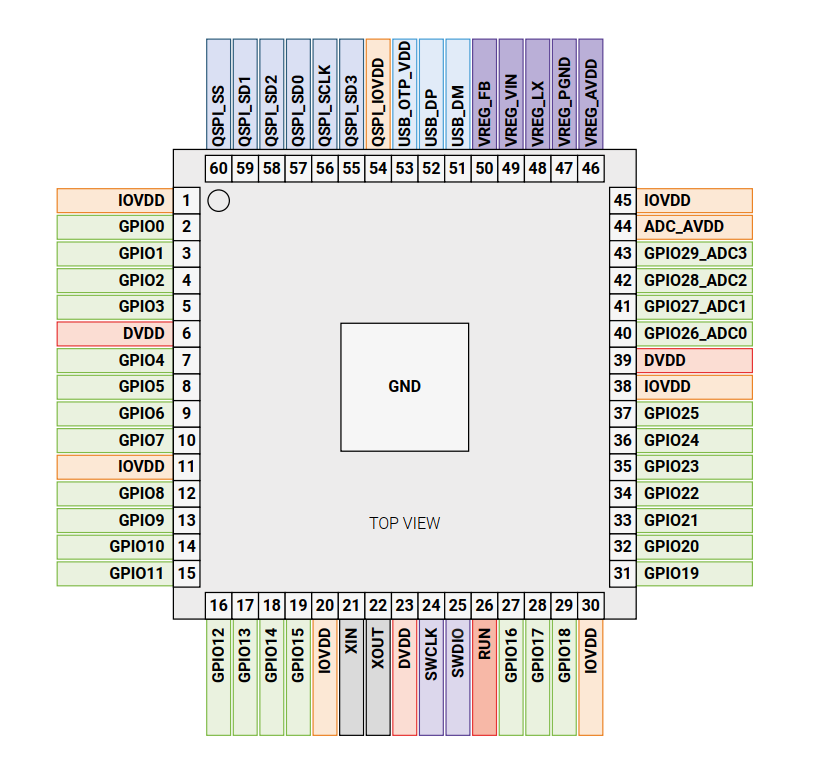
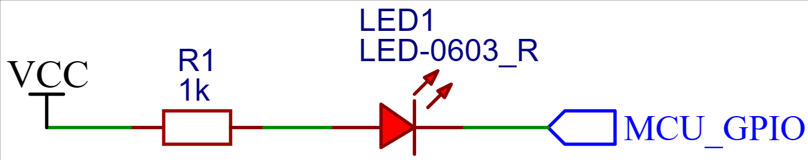
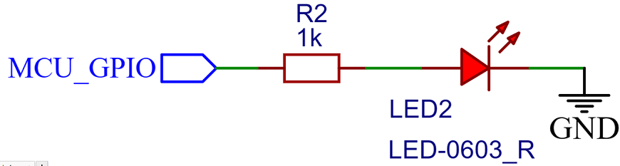
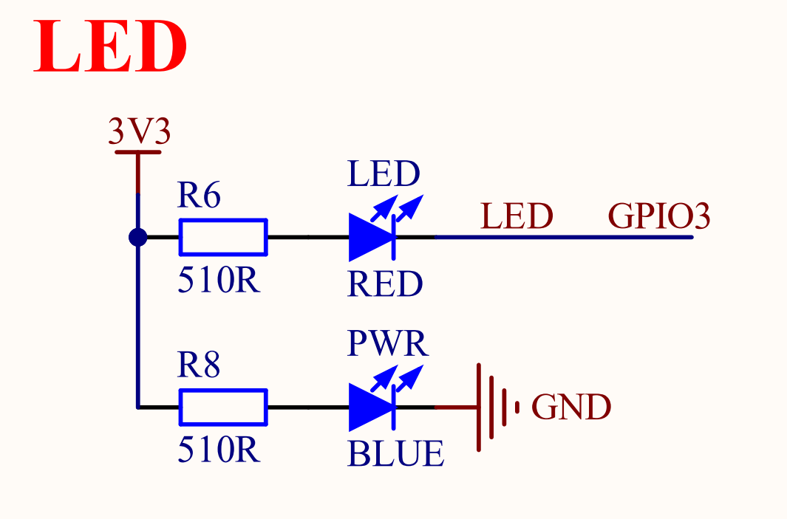

# 跑马灯实验

## 前言

本章实验将介绍如何使用MicroPython让Raspberry RP2350A开发板板载的LED闪烁，以实现跑马灯的效果。通过本章的学习，读者将学习到如何使用MicroPython控制RP2350A的GPIO输出高低电平。  

## GPIO & LED简介

### GPIO简介

GPIO是负责控制或采集外部器件信息的外设，主要负责输入输出功能。RP2350最多有54个多功能通用输入/输出（GPIO）引脚，分为两组：QFN-60封装中的`Bank 0` 30个用户GPIO（RP2350A），或QFN-80封装中的48个用户GPIO `Bank 1` 6个QSPI IO，以及USB DP/DM引脚，以下我们展示的是RP2350A的引脚分布图：



从上面的图示中可见，绿色区域的管脚均可作为普通的IO端口使用。因此，在控制LED灯时，我们可以对连接LED灯的管脚进行操作。但需要开发者在操作过程中参考相关技术手册，以规避潜在的问题。在正点原子的DNRP2350AM开发板中，芯片的GPIO3连接LED灯的负极，因此在本章的实验中，我们将主要对GPIO3进行操作。

### LED简介

LED，即发光二极管，其发光原理基于半导体的特性。在半导体中，有两类重要的载流子：电子，主要存在于n型半导体中；而空穴，则主要存在于p型半导体中。当n型半导体与p型半导体材料接触时，它们的交界处会形成一个特殊的层结。当对这个层结施加适当的电压时，层结中的空穴与电子会发生重组，并释放出能量。这些能量会以光子的形式被释放出来，从而产生可见光。这就是LED发光的基本原理。

#### 1，LED灯驱动原理

LED驱动是指通过稳定的电源为LED提供适宜的电流和电压，确保其正常发光。LED驱动方式主要有恒流和恒压两种，其中，恒流驱动因其能限定电流而备受青睐。由于LED灯对电流变化极为敏感，一旦电流超过其额定值，可能导致损坏。因此，恒流驱动通过确保电流的稳定性，进而保障LED的安全运行。

#### 2，LED灯驱动方式

下面，我们来看一下LED两种驱动方式：

（1）灌入电流接法。指的是LED的供电电流是由外部提供电流，将电流灌入我们的MCU；风险是当外部电源出现变化时，会导致MCU的引脚烧坏。其接法如下图所示：



（2）输出电流接法。指的是由MCU提供电压电流，将电流输出给LED；如果使用 MCU的GPIO 直接驱动 LED，则驱动能力较弱，可能无法提供足够的电流驱动 LED。其接法如下图所示：



DNRP2350AM开发板上的LED采用灌入电流接法，这种方式避免了MCU直接提供电压电流来驱动LED，从而有效减轻了MCU的负载。这使得MCU能够更加专注于执行其他核心任务，进而提升了整体系统的性能和稳定性。

## Pin模块介绍

### 概述

Pin对象用于控制I/O引脚（也称为GPIO - 通用输入/输出引脚），通常与可以驱动输出电压和读取输入电压的物理引脚相关联。Pin模块具有设置引脚模式（IN， OUT等）的方法以及获取和设置数字逻辑电平的方法。

### API描述

Pin类位于machine模块下

#### 构造函数

```python
pin = Pin(id, mode, pull=-1, value, alt=-1)
```

【参数】

- id：引脚号，取值：[0,29]
- mode：工作模式，可以是：Pin.IN、Pin.OUT、Pin.OPEN_DRAIN、Pin.ALT、Pin.ANALOG
- pull：上下拉配置，可选参数，可以是：None、Pin.PULL_UP、Pin.PULL_DOWN
- value：仅在Pin.OUT、Pin.OPEN_DRAIN模式下配置有效，配置初始化引脚的输出
- alt：仅在Pin.ALT模式下有效，为引脚指定一个配置函数

#### value

```python
Pin.value([value])
```

获取引脚输入或设置引脚输出

【参数】

- value：输出值，可选参数，如果不传参数则返回输入值

【返回值】

返回空或当前引脚输入值

#### mode

```python
Pin.mode([mode])
```

获取或设置引脚输入输出模式

【参数】

- mode：输入输出模式，输入参数可参考构建函数的工作模式

【返回值】

返回空或当前引脚输入输出模式

#### pull

```python
Pin.pull([pull])
```

获取或设置引脚上下拉配置

【参数】

- pull：上下拉配置，可选参数，如果不传参数则返回当前上下拉配置

【返回值】

返回空或当前引脚上下拉配置

#### on

```python
Pin.on()
```

设置输出高

【参数】

无

【返回值】

无

#### off

```python
Pin.off()
```

设置输出低

【参数】

无

【返回值】

无

#### high

```python
Pin.high()
```

设置输出高

【参数】

无

【返回值】

无

#### low

```python
Pin.low()
```

设置输出低

【参数】

无

【返回值】

无

更多用法请阅读MicroPython官方API手册：

https://docs.micropython.org/en/latest/library/machine.Pin.html#machine-pin

## 硬件设计

### 例程功能

1. 控制板载LED闪烁，实现跑马灯的效果  

### 硬件资源

1. LED

​	LED - GPIO3

### 原理图

本章实验内容，需要控制LED灯以500ms的频率交替闪烁，正点原子DNRP2350AM开发板上LED灯的连接原理图，如下图所示：  



通过以上原理图可以看出，LED灯对应的GPIO编号为GPIO3，当GPIO输出低电平时LED亮起，GPIO输出高电平时LED熄灭。  

##  实验代码

``` python
from machine import Pin
import time

led = Pin(3, Pin.OUT)

# 设置输出为高
led.value(1)
# pin.on()
# pin.high()
# 设置输出为低
led.value(0)
# pin.off()
# pin.low()

while True:
    # 设置LED对应的GPIO对象输出对应的高低电平
    led.value(1)
    time.sleep_ms(500)
    led.value(0)
    time.sleep_ms(500)
```

可以看到，首先通过Pin构造函数构造了GPIO对象，初始化GPIO3并设置为输出模式，可通过value函数设置GPIO3输出高电平或者低电平，最后在一个循环中轮流设置GPIO对象输出高电平或低电平并延时一段时间，从而能看到板载的LED灯亮起、熄灭，实现交替闪烁的效果。 

## 运行验证

将DNRP2350AM开发板连接到Thonny，然后添加需要运行的实验例程，并点击Thonny左上角的“运行当前脚本”绿色按钮后，可以看到板载的LED灯依次亮起、熄灭，实现闪烁的效果，这与理论推断的结果一致。  

