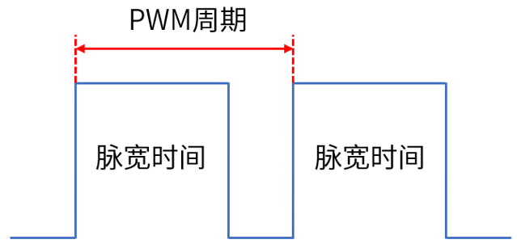
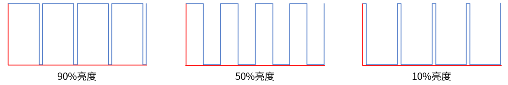

# PWM实验

## 前言

本章将介绍machine模块中的PWM类。通过本章的学习，读者将学习到machine模块中PWM类的使用。

## PWM简介

### 1,PWM原理解析

PWM（Pulse Width Modulation），简称脉宽调制，是一种将模拟信号变为脉冲信号的计数。PWM可以控制LED亮度、直流电机的转速等。

PWM的主要参数如下：

①：PWM频率。PWM频率是PWM信号在1s内从高电平到低电平再回到高电平的次数，也就是说1s内有多少个PWM周期，单位为Hz。

②：PWM周期。PWM周期是PWM频率的倒数，即T=1/f，T是PWM周期，f是PWM频率。如果PWM频率为50Hz，也就是说PWM周期为20ms，即1s由50个PWM周期。

③：PWM占空比。PWM占空比是指在一个PWM周期内，高电平的时间与整个周期时间的比例，取值范围为0%~100%。PWM占空比如下图所示。



PWM周期是一个PWM信号的时间：脉宽时间是指高电平时间；脉宽时间占PWM周期的比例就是占空比。例如，如果PWM周期是10ms，而脉宽时间为8ms，那么PWM占空比就是8/10=80%，此时的PWM信号就是占空比为80%的PWM信号。PWM名为脉冲宽度调制，顾名思义，就是通过调节PWM占空比来调节PWM脉宽时间。

在使用PWM控制LED时，亮1s后灭1s，往复循环，就可以看到LED在闪烁。如果把这个周期缩小到200ms，亮100ms后灭100ms，往复循环，就可以看到LED灯在高频闪烁。继续把这个周期持续缩小，总有一个临界值使人眼分辨不出LED在闪烁，此时LED的亮度处于灭与亮之间亮度的中间值，达到了1/2亮度。PWM占空比和亮度的关系如下图所示。



## PWM模块介绍

### 概述

RP2350 的 PWM 模块包含 12 个相同的切片。每个切片可以驱动两个 PWM 输出信号，或测量输入信号的频率或占空比。每个切片上的两个输出具有相同的周期，占空比可以独立变化。

### API描述

PWM类位于machine模块下

#### 构造函数

```python
pwm = PWM(dest,...)
```

【参数】

- dest：PWM输出引脚对象

#### freq

```python
PWM.freq([value])
```

获取或设置PWM输出的当前频率。

【参数】

- value：设置的频率大小，单位为Hz

【返回值】

如果没有参数，则返回以Hz为单位的频率。

#### duty_u16

```python
PWM.duty_u16([value])
```

获取或设置PWM输出的当前占空比。

【参数】

- value：设置占空比的值，取值范围为[0:65535]

【返回值】

如果没有参数，则返回占空比。

## 硬件设计

### 例程功能

1. 通过程序不断改变 PWM 的占空比使得 LED灯由亮到暗，再由暗到亮，依次循环。

### 硬件资源

1. LED灯

   ​	LED - GPIO3


### 原理图

本章实验内容，主要讲解PWM模块的使用，无需关注原理图。

##  实验代码

``` python
import time
from machine import Pin, PWM

"""
 * @brief       程序入口
 * @param       无
 * @retval      无
"""
if __name__ == '__main__':
    pwm = PWM(Pin(3))
    pwm.freq(1000)
    duty = 0
    direction = 1

    for _ in range(8 * 256):
        duty += direction
        if duty > 255:
            duty = 255
            direction = -1
        elif duty < 0:
            duty = 0
            direction = 1
        pwm.duty_u16(duty * 256)
        time.sleep(0.01)
```

可以看到，首先是构建PWM对象，将LED灯连接的GPIO3引脚绑定到PWM功能上，然后freq()函数设置PWM频率为1KHz，接着定义一个设置占空比的变量，在一个for循环中不断改变这个变量值，然后通过duty_u16()函数设置PWM的占空比。

## 运行验证

将DNRP2350AM开发板连接到Thonny，然后添加需要运行的实验例程，并点击Thonny左上角的“运行当前脚本”绿色按钮后，此时，可以看到板子上的LED先由暗再逐渐变亮，以此循环，实现了呼吸灯的效果。

