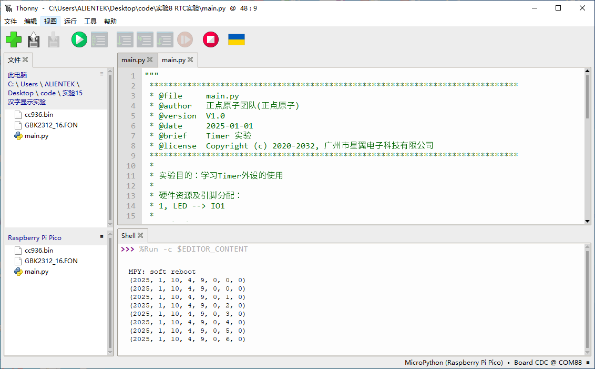

# RTC实验

## 前言

本章将介绍machine模块中的RTC类，即RTC时钟类。通过本章的学习，读者将学习到machine模块中RTC类的使用。  

## RTC时钟简介

RTC（实时时钟）是指安装在电子设备或实现其功能的 IC（集成电路）上的时钟。当您在数字电路中称其为“时钟”时，您可能会想到周期信号，但在英语中， clock 也意味着“时钟”。那为什么我们需要一个单独的 RTC?原因是 CPU 的定时器时钟功能只在“启动”即“通电时”运行，断电时停止。当然，如果时钟不能连续跟踪时间，则必须手动设置时间。通常， RTC 配备一个单独分离的电源，如纽扣电池（备用电池），即使CPU断电，它也能保持运作，随时可以实时显示时间。

### RP2350A的RTC

在 RP2350A 中，并没有像 STM32 芯片一样，具有 RTC 外设，但是存在一个系统时间，利用系统时间，也可以实现实时时钟的功能效果。

## RTC模块介绍

### 概述

MicroPython提供了一个类RTC模块，用户可以设置和获取当前系统时间

### API描述

RTC类位于machine模块下

#### 构造函数

```python
rtc = RTC()
```

【参数】

无

### datetime

```python
print(rtc.datetime())
```

【参数】

无

【返回值】

- year：年
- mon：月
- day：日
- hour：时
- min：分
- sec：秒
- microsec：微秒

更多用法请阅读官方API手册：

https://docs.micropython.org/en/latest/library/machine.RTC.html

## 硬件设计

### 例程功能

1. 创建一个RTC对象，并设置RTC时间
2. 最后进入一个while循环中不断打印RTC时间

### 硬件资源

1. 本章实验内容，主要讲解RP2350A内置RTC模块的使用，无需关注硬件资源。


### 原理图

本章实验内容，主要讲解RTC模块的使用，无需关注原理图。

##  实验代码

``` python
from machine import RTC
import time


"""
 * @brief       程序入口
 * @param       无
 * @retval      无
"""
if __name__ == '__main__':
    rtc = RTC()
    rtc.datetime((2025, 1, 10, 0, 9, 00, 0,0)) # 设置时间为2025/1/10 9：00：00
    
    while True:
        print(rtc.datetime()) # 打印RTC时间
        time.sleep(1)
```

可以看到，首先是构造了一个RTC对象，并将时间设置为2025年1月10日9时0分0秒，最后在一个while循环里每隔1秒读取一次RTC时钟并通过串口打印。

## 运行验证

将DNRP2350AM开发板连接到Thonny，然后添加需要运行的实验例程，并点击Thonny左上角的“运行当前脚本”绿色按钮后，此时，shell终端每隔1秒打印一次RTC时间，如下图所示：




