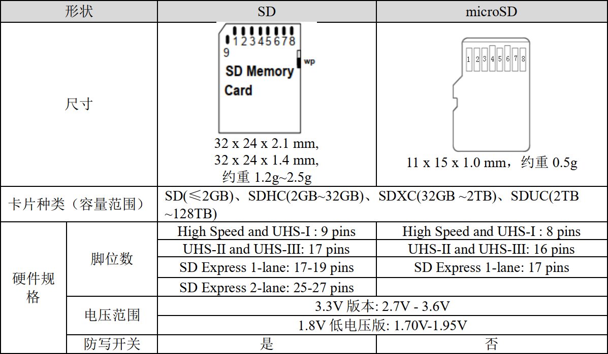
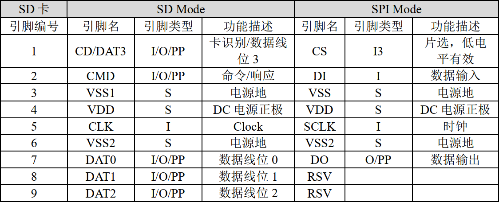
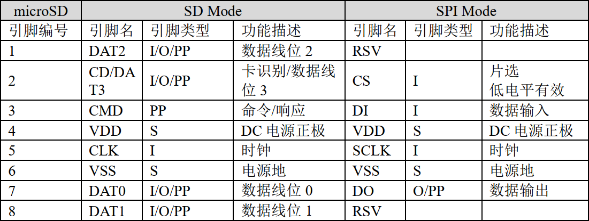
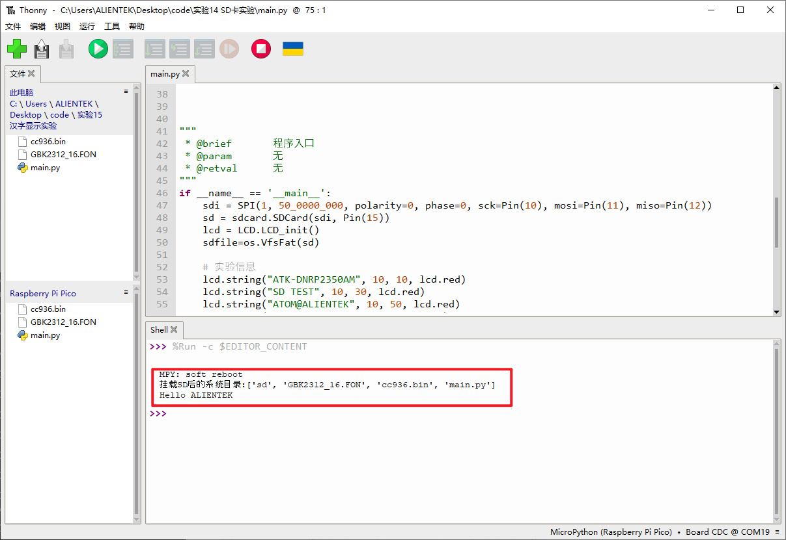

# SD卡实验

## 前言

本章将介绍如何使用MicroPython提供的SD卡库通过SPI的方式使用SD卡功能。通过本章的学习，读者将学习到如何使用MicroPython驱动RP2350A实现SD卡的读写功能。

## SD卡简介

### 1，SD卡物理结构

SD卡的规范由SD卡协会明确，可以访问[SD Association](https://www.sdcard.org)查阅更多标准。SD卡主要有SD、Mini SD和microSD(原名TF卡，2004年正式更名为Micro SD Card，为方便本文用microSD表示)三种类型，Mini SD已经被microSD取代，使用得不多，根据最新的SD卡规格列出的参数如下所示：



上述表格的“脚位数”，对应于实卡上的“金手指”数，不同类型的卡的触点数量不同，访问的速度也不相同。SD卡允许了不同的接口来访问它的内部存储单元。最常见的是SDIO模式和SPI模式，根据这两种接口模式，我们也列出SD卡引脚对应于这两种不同的电路模式的引脚功能定义，如下所示：



对比的，我们来看一下microSD引脚，可见只比SD卡少了一个电源引脚VSS2，其它的引脚功能类似。



SD卡和Micro SD只有引脚和形状大小不同，内部结构类似，操作时序完全相同，可以使用完全相同的代码驱动，关于SD卡的更多信息和硬件设计规范可以参考SD卡协议《Physical Layer Simplified Specification Version 2.00》的相关章节。

## SD卡模块介绍

### 概述

MicroPython并未直接为RP2350A板卡提供的SD卡驱动文件，不过在MicroPython的Githun仓库中有提供扩展的驱动库，地址：[micropython-lib](https://github.com/micropython/micropython-lib/tree/master/micropython/drivers/storage/sdcard)，这个库提供了以SPI的方式驱动SD卡的方法，我们将这个库移植到DNRP2350AM开发板上，即可实现SD卡的读写功能。

### API描述

SD卡库位于MicroPython下rp2板卡的modules文件夹下。

#### 构造函数

```python
sd = sdcard.SDCard(spi, cs, baudrate=1320000)
```

创建一个SD卡对象

【参数】

- spi：SPI对象，需要提前构造好才能初始化SD卡
- cs：SD卡的片选引脚
- baudrate：SPI传输波特率

### OS模块介绍

### 概述

这个模块用于实现基础的操作系统服务，这个模块实现了相应CPython模块的一个子集，如下所述。想了解更多信息，请参阅原始CPython文档[os](https://docs.python.org/3.5/library/os.html#module-os)：

### API描述

os模块包含文件系统访问和挂载，终端重定向和复制，以及uname和random函数。

#### VfsFat

```python
class os.VfsFat(block_dev)
```

创建使用FAT文件系统格式的文件系统对象。FAT文件系统的存储由block_dev提供。此构造函数创建的对象可以使用mount()进行挂载。

【参数】

- block_dev：为文件系统提供的存储，本实验使用的是SD卡

【返回值】

返回一个文件系统对象

#### mount

```python
os.mount(block_device,mount_point,* ,readonly)
```

将文件系统对象block_device挂载到由mount_point字符串指定的VFS中的位置。。

【参数】

- block_device：需挂载的块设备或文件系统对象
- mount_point：Mount_point可以是‘/’来将fsobj挂载到根目录，或者‘/name’来将它挂载到根目录下的子目录。
- readonly：挂载的设备是否只读

#### umount

```python
os.umount(mount_point)
```

卸载文件系统。

【参数】

- mount_point：可以是命名挂载位置的字符串，也可以是以前挂载的文件系统对象。

【返回值】

更多用法请阅读MicroPython官方API手册：

https://docs.micropython.org/en/latest/library/os.html#module-os

## 硬件设计

### 例程功能

1. 创建一个SD卡对象，将SD卡挂载到文件系统中，便可以使用文件系统的功能对SD卡进行操作，首先使用listdir()函数获取SD卡的目录，然后使用文件系统方法open()在SD卡根目录创建一个文件test.txt文件并写入字符串"Hello ALIENTEK"，写入完成后重新读出来显示到LCD显示器并通过串口打印，最后卸载SD卡。

### 硬件资源

1. SPI_SD卡(连接RP2350A开发板的SPI1)

     CS- GPIO15

     SCK- GPIO10

     MOSI- GPIO11

     MISO- GPIO12

2. 正点原子1.14寸SPI LCD模块

   LCD_BL - GPIO25

   LCD_DC - GPIO8

   SPI_MOSI - GPIO11

   SPI_SCK - GPIO10

   LCD_CS - GPIO9


### 原理图

本章实验内容，主要讲解MicroPython内置的os和SD卡功能的使用，无需关注原理图。

##  实验代码

``` python
from machine import SPI,Pin
import os,sdcard,LCD

"""
 * @brief       程序入口
 * @param       无
 * @retval      无
"""
if __name__ == '__main__':
    sdi = SPI(1, 50_0000_000, polarity=0, phase=0, sck=Pin(10), mosi=Pin(11), miso=Pin(12))
    sd = sdcard.SDCard(sdi, Pin(15))
    lcd = LCD.LCD_init()
    sdfile=os.VfsFat(sd)
    
    # 实验信息
    lcd.string("ATK-DNRP2350AM", 10, 10, lcd.red)
    lcd.string("SD TEST", 10, 30, lcd.red)
    lcd.string("ATOM@ALIENTEK", 10, 50, lcd.red)
    lcd.string("File Read:", 10, 70, lcd.blue)
    lcd.display()
    
    # 挂在到SD/sd
    os.mount(sdfile,'/sd')
    # 重新查询系统文件目录
    print('挂载SD后的系统目录:{}'.format(os.listdir()))
    with open("/sd/test.txt", "w") as f:
            f.write(str("Hello ALIENTEK"))
            
    # 从sd卡目录下读取hello.txt文件内容       
    with open("/sd/test.txt", "r") as f:
        # 读取文件内容
        data = f.read()
        
    # 输出读取的内容
    print(data)
    lcd.string(str(data), 10, 90, lcd.blue)
    lcd.display()
    # 卸載SD卡  
    os.umount('/sd')
```

可以看到，首先构建SPI对象，用于SD卡的硬件初始化，然后构建sd卡和LCD对象，再将sd卡挂载到文件系统中，然后通过os的相关方法读取SD卡目录和对SD卡进行读写。

## 运行验证

将DNRP2350AM开发板连接到Thonny，然后添加需要运行的实验例程，并点击Thonny左上角的“运行当前脚本”绿色按钮后，此时，可以看到Shell端口输出SD卡的系统目录及"Hello ALIENTEK"数据，如下图所示：



这与理论结果一致。
