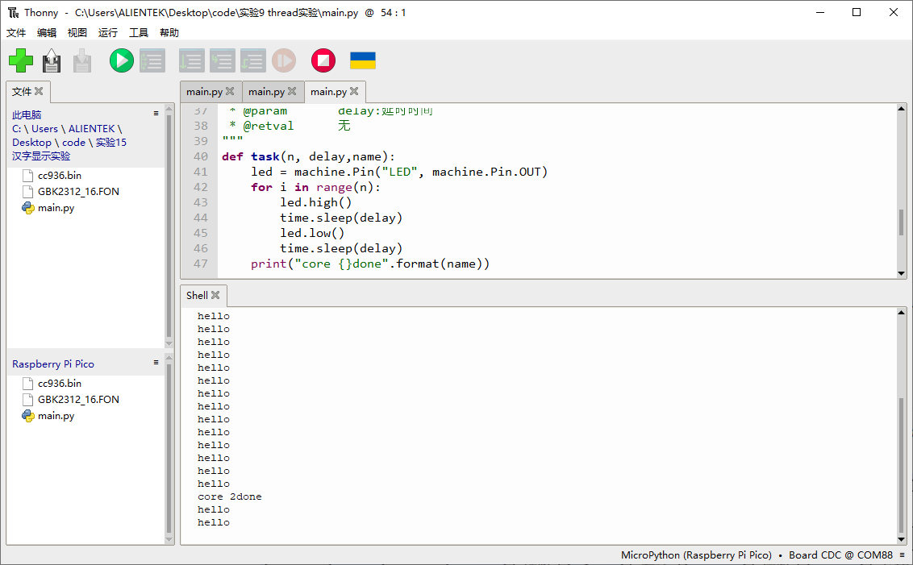

# Thread实验

## 前言

本章将介绍MicroPython固件中的_thread线程模块。通过本章的学习，读者将学习到MicroPython中 _thread线程模块的使用。  

## _thread模块介绍

### 概述

该模块提供了操作多个线程（也被称为 轻量级进程或任务）的底层原语 —— 多个控制线程共享全局数据空间。为了处理同步问题，也提供了简单的锁机制（也称为互斥锁或二进制信号）。

### API描述

_thread线程模块衍生于python3

#### start_new_thread

```python
_thread.start_new_thread(function, args[, kwargs])
```

启动一个线程，并返回其标识符。

【参数】

- function：功能函数
- args：参数（必须是元组）
- kwargs：使用字典来指定有名参数，可选参数

【返回值】

无

更多用法请阅读官方手册：

https://docs.python.org/3.4/library/_thread.html

## 硬件设计

### 例程功能

1. 实现多线程同时运行任务。

### 硬件资源

1. 本章实验内容，主要讲解RP2350A使用_thread线程模块实现多线程同时运行任务，无需关注硬件资源。


### 原理图

本章实验内容，主要讲解_thread线程模块的使用，无需关注原理图。

##  实验代码

``` python
import time, _thread, machine

"""
 * @brief       LED灯任务函数
 * @param       n:循环次数
 * @param       delay:延时时间
 * @retval      无
"""
def task(n, delay,name):
    led = machine.Pin("LED", machine.Pin.OUT)
    for i in range(n):
        led.high()
        time.sleep(delay)
        led.low()
        time.sleep(delay)
    print("core {}done".format(name))
        
"""
 * @brief       程序入口
 * @param       无
 * @retval      无
"""
if __name__ == '__main__':
    _thread.start_new_thread(task, (20, 0.5,"2"))
    while True:
        print("hello")
        time.sleep(1)
```

可以看到，首先创建task()函数带有三个输入参数，第一个参数是函数执行的循环次数，第二个参数是函数内的延时时间，第三个参数输入cpu的核心号，函数的功能是每隔delay秒执行亮灭LED灯，循环n次，最后打印运行函数的CPU号。

然后在入口函数name创建新线程，设置CPU2运行task函数，传入对应的参数，然后进入一个死循环，每隔1秒打印一次hello。

## 运行验证

将DNRP2350AM开发板连接到Thonny，然后添加需要运行的实验例程，并点击Thonny左上角的“运行当前脚本”绿色按钮后，此时，LED灯每隔1秒亮灭一次，持续n次，shell窗口每隔1秒打印一次数据，约20次后系统打印输出core 2done，然后停止运行task函数，如下图所示：



可以看到串口每隔1秒同时执行两个不同的函数功能，提示两个线程在同时进行。


