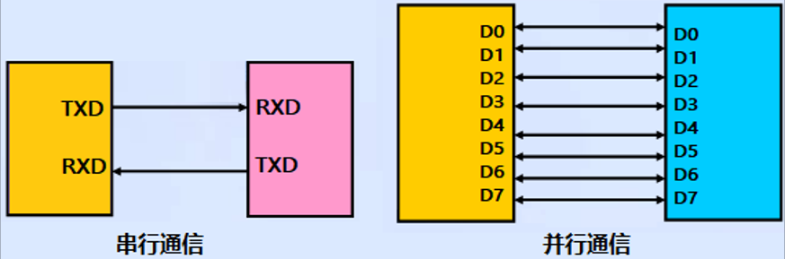
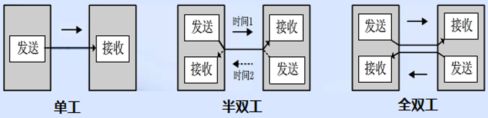
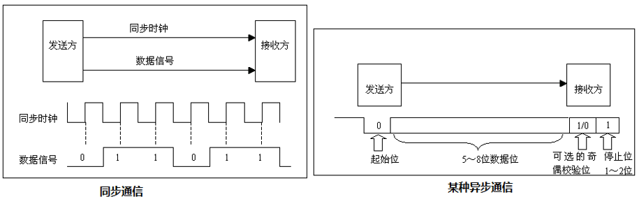
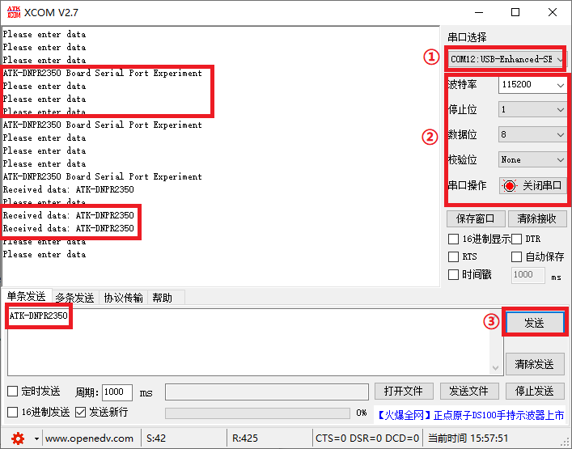

# UART实验

## 前言

本章将介绍使用串口进行数据的收发操作，实现RP2350A与上位机软件的串口通信的功能，通过本章的学习，读者将学习到如何使用MicroPython使用RP2350A的UART通讯功能。

## 串口简介

学习串口前，我们先来了解一下数据通信的一些基础概念。

### 数据通信的基础概念

在单片机的应用中，数据通信是必不可少的一部分，比如：单片机和上位机、单片机和外围器件之间，它们都有数据通信的需求。由于设备之间的电气特性、传输速率、可靠性要求各不相同，于是就有了各种通信类型、通信协议，我们最常的有：USART、IIC、SPI、CAN、USB等。

#### 1，数据通信方式

按数据通信方式分类，可分为串行通信和并行通信两种。串行和并行的对比如下图所示：



串行通信的基本特征是数据逐位顺序依次传输，优点是传输线少、布线成本低、灵活度高等优点，一般用于近距离人机交互，特殊处理后也可以用于远距离，缺点就是传输速率低。

而并行通信是数据各位可以通过多条线同时传输，优点是传输速率高，缺点就是布线成本高，抗干扰能力差因而适用于短距离、高速率的通信。

#### 2，数据传输方向

根据数据传输方向，通信又可分为全双工、半双工和单工通信。全双工、半双工和单工通信的比较如下图所示：



单工是指数据传输仅能沿一个方向，不能实现反方向传输，如校园广播。

半双工是指数据传输可以沿着两个方向，但是需要分时进行，如对讲机。

全双工是指数据可以同时进行双向传输，日常的打电话属于这种情形。

这里注意全双工和半双工通信的区别：半双工通信是共用一条线路实现双向通信，而全双工是利用两条线路，一条用于发送数据，另一条用于接收数据。

#### 3，数据同步方式

根据数据同步方式，通信又可分为同步通信和异步通信。同步通信和异步通信比较如下图所示：



同步通信要求通信双方共用同一时钟信号，在总线上保持统一的时序和周期完成信息传输。优点：可以实现高速率、大容量的数据传输，以及点对多点传输。缺点：要求发送时钟和接收时钟保持严格同步，收发双方时钟允许的误差较小，同时硬件复杂。

异步通信不需要时钟信号，而是在数据信号中加入开始位和停止位等一些同步信号，以便使接收端能够正确地将每一个字符接收下来，某些通信中还需要双方约定传输速率。优点：没有时钟信号硬件简单，双方时钟可允许一定误差。缺点：通信速率较低，只适用点对点传输。

#### 4，通信速率

在数字通信系统中，通信速率（传输速率）指数据在信道中传输的速度，它分为两种：传信率和传码率。

```传信率```:每秒钟传输的信息量，即每秒钟传输的二进制位数，单位为bit/s（即比特每秒），因而又称为比特率。

```传码率```：每秒钟传输的码元个数，单位为Baud（即波特每秒），因而又称为波特率。

另外，比特率和波特率也是有一定的关系的。

比特率和波特率的关系可以用以下式子表示：``比特率 = 波特率 * log2M``，其中M表示码元承载的信息量。我们也可以理解M为码元的进制数。

## UART模块介绍

### 概述

UART实现标准的UART/USART双工串行通信协议。RP2350A内部包含两个UART硬件模块，每个 UART 都可以连接到多个 GPIO 引脚，详细内容请参照[数据手册](https://datasheets.raspberrypi.com/rp2350/rp2350-datasheet.pdf)中的第 9.4 节的 GPIO 多路复用表。

### API描述

UART类位于machine模块下

#### 构造函数

```python
uart = UART(id, baudrate=115200, tx=Pin(0), rx=Pin(1))
```

【参数】

- id：UART号，有效值 [0,1]
- baudrate：UART波特率，可选参数，默认115200
- tx：发送数据的引脚号
- rx：接收数据的引脚号

### read

```python
UART.read([nbytes])
```

读取字符。若指定nbytes，则最多读取该数量的字节。否则可读取尽可能多的数据。

【参数】

- nbytes：最多读取nbytes字节，可选参数

【返回值】

一个包括读入字节的字节对象

### write

```
UART.write(buf)
```

将字节缓冲区写入UART。

【参数】

- buf：一个buffer对象

【返回值】

写入的字节数

### any

```python
UART.any()
```

计算可以在不阻塞的情况下读取的字符数。

【参数】

无

【返回值】

返回一个整数，如果没有可用的字符，它将返回0；如果有字符，它将返回一个正数。

更多用法请阅读MicroPython官方API手册：

https://docs.micropython.org/en/latest/library/machine.UART.html#machine-uart

## 硬件设计

### 例程功能

1. 返回串口接收到的数据
2. 每间隔一定时间，串口发送一段提示信息
3. LED闪烁，提示程序正在运行

### 硬件资源

1. LED

   ​	LED - GPIO3

2. uart0:（UART0_TX、UART0_RX连接至板载USB转串口芯片上

   ​	UART0_TX - GPIO0

   ​	UART0_RX - GPIO1

### 原理图

板载的USB转串口芯片的USB接口通过板载的USB UART端口引出，其原理图如下图所示：


从以上原理图可以看出，TXD引脚和RXD引脚分别作为发送和接收引脚分别与USB转串口芯片的接收和发送引脚进行连接，USB转串口芯片再通过一对USB差分信号连接至USB UART的接口，这样一来，RP2350A就可以通过USB与PC上位机软件进行串口通信了。另外RP2350A有两个串口，即 uart0、uart1。

##  实验代码

``` python
from machine import Pin,UART
import time

"""
 * @brief       程序入口
 * @param       无
 * @retval      无
"""
if __name__ == '__main__':
    times = 0
    led = Pin(3, Pin.OUT)
    uart = UART(0, baudrate=115200, tx=Pin(0), rx=Pin(1))

    while True:
        if uart.any():
            data = uart.read(128)                      # 接收128个字符
            uart.write('Received data: {}'.format(data.decode()))
        else:
            times+=1
            if (times % 200) == 0:
                uart.write('ATK-DNPR2350 Board Serial Port Experiment\r\n')  # 发送一条数据
            elif (times % 50) == 0:
                uart.write('Please enter data\r\n')    # 发送一条数据
            elif (times % 30) == 0:
                led.toggle()

        time.sleep_ms(1)
```

本实验非常简单，首先构建一个LED对象和一个UART对象，在一个循环中用any()函数判断是否接受到数据，倘若接收到数据，则使用read()函数读取数据，并将读取的数据再次通过write()函数发出。如果未接收到数据，则每隔一段时间通过uart0打印一段提示信息和LED灯翻转一次。

## 运行验证

将DNRP2350AM开发板连接到Thonny，然后添加需要运行的实验例程，并点击Thonny左上角的“运行当前脚本”绿色按钮后，此时，可以看到开发板上的LED灯闪烁，然后我们打开串口调试助手XCOM V2.7，然后将开发板的UART接口通过USB连接电脑，连接对应的串口端口，便可与XCOM上位机通信了，如下图所示：	



​	①串口端口号：根据你的电脑实际选择

​	②务必保持一致

​	③XCOM上位机发送数据按钮

可以看到，上位机连接端口后，RP2350A开发板会每隔一段时间发送一段提示信息，当我们通过上位机往RP2350A发送数据时，上位机收到你刚发送的信息，这与理论推断的结果一致。

