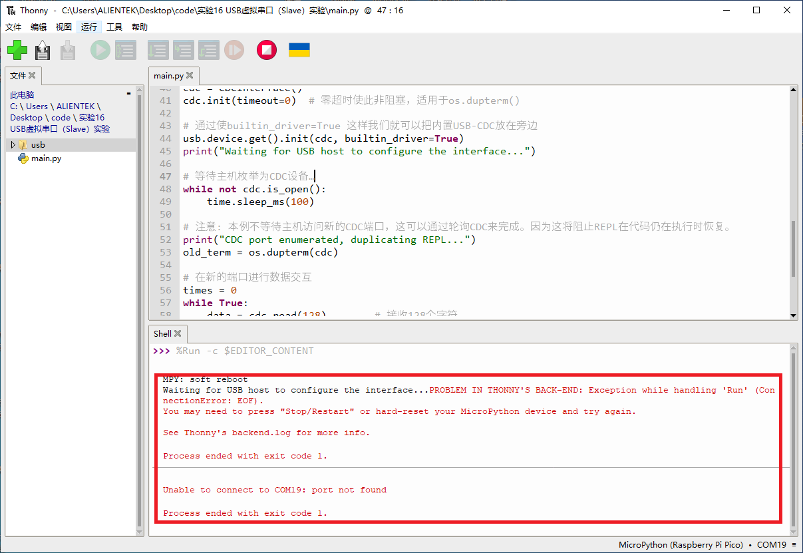

# USB虚拟串口实验

## 前言

本章将介绍如何使用RP2350A开发板的USB功能。通过本章的学习，读者将学习到如何使用MicroPython驱动RP2350A实现USB CDC功能。

## USB虚拟串口介绍

### 1，USB虚拟串口简介

USB虚拟串口，简称VCP，是Virtual COM Port的简写，它是利用USB的CDC类来实现的一种通信接口。

我们可以利用RP2350A自带的USB功能，来实现一个USB虚拟串口，从而通过USB，实现电脑与RP2350A的数据互传。上位机无需编写专门的USB程序，只需要一个串口调试助手即可调试，非常实用。

## USB模块介绍

### 概述

USB的驱动还是较为复杂的，MicroPython并未直接为RP2350A板卡提供的USB的驱动文件，不过在MicroPython的Github仓库中有提供扩展的驱动库，地址：[[micropython-lib](https://github.com/micropython/micropython-lib/tree/master/micropython/usb)]，这个库提供了数个不同的USB类驱动方法，有cdc、hid、keyboard、midi、mouse，我们将cdc类这个库移植到DNRP2350AM开发板上，即可实现USB虚拟串口功能。

### API描述

CDC类可用于实现USB虚拟串口功能，库文件存放在对应的实验例程的文件夹内。

#### 构造函数

```python
cdc = CDCInterface()
```

USB CDC串行设备类，构造成类似虚拟UART。

#### init

```python
cdc.init(baudrate=9600, bits=8, parity="N", stop=1, timeout=0, txbuf=256, rxbuf=256, flow=0)
```

将关键字参数中提供的值打包到新的控制寄存器值的命名字段中。任何未提供的字段将被设置为默认值。

【参数】

- baudrate：UART波特率
- bits：每个字符的位数
- parity：奇偶校验
- stop：停止位的位数
- timeout：超时时间
- txbuf：发送缓存区大小
- rxbuf：接收缓存区大小
- flow：UART流控制，目前不支持UART流控制

【返回值】

无

#### is_open

```python
cdc.is_open()
```

检测USB设备是否被主机配置。

【参数】

无

【返回值】

USB已被主机配置返回：True，否则返回：False

#### read

```python
cdc.read(size=128)
```

读取一定大小的数据并返回实际读到的字节数。

【参数】

- size：读取size大小的字节数

【返回值】

返回实际读取的字节数

#### write

```python
cdc.write(size=128)
```

写入一定大小的数据并返回实际写入的字节数。

【参数】

- size：写入size大小的字节数

【返回值】

返回实际写入的字节数

更多用法请查看MicroPython的USB扩展库源码https://github.com/micropython/micropython-lib/tree/master/micropython/usb

## 硬件设计

### 例程功能

1. 构建一个USB CDC类，实现一个USB虚拟串口功能，当程序运行后，打开串口调试助手XCOM，连接对应的端口号，即可使用像串口一样的功能。

### 硬件资源

1. USB:

     USB_D+ - USB_DP

     USB_D- - USB_DN

### 原理图

本章实验内容，主要讲解MicroPython内置的os和USB扩展库的使用，无需关注原理图。

##  实验代码

``` python
import os
import time
import usb.device
from usb.device.cdc import CDCInterface

cdc = CDCInterface()
cdc.init(timeout=0)  # 零超时使此非阻塞，适用于os.dupterm()

# 通过使builtin_driver=True 这样我们就可以把内置USB-CDC放在旁边
usb.device.get().init(cdc, builtin_driver=True)
print("Waiting for USB host to configure the interface...")

# 等待主机枚举为CDC设备…
while not cdc.is_open():
    time.sleep_ms(100)

# 注意: 本例不等待主机访问新的CDC端口，这可以通过轮询CDC来完成。因为这将阻止REPL在代码仍在执行时恢复。   
print("CDC port enumerated, duplicating REPL...")
old_term = os.dupterm(cdc)

# 在新的端口进行数据交互
times = 0
while True:
    data = cdc.read(128)        # 接收128个字符
    if data != None:
        cdc.write('Received data: {}'.format(data.decode()))
    else:
        times+=1
        if (times % 2000) == 0:
            cdc.write('ATK-DNPR2350 USB CDC Experiment\r\n')  # 发送一条数据
        elif (times % 500) == 0:
            cdc.write('Please enter data\r\n')    # 发送一条数据
    time.sleep_ms(1)
```

可以看到，首先构建CDC对象，然后等待主机配置USB接口，连接成功后，重新启用USB端口功能为CDC，此时可以在电脑中看到USB虚拟端口，最后在一个while循环中不断的接收和发送数据。

## 运行验证

将DNRP2350AM开发板连接到Thonny，连接上开发板之后，我们需要先将USB类的相关库上传到DNRP2350AM开发板的NOR Flash上，具体操作如下图所示：


​	①电脑连接DNRP2350A开发板

​	②在此电脑的文件中找到实验16的实验16 USB虚拟串口（Slave）实验文件夹，选中文件夹的整个usb文件夹，然后右击鼠标，将文件上传

​	③直接点击上传/，等待文件夹上传成功即可。

​	④上传成功后可以在板卡窗口看到

然后添加需要运行的实验例程，并点击Thonny左上角的“运行当前脚本”绿色按钮后，此时，可以看到Thonny原本连接的开发板被断开，如下图所示：



这时我们打开XCOM串口调试助手，按以下选项配置串口，可以看到和UART实验一样的现象。


这与理论结果一致。

