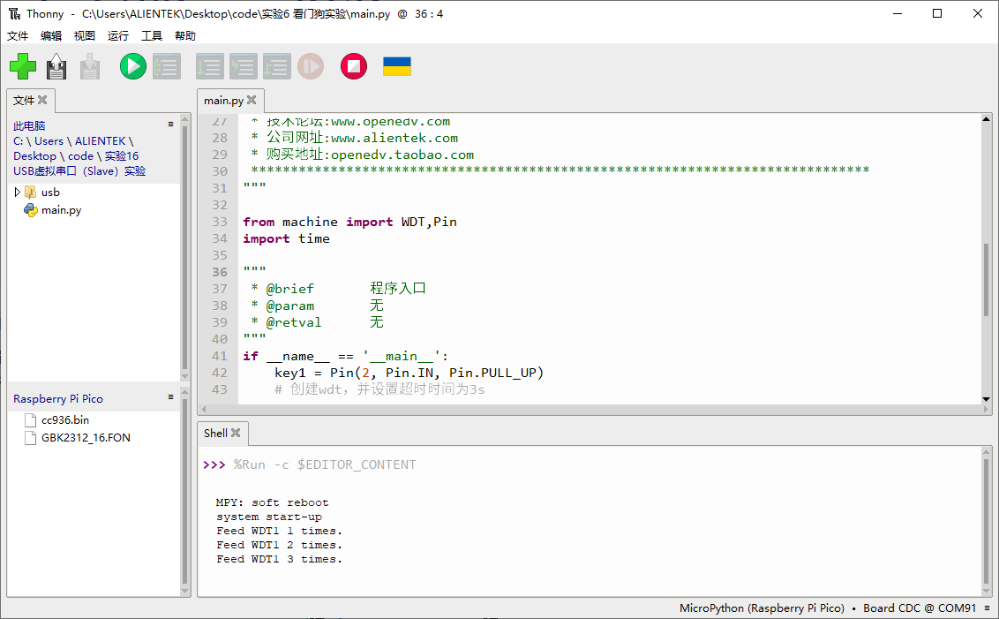
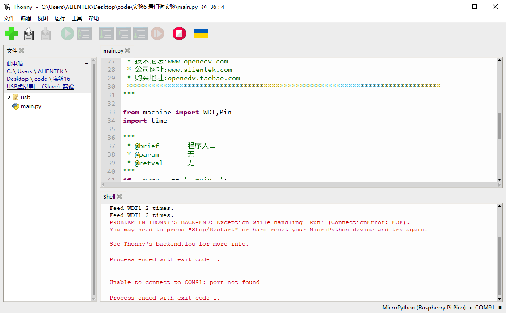

# 看门狗实验

## 前言

本章将介绍machine模块中的WDT类，即看门狗类。通过本章的学习，读者将学习到machine模块中WDT类的使用。  

## 看门狗简介

MCU工作在一些复杂环境，可能受到某些干扰出现程序跑飞，导致系统无法继续执行工作，看门狗的作用可以在程序跑飞时对系统进行复位。看门狗的本质也是一个定时器，在程序启动后，需要在一定的时间内再给它一个信号，俗称“喂狗”。如果没有按时“喂狗”，说明系统或软件出现了不可预知的问题(比如软件卡在某个循环或逾期事件中)，这时看门狗就向系统发送个复位信号，使整个系统重启，重新进入正常的工作状态。看门狗有助于检测、处理系统或软件的错误行为。

在RP2350上，看门狗从系统级滴答块中获取滴答输入。与RP2040一样，看门狗可以触发PSM（开机状态机）序列来重置系统组件，也可以用于重置选定的子系统组件。在RP2350上，看门狗还可以触发芯片电平重置。

## WDT模块介绍

### 概述

RP2350A内部仅有1个WDT硬件模块，用于在应用程序崩溃且最终进入不可恢复状态时重启系统。一旦开始，当硬件运行期间没有定期进行喂狗（feed）就会在超时后自动复位。

### API描述

WDT类位于machine模块下

#### 构造函数

```python
wdt = WDT(id=0, timeout=3000)
```

【参数】

- id：WDT号，取值:0，默认0
- timeout：超时值，单位ms，rp2最大超时时间为8388ms

#### feed

```python
WDT.feed()
```

喂狗操作

【参数】

无

【返回值】

无

更多用法请阅读MicroPython官方API手册：

https://docs.micropython.org/en/latest/library/machine.WDT.html#machine-wdt

## 硬件设计

### 例程功能

1. 创建一个WDT对象，并配置其超时时间为3秒
2. 按下KEY0按键可对WDT对象进行喂狗操作
3. 若喂狗次数达5次，则停止WDT对象并退出

### 硬件资源

1. 独立按键

   ​	KEY1按键 - GPIO2

2. 看门狗0

### 原理图

本章实验内容，主要讲解WDT模块的使用，无需关注原理图。

##  实验代码

``` python
from machine import WDT,Pin
import time

"""
 * @brief       程序入口
 * @param       无
 * @retval      无
"""
if __name__ == '__main__':
    key1 = Pin(2, Pin.IN, Pin.PULL_UP)
    # 创建wdt，并设置超时时间为3s
    wdt = WDT(timeout=3000)
    wdt.feed()
    print("system start-up")

    feed_times = 0

    while feed_times < 5:
        if key1.value() == 0:
            time.sleep_ms(20)
            if key1.value() == 0:
                # 对WDT喂狗
                wdt.feed()
                feed_times += 1
                print("Feed WDT1 %d times." % (feed_times))
                while key1.value() == 0:
                    pass
        time.sleep_ms(10)
```

可以看到，首先是构建独立按键key1对象，然后是构造了WDT对象，WDT对象使用的是WDT0，且超时时间为3秒，接着是打印开机系统启动提示，再接着就是根据本实验需要实现的功能，在一个while循环里读取按键状态，并在按键被按下时，对WDT对象进行喂狗操作，当未及时喂狗或者喂狗达到5次后，系统自动复位。

## 运行验证

将DNRP2350AM开发板连接到Thonny，然后添加需要运行的实验例程，并点击Thonny左上角的“运行当前脚本”绿色按钮后，此时，若连续在3秒间隔内按下板载的KEY1按键进行喂狗操作，则能看到“串行终端”窗口打印输出WDT0被喂狗的次数提示，如下图所示：



若喂狗次数达到5次，则脚本程序运行完毕。

但若没有在3秒内按下板载的KEY1按键进行喂狗操作，则WDT0将对RP2350A进行系统复位，此时通过Thonny软件能观察到，Shell提示系统进程停止，端口断开连接，如下图所示：



