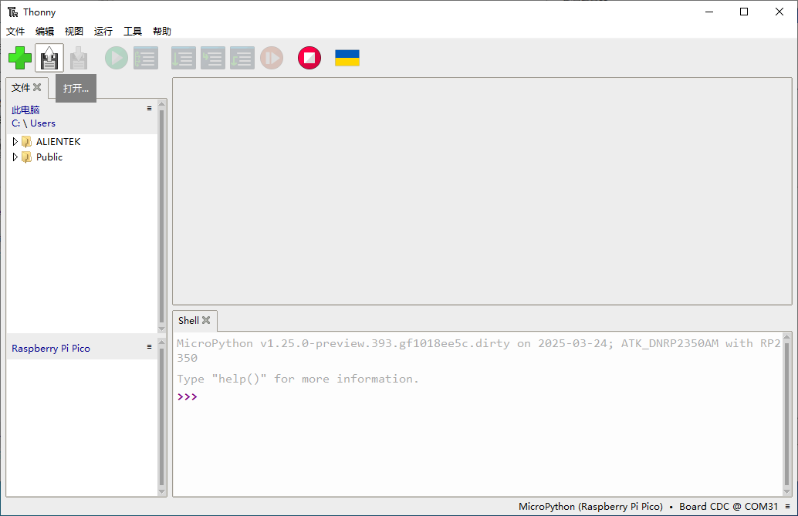

# 固件下载与使用

## 概述

选择MicroPython进行RP2350A开发，需要先将DNRP2350AM开发板的MicroPython固件下载到开发板，再通过Thonny软件编写程序并将程序烧录到开发板或者在线运行，使用非常方便

## 固件烧录

正点原子提供DNRP2350AM开发板的MicroPython固件(RISC-V CPU模式)，固件名:firmware.uf2，在正点原子提供的软件资料中可以找到，MicroPython固件的编译方法这里不再介绍，MicroPython的源码可以通过[MicroPython](https://github.com/micropython/micropython)进行了解。

怎么将MicroPython固件烧录到开发板呢？RP2350A固件烧录方法也非常简单，首先将DNRP2350AM开发板的USB端通过Type-C线连接电脑，然后常按住开发板的BOOT按键，再按下RST按键即可同时松开两个按键，此时电脑上出现一个RP2350盘，如下图所示：

此时找到我们获取的MicroPython固件，将固件直接复制到该盘的系统目录，如下图所示

## Thonny软件的使用

下载完成后系统自动复位，此时打开Thonny软件，点击右下角本地Python3 - Thonny的Python，选择我们开发板的端口MicroPython(Raspberry Pi Pico)....，不同电脑端口可能不一样，如下图所示：

连接完成后，如下图所示：

点击左下角的Raspberry Pi Pico板卡处，可以对板卡进行操作，比如上传文件，创建文件夹到系统目录以及读取存储空间等，如下图所示：

我们可以获取开发板的存储空间，空间大小如下图所示：

这里显示总空间大小是7MB，我们使用的NOR Flash大小为8MB，预留了1MB用于存放MicroPython固件，所以这里显示7MB。

下面我们介绍下如何在线运行程序，看下图：

​	①打开文件，找到要运行的实验程序

​	②这个是跑马灯实验，点亮LED灯

​	③点击运行，程序启动，可以看到LED灯闪烁

​	④shell窗口提示程序重新启动

通过上诉步骤，便可以实现程序在线运行，但是我需要程序脱机运行怎么办？

这个时候我们就需要将程序文件以main.py的名字，保存到开发板的系统文件根目录，步骤如下图所示：

​	①找到程序存放路径

​	②右击py文件

​	③点击上传

​	④上传后可以在开发板的系统文件根目录看到文件，这里注意是main.py

对开发板重新复位，程序即可运行，更多方法大家自己探索，这里就不一一叙述了