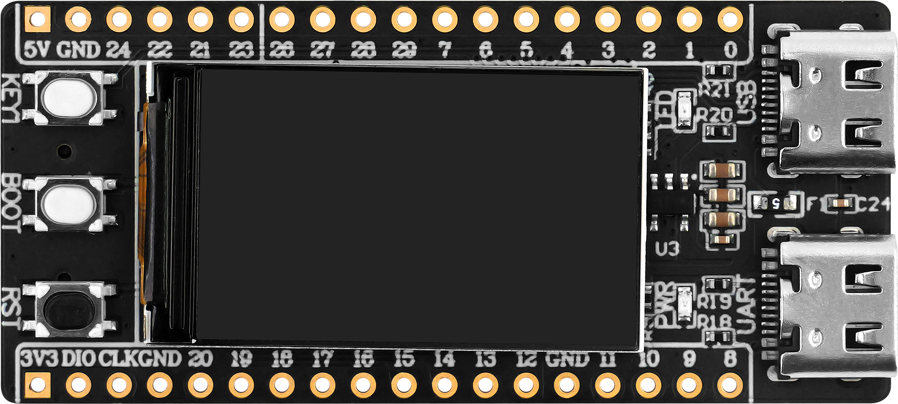

# RaspberryPi-RP2350A小系统板 开发板

RaspberryPi-RP2350A小系统板 开发板是正点原子以RP2350A为核心推出的开发板，主要用于实验教学。同时，凭借其高性价比和强大的扩展性也适合创客和DIY爱好者进行各种项目开发。

## 外观

正面

背面

RaspberryPi-RP2350A小系统板 开发板的外观设计简洁而功能性强，采用了标准的矩形电路板形状，整体尺寸较为紧凑，适合嵌入式项目使用。板上布满了多种接口和引脚，包括两排单边18个引脚排针，支持多种通信协议，如I2C、SPI和UART等。这些接口排列整齐，便于与外部模块和传感器进行连接。板上还配备了USB接口，支持设备和主机模式，适合各种数据交互需求。

RaspberryPi-RP2350A小系统板整体小巧、美观，其尺寸如下：

| 开发板 | 长（mm）| 宽（mm）|
| --- | --- | --- |
| RaspberryPi-RP2350A小系统板 | 55.88 | 25.40 |

## 接口介绍

RaspberryPi-RP2350A小系统板引出了多种接口，方便用户开发和使用

| 接口                         | 描述                                                         |
| ---------------------------- | ------------------------------------------------------------ |
| Type-C 接口1                 | RP2350A包含一个USB2.0控制器 一个全速(FS)设备(12mb/s) 主机既可以与LS设备通信，也可以与FS设备通信 |
| Type-C 接口2                 | USB 转串口 通过该接口可直接与 RP2350A 的 UART0 进行通信 |
| 2*18引出接口                  | 主要引出30个可编程IO 1. 一个3.3V电源和地以及一个5V 电源和地 2. SWD调试接口接口 3. 四个 ADC 采集引脚（0V ~ 1.8V） |
| TF 卡槽                      | 用于外接 TF 卡 连接至 RP2350A 的模拟SDIO接口                |

## 开发板硬件资源

| 硬件           | 描述                                                          |
| -------------- | ------------------------------------------------------------ |
| RP2350A        | 树莓派推出基于Hazard3 RISC-V 内核与Arm Cortex-M33 内核的双核、双架构芯片 [**详细介绍**](./rp2350a-and-picosdk-introduction#rp2350a介绍) |
| 复位按键       | 用于对 RP2350A 芯片进行硬件复位                                |
| 用户按键*2     | 两个用户按键，从上至下依次定义为 KEY1、BOOT、RESET KEY1：有效电平为低 BOOT：有效电平为低 BOOT 同时作为 RP2350A 的下载模式配置按键，按住不放再按下RESET芯片则进入下载模式		|
| SPI-LCD屏     	| 1.14‘ SPI显示屏（240*135）                               		|
| LED_BLUE      | 电源灯 有效电平为低                    						|
| LED_RED       | 使能后发出红光和 有效电平为低                    			|
| 板载8MB FLASH 	| RP235x系列现在支持使用相同的QSPI引脚连接第二个存储设备，并通过GPIO提供额外的芯片选择 需使用QSPI驱动，标称容量大小为 8MB |
| 晶振震荡电路 | 可为 RP2350A 提供 12MHz 的时钟，为一些需要精准频率的应用提供一个稳定的外部时钟源 |