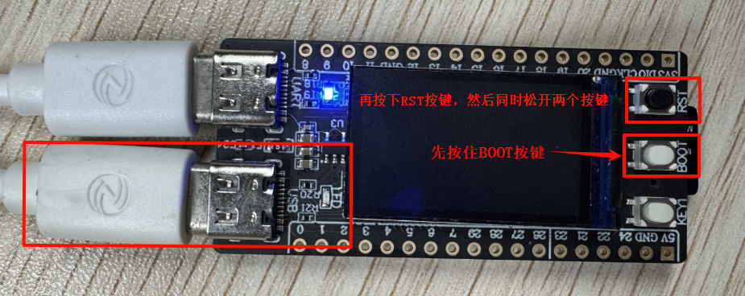
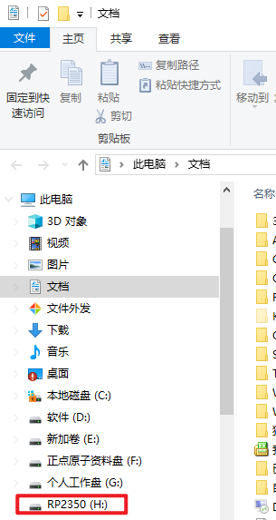

# 固件烧录

## 前言

DNRP2350AM 开发板在出厂前默认都会在其板载的Flash芯片上提前烧录好固件，用户无需烧录固件即可直接上手使用。

一般情况下，用户无需主动固件烧录，只有在需要更新固件时，才需要进行固件烧录。

## 固件说明

用户除了使用我们提供的例程进行烧写外，还可从DNRP2350AM 开发板的资料盘中获取部分编译好的固件，存放固件的目录路径为`资料盘/5，例程资源文件`。

在上述路径中，固件的描述如下：

| 固件 | 描述     |
| --- | -------- |
| LED/led.uf2 | LED灯实验固件 |
| KEY/key.uf2 | 按键实验固件 |
| UART/uart.uf2 | UART实验固件 |
| ADC/adc_temp.uf2 | ADC实验固件 |
| LCD/lcd.uf2 | LCD实验固件 |
| TF_Card/sd.uf2 | TF卡实验固件 |

## 固件烧录工具

固件烧录过程并没有多复杂，也不需要额外的软件。首先，将DNRP2350AM开发板的USB端通过Type-C线连接电脑，然后**设备上电 --> 按住 BOOT 不放 --> 单击复位按键 --> 松开 两个按键**，如下图所示：

此时电脑上显示一个名字为**RP2350**的盘符，如下图所示：

出现如图中所示盘符后将其打开，把固件拖拽进去即可完成。

## 运行固件

按上述步骤说明依次执行完后，系统会自动加载固件内容。