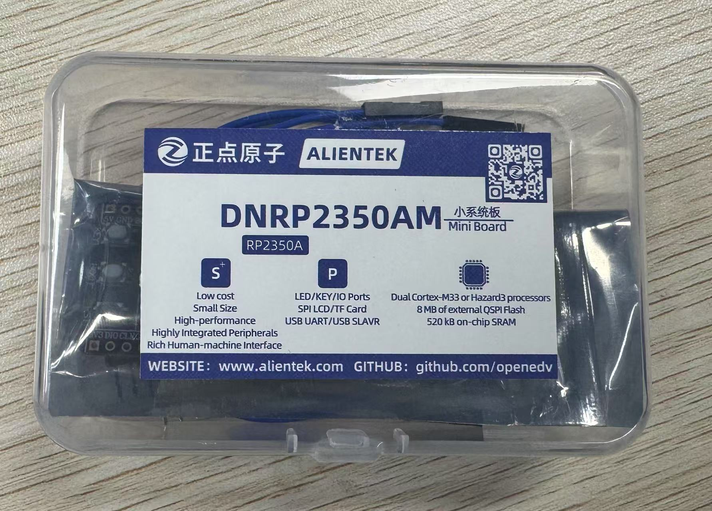
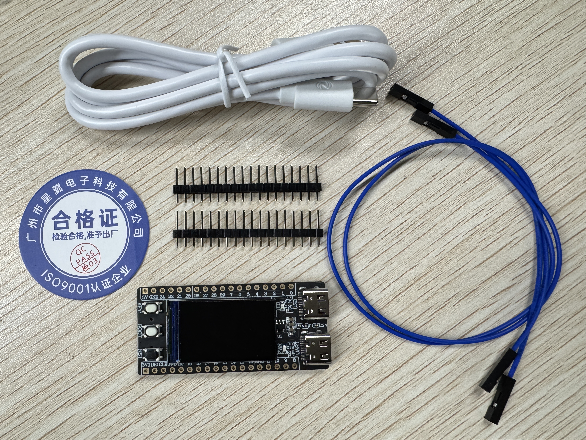
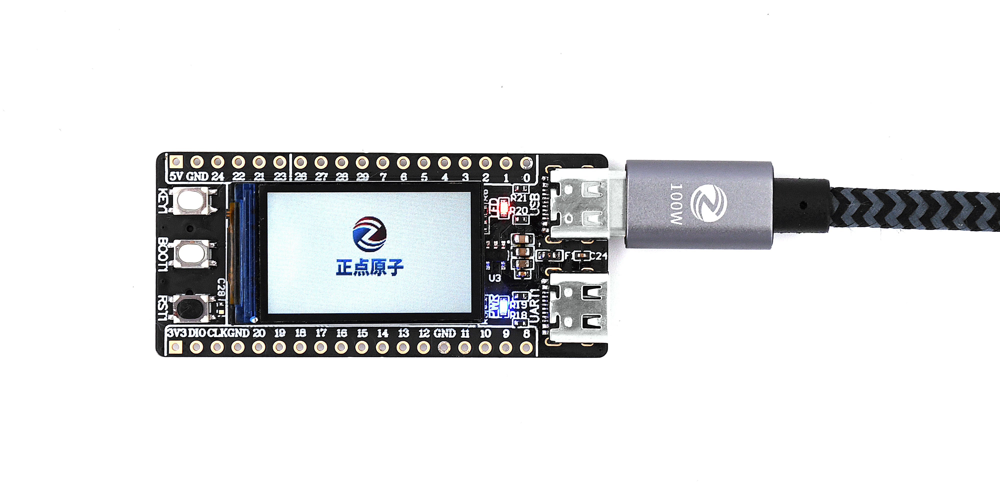

# 产品验收

在收到产品包裹后，请先根据自己的购买清单，核对收到的货物（通常情况下，产品包裹中会提供有发货单）。

## 外观检查

RaspberryPi-RP2350A小系统板 开发板采用透明塑料盒进行包装，如下

透明塑料盒中包含了 RaspberryPi-RP2350A小系统板 开发板 标配套餐中的所有物品，如还购买了其他产品，请单独验收。

在确认透明塑料盒外观无损坏后，打开透明塑料盒并取出其中的所有物品进行清点、检查.

透明塑料盒中应包含如下物品

1. RaspberryPi-RP2350A小系统板 开发板
2. USB 线数据线（Type-A to Type-C）
3. 两根杜邦线
4. 合格证

请依次检查透明塑料盒中物品的数量和外观是否无异。

## 功能测试

对 RaspberryPi-RP2350A小系统板 开发板 进行供电，其正面的蓝色 LED发亮，待系统启动后，将自动运行测试例程

进入测试例程后，通过轮询的方式测各项功能，重点观察屏幕显示、LED 、USB、USB串口等功能是否正常。

如在使用过程中遇到任何问题，请与我们联系。
