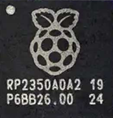
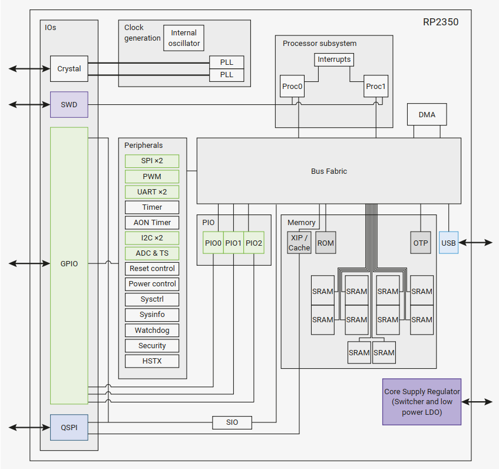
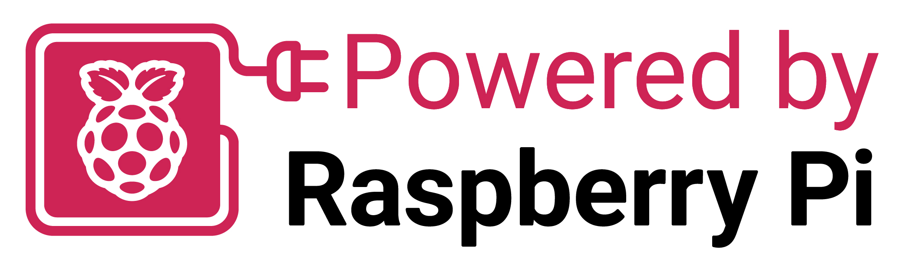

# RP2350A与PICOSDK介绍

## RP2350A介绍

RP2350A是Raspberry Pi推出的一款RP2350 独特的双核、双架构芯片。该功能提供行业标准的 Arm Cortex-M33 内核和开放硬件 Hazard3 RISC-V 内核，可通过软件选择或通过片上 OTP 内存编程来选择。

RP2350A集成了丰富的外设，包括 2 个 UART、2 个 SPI 控制器、2 个 I2C 控制器、24 个 PWM 通道、支持主机和设备模式的 USB 1.1 控制器和 PHY、12 个 PIO 状态机以及 1 个 HSTX 外设。

### 功能框图

### 核心参数

| 参数     | 描述                                                         |
| -------- | ------------------------------------------------------------ |
| 双核架构      | RP2350搭载了双核Arm Cortex-M33 处理器或 Hazard3 RISC-V 处理器，运行频率高达 150 MHz，性能远超 RP2040 |
| 丰富的内存      | 它拥有 520 kB 的片上 SRAM，分为 10 个独立的存储区，并支持通过专用 QSPI 总线连接高达 16 MB 的外部 QSPI 闪存/PSRAM，此外还可通过可选的第二个芯片选择连接额外的 16 MB 闪存/PSRAM |
| 片上电源管理      | 它内置了开关模式电源，可生成内核电压                 |
| 灵活的封装选项 | RP2350 提供 QFN-80 (10 × 10 mm) 和 QFN-60 (7 × 7 mm) 两种封装选择，并有带和不带封装内闪存的版本             |
| 多功能外设 | 2 x UARTs 2× SPI controllers 2 x I2C controllers 24 x PWM channels 30 x GPIO + 4 x Analogue Inputs USB 1.1 controller and PHY, with host and device support 12× PIO state machines 1× HSTX peripheral WDT /RTC / Timer |

## Pico-sdk介绍

[**Pico-SDK**](https://github.com/raspberrypi/pico-sdk) 树莓派Pico SDK（Software Development Kit）是一个为树莓派Pico开发板及其他基于RP2350芯片的设备提供的软件开发工具包。它为开发者提供了编写、调试和部署C/C++应用程序所需的工具和库。这个SDK非常适合开发嵌入式系统和物联网设备应用，支持硬件控制、传感器接口、实时处理等功能.